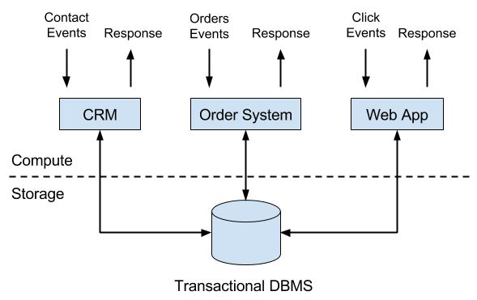
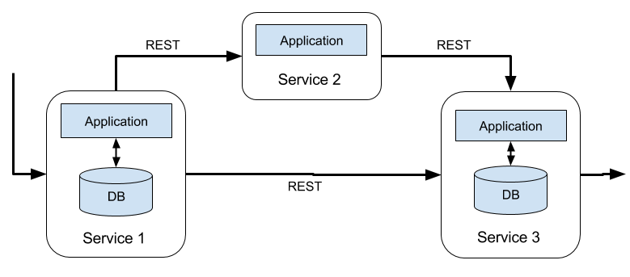
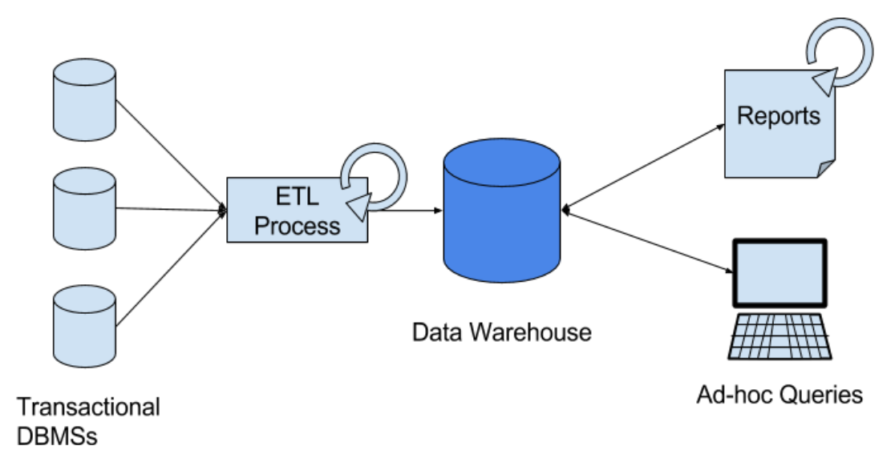
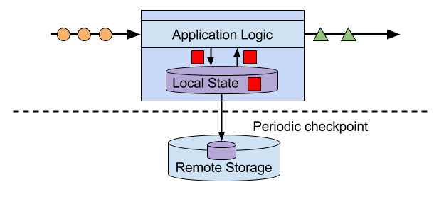
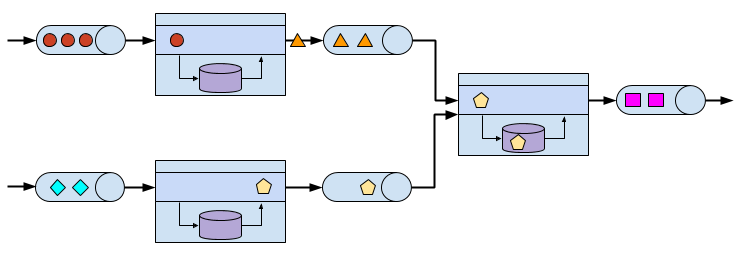
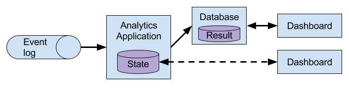
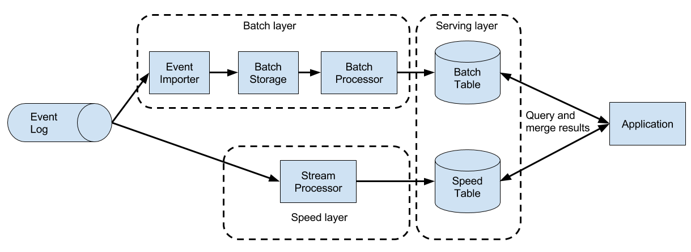
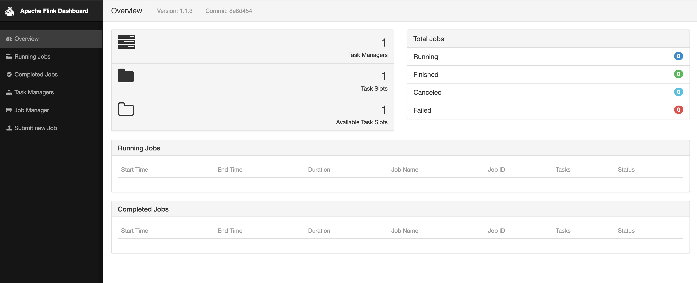
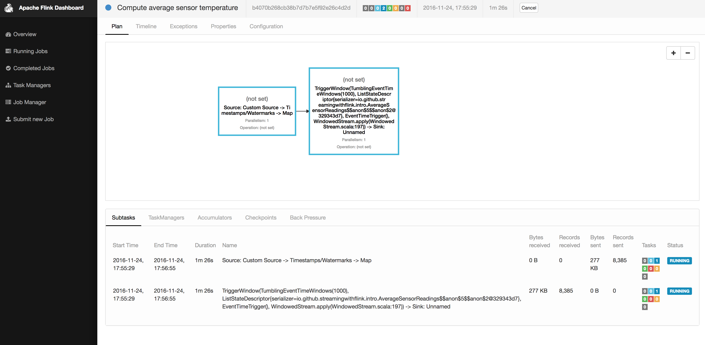

# Chapter 1. Introduction to Stateful Stream Processing
`Apache Flink` is a distributed stream processor with intuitive and expressive APIs to implement stateful stream processing applications. It efficiently runs such applications at large scale in a fault-tolerant manner. Flink joined the Apache Software Foundation as an incubating project in April 2014 and became a top-level project in January 2015. Since its beginning, Flink has a very active and continuously growing community of users and contributors. Until today, more than 350 individuals have contributed to Flink and it has evolved into one of the most sophisticated open source stream processing engines as proven by its widespread adoption. Flink powers large-scale business-critical applications in many companies and enterprises across different industries and around the globe.

Stream processing technology is being rapidly adopted by companies and enterprises of any size because it provides superior solutions for many established use cases but also facilitates novel applications, software architectures, and business opportunities. In this chapter we discuss why stateful stream processing is becoming so popular and assess its potential. We start reviewing conventional data processing application architectures and point out their limitations. Next, we introduce application designs based on stateful stream processing that exhibit many interesting characteristics and benefits over traditional approaches. We briefly discuss the evolution of open source stream processors and help you to run a first streaming application on a local Flink instance. Finally, we tell you what you will learn when reading this book.

## 1.1 Traditional Data Infrastructures
Companies employ many different applications to run their business, such as enterprise resource planning (ERP) systems, customer relationship management (CRM) software, or web-based applications. All of these systems are typically designed with separate tiers for data processing (the application itself) and data storage (a transactional database system) as shown in `Figure 1-1`.

*Figure 1-1. Transactional applications*

The applications are usually connected to external services or face human users and continuously process incoming events such as orders, or mails, or clicks on a website. When an event is processed, an application reads its state or updates its state by running transactions against the remote database system. Typically, a database system serves multiple applications which often even access the same databases or tables.

This design can cause problems when applications need to evolve or scale. Since, multiple applications might work on the same data representation or share the same infrastructure, changing the schema of a table or scaling a database system requires careful planning and a lot of effort. A recent approach to overcome the tight bundling of applications is the microservice design pattern. Microservices are designed as small, self-contained, and independent applications. They follow the UNIX philosophy of doing a single thing and doing it well. More complex applications are built by connecting several microservices with each other that only communicate over standardized interfaces such as RESTful HTTP connections. Because microservices are strictly decoupled from each other and only communicate over well defined interfaces, each microservice can be implemented with a custom technology stack including programming language, libraries, and data stores. Microservices and all required software and services are typically bundled and deployed in independent containers. `Figure 1-2` depicts a microservice architecture.

*Figure 1-2. A microservice architecture*

The data that is stored in the various transactional database systems of a company can provide valuable insights about various aspects of the company’s business. For example, the data of an order processing system can be analyzed to obtain sales growth over time, to identify reasons for delayed shipments, or to predict future sales in order to adjust the inventory. However, transactional data is often distributed across several disconnected database systems and becomes more valuable when it can be jointly analyzed. Moreover, it is often required to transform the data into a common format.

Instead of running analytical queries directly on the transactional databases, a common component in IT systems is a `data warehouse`. A data warehouse is a specialized database system for analytical query workloads. In order to populate a data warehouse, the data managed by the transactional database systems needs to be copied to it. The process of copying data to the data warehouse is called `extract-transform-load` (ETL).  An ETL process extracts data from a transactional database, transforms it into a common representation which might include validation, value normalization, encoding, de-duplication, and schema transformation, and finally loads it into the analytical database. ETL processes can be quite complex and often require technically sophisticated solutions to meet performance requirements. In order to keep the data of the data warehouse up-to-date, ETL processes need to run periodically.

Once the data has been imported into the data warehouse it can be queried and analyzed. Typically, there are two classes of queries executed on a data warehouse：
+ the first type are periodic report queries that compute business relevant statistics such as revenue, user growth, or production output. These metrics are assembled into reports that help to assess the situation of the business
+ the second type are ad-hoc queries that aim to provide answers to specific questions and support business-critical decisions

Both kinds of queries are executed by a data warehouse in a batch processing fashion, i.e., the data input of a query is fully available and the query terminates after it returned the computed result. The architecture is depicted in `Figure 1-3`.

*Figure 1-3. A traditional data warehouse architecture for data analytics*

Until the rise of `Apache Hadoop`, specialized analytical database systems and data warehouses were the predominant solutions for data analytics workloads. However, with the growing popularity of Hadoop, companies realized that a lot of valuable data was excluded from their data analytics process. Often, this data was either unstructured, i.e., not strictly following a relational schema, or too voluminous to be cost-effectively stored in a relational database system. Today, components of the `Apache Hadoop` ecosystem are integral parts in the IT infrastructures of many enterprises and companies. Instead of inserting all data into a relational database system, significant amounts of data, such as, log files, social media, or web click logs, are written into Hadoop’s distributed file system (HDFS) or other bulk data stores, like `Apache HBase`, which provide massive storage capacity at small cost. Data that resides in such storage systems is accessible to several `SQL-on-Hadoop` engines, as for example `Apache Hive`, `Apache Drill`, or `Apache Impala`. However, also with storage systems and execution engines of the Hadoop ecosystem the overall mode of operation of the infrastructure remains basically the same as the traditional data warehouse architecture, i.e., data is periodically extracted and loaded into to a data store and processed by periodic or ad-hoc queries in a batch fashion.

## 1.2 Stateful Stream Processing
**An important observation is that virtually all data is created as continuous streams of events**. Think of user interactions on websites or in mobile apps, placements of orders, server logs, or sensor measurements; all of these data are streams of events. In fact, it is difficult to find examples of finite, complete data sets that are generated all at once. Stateful stream processing is an application design pattern for processing unbounded streams of events and is applicable to many different use cases in the IT infrastructure of a company. Before we discuss its use cases, we briefly explain what stateful stream processing is and how it works.

Any application that processes a stream of events and does not just perform trivial record-at-a-time transformations needs to be stateful, i.e., have the ability to store and access intermediate data. When an application receives an event, it can perform arbitrary computations that involve reading data from or writing data to the state. In principle, state can be stored and accessed in many different places including program variables, local files, or embedded or external databases.

**Apache Flink stores application state locally in memory or in an embedded database and not in a remote database**. Since Flink is a distributed system, the local state needs to be protected against failures to avoid data loss in case of application or machine failures. Flink guarantees this by periodically writing a consistent checkpoint of the application state to a remote and durable storage. State, state consistency, and Flink’s checkpointing mechanism will be discussed in more detail in the following chapters. `Figure 1-4` shows a stateful Flink application.

*Figure 1-4. A stateful streaming application*

Stateful stream processing applications often ingest their incoming events from an event log. An event log stores and distributes event streams. Events are written to a durable, append-only log which means that the order of written events cannot be changed. A stream that is written to an event log can be read many times by the same or different consumers. Due to the append-only property of the log, events are always published to all consumers in exactly the same order. There are several event log systems available as open source software, `Apache Kafka` being the most popular, or as integrated services offered by cloud computing providers.

Connecting a stateful streaming application running on Flink and an event log is interesting for multiple reasons. In this architecture the event log acts as a source of truth because it persists the input events and can replay them in an deterministic order. In case of a failure, Flink restores a stateful streaming application by recovering its state from a previously taken checkpoint and resets the read position on the event log. The application will replay (and fast forward) the input events from the event log until it reaches the tail of the stream. This technique is used to recover from failures but can also be leveraged to update an application, fix bugs and repair previously emitted results, migrate an application to a different cluster, or perform A/B tests with different application versions.

As previously stated, stateful streaming processing is a versatile and flexible design pattern and can be used to address many different use cases. In the following we present three classes of applications that are commonly implemented using stateful stream processing:
1. event-driven applications
2. data pipeline applications
3. data analytics applications

We will give examples of real-world applications. We describe these classes as distinct patterns to emphasize the versatility of stateful stream processing. However, most real-world applications combine characteristics of more than one class which again shows the flexibility of this application design pattern.

### 1.2.1 Event-driven Applications🐬
`Event-driven applications` are stateful streaming applications that ingest event streams and apply business logic on the received events. Depending on the business logic, an event-driven application can trigger actions such as sending an alert or an email or write events to an outgoing event stream that is possibly consumed by another event-driven application.

Typical use cases for event-driven applications include
+ Real-time recommendations, e.g., for recommending products while customers browse on a retailer’s website,
+ Pattern detection or complex event processing (CEP), e.g., for fraud detection in credit card transactions, and
+ Anomaly detection, e.g., to detect attempts to intrude a computer network.

**Event-driven applications are an evolution of the previously discussed microservices. They communicate via event logs instead of REST calls and hold application data as local state instead of writing it to and reading it from an external data store, such as a transactional database or key-value store**. `Figure 1-5` sketches a service architecture composed of event-driven streaming applications.

*Figure 1-5. An event-driven application architecture.*

Event-driven applications are an interesting design pattern because they offer several benefits compared to the traditional architecture of separate storage and compute tiers or the popular microservice architectures. Local state accesses, i.e., reading from or writing to memory or local disk, provide very good performance compared to read and write queries against remote data stores. Scaling and fault-tolerance do not need special consideration because these aspects are handled by the stream processor. Finally, by leveraging an event log as input source the complete input of an application is reliably stored and can be deterministically replayed. This is very attractive especially in combination with Flink’s savepoint feature which can reset the state of an application to a previous consistent savepoint. By resetting the state of a (possibly modified) application and replaying the input, it is possible to fix a bug of the application and repair its effects, deploy new versions of an application without losing its state, or run what-if or A/B tests. We know of a company that decided to built the backend of a social network based on an event log and event-driven applications because of these features.

Event-driven applications have quite high requirements on the stream processor that runs them. The business logic is constrained by how much it can control state and time. This aspect depends on the APIs of the stream processor, what kinds of state primitives it provides, and on the quality of its support for event-time processing. Moreover, exactly-once state consistency and the ability to scale an application are fundamental requirements. `Apache Flink` checks all these boxes and is a very good choice to run event-driven applications.

### 1.2.2 Data Pipelines and Real-time ETL🐬
Today’s IT architectures include many different data stores, such as relational and special-purpose database systems, event logs, distributed file systems, in-memory caches, and search indexes. All of these systems store data in different representations and data structures that provide the best performance for their specific purpose. Subsets of an organization’s data are stored in multiple of these systems. For example, information for a product that is offered in a webshop can be stored in a transactional database, a web cache, and a search index. Due to this replication of data, the data stores must be kept in sync.

The traditional approach of a periodic ETL job to move data between storage systems is typically not able to propagate updates fast enough. Instead a common approach is to write all changes into an event log that serves as source of truth. The event log publishes the changes to consumers that incorporate the updates into the affected data stores. Depending on the use case and data store, the updates need to be processed before they can be incorporated. For example they need to be normalized, joined or enriched with additional data, or pre-aggregated, i.e., transformations that are also commonly performed by ETL processes.

Ingesting, transforming, and inserting data with low latency is another common use case for stateful stream processing applications. We call this type of applications `data pipelines`. Additional requirements for data pipelines are the ability to process large amounts for data in short time, i.e., support for high throughput, and the capability to scale an application. A stream processor that operates data pipelines should also feature many source and sink connectors to read data from and write data to various storage systems and formats. Again, Flink provides all required features to successfully operate data pipelines and includes many connectors.

### 1.2.3 Streaming Analytics🐬
Previously in this chapter, we described the common architecture for data analytics pipelines. ETL jobs periodically import data into a data store and the data is processed by ad-hoc or scheduled queries. The fundamental mode of operation - `batch processing` - is the same regardless whether the architecture is based on a data warehouse or components of the Hadoop ecosystem. While the approach of periodically loading data into data analysis systems has been the state-of-the-art for many years, it suffers from a notable drawback.

Obviously, the periodic nature of the ETL jobs and reporting queries induce a considerable latency. Depending on the scheduling intervals it may take hours or days until a data point is included in a report. To some extent, the latency can be reduced by importing data into the data store with data pipeline applications. However, even with continuous ETL there will always be a certain delay until an event is processed by a query. In the past, analyzing data with a few hours or even days delay was often acceptable because a prompt reaction to new results or insights did not yield a significant advantage. However, this has dramatically changed in the last decade. The rapid digitalization and emergence of connected systems made it possible to collect much more data in real-time and immediately act on this data for example by adjusting to changing conditions or by personalizing user experiences. An online retailer is able to recommend products to users while they are browsing on the retailer’s website; mobile games can give virtual gifts to users to keep them in a game or offer in-game purchases at the right moment; manufacturers can monitor the behavior of machines and trigger maintenance actions to reduce production outages. All these use cases require collecting real-time data, analyzing it with low latency, and immediately reacting to the result. Traditional batch oriented architectures are not able to address such use cases.

You are probably not surprised that stateful stream processing is the right technology to build low-latency analytics pipelines. Instead of waiting to be periodically triggered, a streaming analytics application continuously ingests streams of events and maintains an updating result by incorporating the latest events with low latency. This is similar to view maintenance techniques that database systems use to update materialized views. Typically, streaming applications store their result in an external data store that supports efficient updates, such as a database or key-value store. Alternatively, **Flink provides a feature called queryable state which allows users to expose the state of an application as a key-lookup table and make it accessible for external applications**. The live updated results of a streaming analytics applications can be used to power dashboard applications as shown in `Figure 1-6`.

*Figure 1-6. A streaming analytics application*

Besides the much smaller time for an event to be incorporated into an analytics result, there is another, less obvious, advantage of streaming analytics applications. Traditional analytics pipelines consist of several individual components such as an ETL process, a storage system, and in case of a Hadoop-based environment also a data processor and scheduler to trigger jobs or queries. These components need to be carefully orchestrated and especially error handling and failure recovery can become challenging.

In contrast, a stream processor that runs a stateful streaming application takes care of all processing steps, including event ingestion, continuous computation including state maintenance, and updating the result. Moreover, the stream processor is responsible to recover from failures with exactly-once state consistency guarantees and should be capable of adjusting the parallelism of an application. Additional requirements to successfully support streaming analytics applications are support for event-time processing in order to produce correct and deterministic results and the ability to process large amounts of data in little time, i.e., high throughput. Flink offers good answers to all of these requirements.

Typical use cases for streaming analytics applications are
+ Monitoring the quality of cellphone networks.
+ Analyzing user behavior in mobile applications.
+ Ad-hoc analysis of live data in consumer technology.

Although not being covered in this book but certainly worth mentioning is that Flink also provides support for analytical SQL queries over streams. Multiple companies have built streaming analytics services based on Flink’s SQL support both for internal use or to publicly offer them to paying customers.

## 1.3 The Evolution of Open Source Stream Processing
Data stream processing is not a novel technology. First research prototypes and commercial products date back to the late 1990s. However, the growing adoption of stream processing technology in the recent past is driven to a large extent by the availability of mature open source stream processors. Today, distributed open source stream processors power business-critical applications in many enterprises across different industries such as (online) retail, social media, telecommunication, gaming, and banking. Open source software is a major driver of this trend, mainly due to two reasons:
1. Open source stream processing software is a commodity that everybody can evaluate and use.
2. Scalable stream processing technology is rapidly maturing and evolving due to the efforts of many open source communities.

The Apache Software Foundation alone is the home of more than a dozen projects that are related to stream processing. New distributed stream processing projects are continuously entering the open source stage and are challenging the state-of-the-art with new features and capabilities. Often are features of these newcomers being adopted by more stream processors of earlier generations. Moreover, users of open source software request or contribute new features that are missing to support their use cases. This way, open source communities are constantly improving the capabilities of their projects and are pushing the technical boundaries of stream processing further. We will take a brief look into the past to see where open source stream processing came from and where it is today.

The first generation of distributed open source stream processors that got substantial adoption focused on event processing with millisecond latencies and provided guarantees that events would never be lost in case of a failure. These systems had rather low-level APIs and did not provide built-in support for accurate and consistent results of streaming applications because the results depended on the timing and order of arriving events. Moreover, even though events would not be lost in case of a failure, they could be processed more than once. In contrast to batch processors that guarantee accurate results, the first open source stream processors traded result accuracy for much better latency. The observation that data processing systems (at this point in time) could either provide fast or accurate results led to the design of the so-called `Lambda architecture` which is depicted in `Figure 1-7`.

*Figure 1-7. The Lambda architecture*

The Lambda architecture augments the traditional periodic batch processing architecture with a `Speed Layer` that is powered by a low-latency stream processor. Data arriving to the Lambda architecture is ingested by the stream processor as well as written to a batch storage such as HDFS. The stream processor computes possibly inaccurate results in near real-time and writes the results into a speed table. The data written to the batch storage is periodically processed by a batch processor. The exact results are written into a batch table and the corresponding inaccurate results from the speed table are dropped. Applications consume the results from the `Serving Layer` by merging the most recent but only approximated results from the speed table and the older but accurate result from the batch table. The Lambda architecture aimed to improve the high result latency of the original batch analytics architecture. However, the approach had a few notable drawbacks. First of all, it requires two semantically equivalent implementations of the application logic for two separate processing systems with different APIs. Second, the latest results computed by the stream processor are not accurate but only approximated. Third, the Lambda architecture is hard to setup and maintain. A textbook setup consists of a stream processor, a batch processor, a speed store, a batch store, and tools to ingest data for the batch processor and scheduling batch jobs.

Improving on the first generation, the next generation of distributed open source stream processors provided better failure guarantees and ensured that in case of a failure each record contributes exactly once to the result. In addition, programming APIs evolved from rather low-level operator interfaces to high-level APIs with more built-in primitives. However, some improvements such as higher throughput and better failure guarantees came at the cost of increasing processing latencies from milliseconds to seconds. Moreover, results were still dependent on timing and order of arriving events, i.e., the results did not depend solely on the data but also on external conditions such as the hardware utilization.

The third generation of distributed open source stream processors fixed the dependency of results on the timing and order of arriving events. In combination with exactly-once failure semantics, systems of this generation are the first open source stream processors that are capable of computing consistent and accurate results. By computing results only based on the actual data, these systems are also able to process historical data in the same way as “live” data, i.e., data which is ingested as soon as it is produced. Another improvement was the dissolution of the latency-throughput trade-off. While previous stream processors only provided either high throughput or low latency, systems of the third generation are able to serve both ends of the spectrum. Stream processors of this generation made the lambda architecture obsolete.

In addition to the system properties discussed so far, such as failure tolerance, performance, and result accuracy, stream processors also continuously added new operational features. Since streaming applications are often required to run 24/7 with minimum downtime, many stream processors added features such as highly-available setups, tight integration with resource managers, such as `YARN` or `Mesos`, and the ability to dynamically scale streaming applications. Other features include support to upgrade application code or migrating a job to a different cluster or a new version of the stream processor without losing the current state of an application.

## 1.4 A Taste of Flink🐳
Apache Flink is a distributed stream processor of the third generation with a competitive feature set. It provides accurate stream processing with high throughput and low latency at scale. In particular the following features let it stand out:
- Flink supports `event-time` and `processing-time` semantics. Event-time provides consistent and accurate results despite out-of-order events. Processing-time can be applicable for applications with very low latency requirements.
- Flink supports exactly-once state consistency guarantees.
- Flink achieves millisecond latencies and is able to process millions of events per second. Flink applications can be scaled to run on thousands of cores.
- Flink features layered APIs with varying tradeoffs for expressiveness and ease-of-use. This book covers the `DataStream` API and the `ProcessFunction` which provide primitives for common stream processing operations, such as windowing and asynchronous operations, and interfaces to precisely control state and time. Flink’s relational APIs, SQL and the LINQ-style Table API, are not discussed in this book.
- Flink provides connectors to the most commonly used storage systems such as `Apache Kafka`, `Apache Cassandra`, `Elasticsearch`, `JDBC`, `Kinesis`, and (distributed) file systems such as `HDFS` and `S3`.
- Flink is able to run streaming applications 24/7 with very little downtime due to its highly-available setup (no single point of failure), a tight integration with `YARN` and `Apache Mesos`, fast recovery from failures, and the ability to dynamically scale jobs.
- Flink allows for updating the application code of jobs and migrating jobs to different Flink clusters without losing the state of the application.
- Detailed and customizable collection of system and application metrics help to identify and react to problems ahead of time.
- Last but not least, Flink is also a full-fledged batch processor.

In addition to these features, Flink is a very developer-friendly framework due to its easy-to-use APIs. An embedded execution mode starts Flink applications as a single JVM process which can be used to run and debug Flink jobs within an IDE. This feature comes in handy when developing and testing Flink applications.

Next, we will guide you through the process of starting a local cluster and executing a first streaming application in order to give you a first impression of Flink. The application we are going to run converts and aggregates randomly generated temperature sensor readings by time. For this your system needs to have Java 8 (or a later version) installed. We describe the steps for a UNIX environment. If you are running Windows, we recommend to set up a virtual machine with Linux, Cygwin (a Linux environment for Windows), or the Windows Subsystem for Linux, which was introduced with Windows 10.

1. Go to the Apache Flink webpage[ flink.apache.org](http://flink.apache.org/) and download the Hadoop-free binary distribution of Apache Flink 1.4.0.

2. Extract the archive file
	`tar xvfz flink-1.4.0-bin-scala_2.11.tgz`

3. Start a local Flink cluster
   `cd flink-1.4.0./bin/start-cluster.sh`

4. Open the web dashboard on by entering the URL[ http://localhost:8081](http://localhost:8081/) in your browser. As shown in `Figure 1-8`, you will see some statistics about the local Flink cluster you just started. It will show that a single Task Manager (Flink’s worker processes) is connected and that a single Task Slot (resource units provided by a Task Manager) is available.

	
	*Figure 1-8. Screenshot of Apache Flink’s web dashboard showing the overview*

5. Download the JAR file that includes all example programs of this book.
   `wget https://streaming-with-flink.github.io/examples/download/examples-scala.jar `

   Note: you can also build the JAR file yourself by following the steps on the repository’s README file.

6. Run the example on your local cluster by specifying the applications entry class and the JAR file
   `./bin/flink run -c io.github.streamingwithflink.AverageSensorReadings examples-scala.jar`

7. Inspect the web dashboard. You should see a job listed under “Running Jobs”. If you click on that job you will see the data flow and live metrics about the operators of the running job similar to the screenshot in `Figure 1-9`.
	
	*Figure 1-9. Screenshot of Apache Flink’s web dashboard showing a running job*

8. The output of the job is written to the standard out of Flink’s worker process which is by default redirected into a file in the ./log folder. You can monitor the constantly produced output using the tail command for example as follows
   `tail -f ./log/flink-<user>-jobmanager-<hostname>.out`
   You should see lines as the following ones being written to the file:
   `SensorReading(sensor_2,1480005737000,18.832819812267438)
   SensorReading(sensor_5,1480005737000,52.416477673987856)
   SensorReading(sensor_3,1480005737000,50.83979980099426)
   SensorReading(sensor_4,1480005737000,-17.783076985394775)`

   The output can be read as follows: the first field of the SensorReading is a sensorId, the second field is the timestamp as milliseconds since 1970-01-01-00:00, and the third field is an average temperature computed over five seconds.

9. Since you are running a streaming application, it will continue to run until you cancel it. You can do this by selecting the job in the web dashboard and clicking on the CANCEL button on the top of the page.

10. Finally, you should stop the local Flink cluster
      `./bin/stop-cluster.sh`

That’s it. You just installed and started your first local Flink cluster and ran your first Flink DataStream program! Of course there is much more to learn about stream processing with Apache Flink and that’s what this book is about.

## 1.5 What You Will Learn in This Book
This book will teach you everything to know about stream processing with Apache Flink. Chapter 2 discusses fundamental concepts and challenges of stream processing and Chapter 3 the system architecture of Flink to address these requirements. Chapters 4 to 8 guide you through setting up a development environment, cover the basics of the DataStream API, and go into the details of Flink’s time semantics and window operators, its connectors to external systems, and the details of Flink’s fault-tolerant operator state. Chapter 9 discusses how to setup and configure Flink clusters in various environments and finally Chapter 10 how to operate, monitor, and maintain streaming applications that run 24/7.