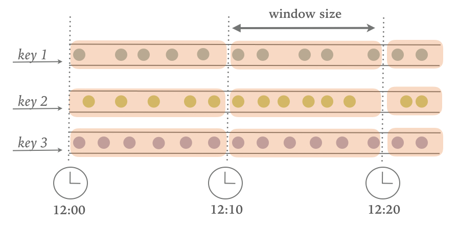

# Chapter 2. Stream Processing Fundamentals
So far, you have seen how stream processing addresses limitations of traditional batch processing and how it enables new applications and architectures. You have become familiar with the evolution of the open-source stream processing space and you have got a brief taste of what a Flink streaming application looks like. In this chapter, you will enter the streaming world for good and you will get the necessary background for the rest of this book.

This chapter is still rather independent of Flink. Its goal is to introduce the fundamental concepts of stream processing and discuss the requirements of stream processing frameworks. We hope that after reading this chapter, you will have gained a better understanding of stream applications requirements and you will be able to evaluate the features of modern stream processing systems.

## 2.1 Introduction to dataflow programming
Before we delve into the fundamentals of stream processing, we must first introduce the necessary background on dataflow programming and establish the terminology that we will use throughout this book.

### 2.1.1 Dataflow graphs
As the name suggests, a dataflow program describes how data flows between operations. **Dataflow programs are commonly represented as directed graphs, where nodes are called operators and represent computations and edges represent data dependencies**. Operators are the basic functional units of a dataflow application. They consume data from inputs, perform a computation on them, and produce data to outputs for further processing. Operators without input ports are called `data sources` and operators without output ports are called `data sinks`. A dataflow graph must have at least one data source and one data sink. `Figure 2.1` shows a dataflow program that extracts and counts hashtags from an input stream of tweets.

*Figure 2-1. A logical dataflow graph to continuously count hashtags. Nodes represent operators and edges denote data dependencies*

Dataflow graphs like the one of `Figure 2.1` are called logical because they convey a high-level view of the computation logic. In order to execute a dataflow program, its logical graph is converted into a physical dataflow graph, which includes details about how the computation is going to be executed. For instance, if we are using a distributed processing engine, each operator might have several parallel tasks running on different physical machines. `Figure 2.2` shows a physical dataflow graph for the logical graph of `Figure 2.1`. While in the logical dataflow graph the nodes represent operators, in the physical dataflow, the nodes are tasks. The `Extract hashtags` and `Count` operators have two parallel operator tasks, each performing a computation on a subset of the input data.

*Figure 2-2. A physical dataflow plan for counting hashtags. Nodes represent tasks*

### 2.1.2 Data parallelism and task parallelism
You can exploit parallelism in dataflow graphs in different ways. First, you can partition your input data and have tasks of the same operation execute on the data subsets in parallel. This type of parallelism is called `data parallelism`. Data parallelism is useful because it allows for processing large volumes of data and spreading the computation load across several computing nodes. Second, you can have tasks from different operators performing computations on the same or different data in parallel. This type of parallelism is called `task parallelism`. Using task parallelism you can better utilize the computing resources of a cluster.

### 2.1.3 Data exchange strategies
Data exchange strategies define how data items are assigned to tasks in a physical dataflow graph. Data exchange strategies can be automatically chosen by the execution engine depending on the semantics of the operators or explicitly imposed by the dataflow programmer. Here, we briefly review some common data exchange strategies, as shown in `Figure 2.3`.

*Figure 2-3. Data exchange strategies*

+ The `forward` strategy sends data from a task to a receiving task. If both tasks are located on the same physical machine (which is often ensured by task schedulers), this exchange strategy avoids network communication.
+ The `broadcast` strategy sends every data item to all parallel tasks of an operator. Because this strategy replicates data and involves network communication, it is fairly expensive.
+ The `key-based` strategy partitions data by a key attribute and guarantees that data items having the same key will be processed by the same task. In `Figure 2.2`, the output of the `Extract hashtags` operator is partitioned by key (the hashtag), so that the count operator tasks can correctly compute the occurrences of each hashtag.
+ The `random` strategy uniformly distributes data items to operator tasks in order to evenly distribute the load across computing tasks.

> **THE FORWARD AND RANDOM STRATEGIES AS KEY-BASED**
> The forward strategy and the random strategy can also be viewed as variations of the key-based strategy, where the first preserves the key of the upstream tuple while the latter performs a random re-assignment of keys.

## 2.2 Processing infinite streams in parallel
Now that you have become familiar with the basics of dataflow programming, it’s time to see how these concepts apply to processing data streams in parallel. But first, we define the term data stream:
​	**A data stream is a potentially unbounded sequence of events**

Events in a data stream can represent monitoring data, sensor measurements, credit card transactions, weather station observations, online user interactions, web searches, etc. In this section, you are going to learn the concepts of processing infinite streams in parallel, using the dataflow programming paradigm.

### 2.2.1 Latency and throughput
In the previous chapter, you saw how streaming applications have different operational requirements from traditional batch programs. Requirements also differ when it comes to evaluating performance. For batch applications, we usually care about the total execution time of a job, or how long it takes for our processing engine to read the input, perform the computation, and write back the result. Since streaming applications run continuously and the input is potentially unbounded, there is no notion of total execution time in data stream processing. Instead, streaming applications must provide results for incoming data as fast as possible while being able to handle high ingest rates of events. We express these performance requirements in terms of latency and throughput.

##### LATENCY
Latency indicates how long it takes for an event to be processed. Essentially, it is the time interval between receiving an event and seeing the effect of processing this event in the output. To understand latency intuitively, consider your daily visit to your favorite coffee shop. When you enter the coffee shop, there might be other customers inside already. Thus, you wait in line and when it is your turn you make an order. The cashier receives your payment and passes your order to the barista who prepares your beverage. Once your coffee is ready, the barista calls your name and you can pick up your coffee from the bench. Your service latency is the time you spend in the coffee shop, from the moment you enter until you have the first sip of coffee.

In data streaming, latency is measured in units of time, such as milliseconds. Depending on the application, you might care about average latency, maximum latency, or percentile latency. For example, an average latency value of 10ms means that events are processed within 10ms on average. Instead, a 95th-percentile latency value of 10ms means that 95% of events are processed within 10ms. Average values hide the true distribution of processing delays and might make it hard to detect problems. If the barista runs out of milk right before preparing your cappuccino, you will have to wait until they bring some from the supply room. While you might get annoyed by this delay, most other customers will still be happy.

Ensuring low latency is critical for many streaming applications, such as fraud detection, raising alarms, network monitoring, and offering services with strict service level agreements (SLAs). Low latency is a key characteristic of stream processing and it enables what we call real-time applications. Modern stream processors, like `Apache Flink`, can offer latencies as low as a few milliseconds. In contrast, traditional batch processing latencies typically range from a few minutes to several hours. In batch processing you first need to gather the events in batches and only then you are able to process them. Thus, the latency is bounded by the arrival time of the last event in each batch and naturally depends on the batch size. True stream processing does not introduce such artificial delays and therefore can achieve really low latencies. **In a true streaming model, events can be processed as soon as they arrive in the system and latency more closely reflects the actual work that has to performed on each event**.

##### THROUGHPUT
Throughput is a measure of the system’s processing capacity, i.e. its rate of processing. That is, throughput tells us how many events the system can process per time unit. Revisiting the coffee shop example, if the shop is open from 7am to 7pm and it serves 600 customers in one day, then its average throughput would be 50 customers per hour. While you want latency to be as low as possible, you generally want throughput to be as high as possible.

Throughput is measured in events or operations per time unit. It is important to note that the rate of processing depends on the rate of arrival; low throughput does not necessarily indicate bad performance. In streaming systems you usually want to ensure that your system can handle the maximum expected rate of events. That is, you are primarily concerned with determining the peak throughput, i.e. the performance limit when your system is at its maximum load. To better understand the concept of peak throughput, let us consider that system resources are completely unused. As the first event comes in, it will be immediately processed with the minimum latency possible. If you are the first customer showing up at the coffee shop right after it opened its doors in the morning, you will be served immediately. Ideally, you would like this latency to remain constant and independent of the rate of the incoming events. However, once we reach a rate of incoming events such that the system resources are fully used, we will have to start buffering events. In the coffee shop example, you will probably see this happening right after lunch. Many people show up at the same time and you have to wait in line to place your order. At this point the system has reached the peak throughput and further increasing the event rate will only result in worse latency. If the system continues to receive data at a higher rate than it can handle, buffers might become unavailable and data might get lost. This situation is commonly known as `backpressure` and there exist different strategies to deal with it. In `Chapter 3`, we look at Flink’s backpressure mechanism in detail.

##### LATENCY VS. THROUGHPUT
At this point, it should be quite clear that latency and throughput are not independent metrics. If events take long to travel in the data processing pipeline, we cannot easily ensure high throughput. Similarly, if a system’s capacity is small, events will be buffered and have to wait before they get processed.

Let us revisit the coffee shop example to clarify how latency and throughput affect each other. First, it should be clear that there is an optimal latency in the case of no load. That is, you will get the fastest service if you are the only customer in the coffee shop. However, during busy times, customers will have to wait in line and latency will increase. Another factor that affects latency and consequently throughput is the time it takes to process an event, or the time it takes for each customer to be served in the coffee shop. Imagine that during Christmas holiday season, baristas have to draw a Santa Claus on the cup of each coffee they serve. This way, the time to prepare a single beverage will increase, causing each person to spend more time in the coffee shop, thus lowering the overall throughput.

Then, can you somehow get both low latency and high throughput or is this a hopeless endeavour? One way you can lower latency is by hiring a more skilled barista, i.e. one that prepares coffees faster. At high load, this change will also increase throughput, because more customers will be served in the same amount of time. Another way to achieve the same result is to hire a second barista, that is, to exploit parallelism. The main take-away here is that lowering latency actually increases throughput. Naturally, if a system can perform operations faster, it can perform more operations at the same amount of time. In fact, that is what you achieve by exploiting parallelism in a stream processing pipeline. By processing several streams in parallel, you can lower the latency while processing more events at the same time.

### 2.2.2 Operations on data streams
Stream processing engines usually provide a set of built-in operations to ingest, transform, and output streams. These operators can be combined into dataflow processing graphs to implement the logic of streaming applications. In this section, we describe the most common streaming operations.

**Operations can be either stateless or stateful**. Stateless operations do not maintain any internal state. That is, the processing of an event does not depend on any events seen in the past and no history is kept. Stateless operations are easy to parallelize, since events can be processed independently of each other and of their arriving order. Moreover, in the case of a failure, a stateless operator can be simply restarted and continue processing from where it left off. On the contrary, stateful operators may maintain information about the events they have received before. This state can be updated by incoming events and can be used in the processing logic of future events. Stateful stream processing applications are more challenging to parallelize and operate in a fault tolerant manner because state needs to be efficiently partitioned and reliably recovered in the case of failures. You will learn more about stateful stream processing, failure scenarios, and consistency in the end of this chapter.

##### DATA INGESTION AND DATA EGRESS
`Data ingestion` and `data egress` operations allow the stream processor to communicate with external systems. `Data ingestion` is the operation of fetching raw data from external sources and converting it into a format that is suitable for processing. Operators that implement data ingestion logic are called `data sources`. A data source can ingest data from a TCP socket, a file, a Kafka topic, or a sensor data interface. `Data egress` is the operation of producing output in a form that is suitable for consumption by external systems. Operators that perform data egress are called `data sinks` and examples include files, databases, message queues, and monitoring interfaces.

##### TRANSFORMATION OPERATIONS
Transformation operations are single-pass operations that process each event independently. These operations consume one event after the other and apply some transformation to the event data, producing a new output stream. The transformation logic can be either integrated in the operator or provided by a `user-defined function` (UDF), as shown in `Figure 2.4`. UDFs are written by the application programmer and implement custom computation logic.

*Figure 2-4. A streaming operator with a UDF that turns each incoming event into a black event*

Operators can accept multiple inputs and produce multiple output streams. They can also modify the structure of the dataflow graph by either splitting a stream into multiple streams or merging streams into a single flow. We discuss the semantics of all operators available in Flink in `Chapter 5`.

##### ROLLING AGGREGATIONS
A rolling aggregation is an aggregation, such as `sum`, `minimum`, and `maximum`, that is continuously updated for each input event. Aggregation operations are stateful and combine the current state with the incoming event to produce an updated aggregate value. Note that to be able to efficiently combine the current state with an event and produce a single value, the aggregation function must be associative and commutative. Otherwise, the operator would have to store the complete stream history. `Figure 2.5` shows a rolling minimum aggregation. The operator keeps the current minimum value and accordingly updates it for each incoming event.

*Figure 2-5. A rolling minimum aggregation operation*

##### WINDOWS🐬
Transformations and rolling aggregations process one event at a time to produce output events and potentially update state. However, some operations must collect and buffer records to compute their result. Consider for example a streaming join operation or a holistic aggregate, such as median. In order to evaluate such operations efficiently on unbounded streams, you need to limit the amount of data these operations maintain. In this section, we discuss window operations, which provide such a mechanism.

Apart from having a practical value, windows also enable semantically interesting queries on streams. You have seen how rolling aggregations encode the history of the whole stream in an aggregate value and provide us with a low-latency result for every event. This is fine for some applications, but what if you are only interested in the most recent data? Consider an application that provides real-time traffic information to drivers so that they can avoid congested routes. In this scenario, you want to know if there has been an accident in a certain location within the last few minutes. On the other hand, knowing about all accidents that have ever happened might not be so interesting in this case. What’s more, by reducing the stream history to a single aggregate, you lose the information about how your data varies over time. For instance, you might want to know how many vehicles cross an intersection every 5 minutes.

**Window operations continuously create finite sets of events called buckets from an unbounded event stream and let us perform computations on these finite sets**. Events are usually assigned to buckets based on data properties or based on time. To properly define window operator semantics, we need to answer two main questions: `how are events assigned to buckets?` and `how often does the window produce a result?`. The behavior of windows is defined by a set of policies. Window policies decide when new buckets are created, which events are assigned to which buckets, and when the contents of a bucket get evaluated. The latter decision is based on a `trigger condition`. When the `trigger condition` is met, the bucket contents are sent to an `evaluation function` that applies the computation logic on the bucket elements. `Evaluation functions` can be aggregations like `sum` or `minimum` or custom operations applied on the bucket’s collected elements. Policies can be based on time (e.g. events received in the last 5 seconds), on count (e.g. the last 100 events), or on a data property. In this section, we describe the semantics of common window types.

+ `Tumbling` windows assign events into non-overlapping buckets of fixed size. When the window border is passed, all the events are sent to an evaluation function for processing. `Count-based tumbling windows` define how many events are collected before triggering evaluation. `Figure 2.6` shows a `count-based tumbling window` that discretizes the input stream into buckets of 4 elements. `Time-based tumbling windows` define a time interval during which events are buffered in the bucket. `Figure 2.7` shows a `time-based tumbling window` that gathers events into buckets and triggers computation every 10 minutes.
	
	*Figure 2-6. Count-based tumbling window*

	
	*Figure 2-7. Time-based tumbling window*

+ `Sliding` windows assign events into overlapping buckets of fixed size. Thus, an event might belong to multiple buckets. We define sliding windows by providing their length and their slide. The slide value defines the interval at which a new bucket is created. The `sliding count-based window` of `Figure 2.8` has a length of 4 events and slide of 3 events.
	
	*Figure 2-8. Sliding count-based window with a length of 4 events and a slide of 3 events*

+ `Session` windows are useful in a common real-world scenario where neither tumbling nor sliding windows can be applied. Consider an application that analyzes online user behavior. In such applications, we would like to group together events that origin from the same period of user activity or session. Sessions comprise of a series of events happening in adjacent times followed by a period of inactivity. For example, user interactions with a series of news articles one after the other could be considered a session. Since the length of a session is not defined beforehand but depends on the actual data, tumbling and sliding windows cannot be applied in this scenario. Instead, we need a window operation that assigns events belonging to the same session in the same bucket. Session windows group events in session based on a session gap value that defines the time of inactivity to consider a session closed. `Figure 2.9` shows a session window.
	
	*Figure 2-9. Session window*

All the window types that you have seen so far are global windows and operate on the full stream. In practice though you might want to partition a stream into multiple logical streams and define parallel windows. For instance, if you are receiving measurements from different sensors, you probably want to group the stream by sensor id before applying a window computation. In parallel windows, each partition applies the window policies independently of other partitions. `Figure 2.10` shows a parallel `count-based tumbling window` of length 2 which is partitioned by event color.

*Figure 2-10. A parallel count-based tumbling window of length 2*

Window operations are closely related to two dominant concepts in stream processing: 
+ **time semantics**
+ **state management** 

Time is perhaps the most important aspect of stream processing. Even though low latency is an attractive feature of stream processing, its true value is way beyond just offering fast analytics. Real-world systems, networks, and communication channels are far from perfect, thus streaming data can often be delayed or arrive out-of-order. It is crucial to understand how you can deliver accurate and deterministic results under such conditions. What’s more, streaming applications that process events as they are produced should also be able to process historical events in the same way, thus enabling offline analytics or even time travel analyses. Of course, none of this matters if your system cannot guard state against failures. All the window types that you have seen so far need to buffer data before performing an operation. In fact, if you want to compute anything interesting in a streaming application, even a simple count, you need to maintain state. Considering that streaming applications might run for several days, months, or even years, you need to make sure that state can be reliably recovered under failures and that your system can guarantee accurate results even if things break. In the rest of this chapter, we are going to look deeper into the concepts of time and state guarantees under failures in data stream processing.

## 2.3 Time semantics🐬
In this section, we introduce time semantics and describe the different notions of time in streaming. We discuss how a stream processor can provide accurate results with out-of-order events and how you can perform historical event processing and time travel with streaming.

### 2.3.1 What is the meaning of one minute?
When dealing with a potentially unbounded stream of continuously arriving events, time becomes a central aspect of applications. Let’s assume you want to compute results continuously, for example every one minute. What would one minute really mean in the context of our streaming application?

Consider a program that analyzes events generated by users playing online mobile games. Users are organized in teams and the application collects a team’s activity and provides rewards in the game, such as extra lives and level-ups, based on how fast the team’s members meet the game’s goals. For example, if all users in a team pop 500 bubbles within one minute, they get a level-up. Alice is a devoted player who plays the game every morning during her commute to work. The problem is that Alice lives in Berlin and she takes the subway to work. And everyone knows that the mobile internet connection in the Berlin subway is lousy. Consider the case where Alice starts popping bubbles while her phone is connected to the network and sends events to the analysis application. Then suddenly, the train enters a tunnel and her phone gets disconnected. Alice keeps on playing and the game events are buffered in her phone. When the train exits the tunnel, she comes back online, and pending events are sent to the application. What should the application do? What’s the meaning of one minute in this case? Does it include the time Alice was offline or not?

*Figure 2-11. Playing online mobile games in the subway. An application receiving game events would experience a gap when the train goes through a tunnel and network connection is lost. Events are buffered in the player’s phone and delivered to the application when the network connection is restored*

Online gaming is a simple scenario showing how operator semantics should depend on the time when events actually happen and not the time when the application receives the events. In the case of a mobile game, consequences can be as bad as Alice and her team getting disappointed and never playing again. But there are much more time-critical applications whose semantics we need to guarantee. If we only consider how much data we receive within one minute, our results will vary and depend on the speed of the network connection or the speed of the processing. Instead, what really defines the amount of events in one minute is the time of the data itself.

In Alice’s game example, the streaming application could operate with two different notions of time, `Processing time` or `Event time`. We describe both notions in the following sections.

### 2.3.2 Processing time
`Processing time` is the time of the local clock on the machine where the operator processing the stream is being executed. A processing-time window includes all events that happen to have arrived at the window operator within a time period, as measured by the wall-clock of its machine. As shown in `Figure 2-12`, in Alice’s case, a processing-time window would continue counting time when her phone gets disconnected, thus not accounting for her game activity during that time.

*Figure 2-12. A processing-time window continues counting time when Alice’s phone gets disconnected*

### 2.3.3 Event time
`Event-time` is the time when an event in the stream actually happened. Event time is based on a timestamp that is attached on the events of the stream. Timestamps usually exist inside the event data before they enter the processing pipeline (e.g. event creation time). `Figure 2-13` shows that an event-time window would correctly place events in a window, reflecting the reality of how things happened, even though some events were delayed.

*Figure 2-13. Event-time correctly places events in a window, reflecting the reality of how things happened*

**`Event-time` completely decouples the processing speed from the results. Operations based on event-time are predictable and their results deterministic. An event-time window computation will yield the same result no matter how fast the stream is processed or when the events arrive at the operator**.

Handling delayed events is only one of the challenges that you can overcome with event time. Except from experiencing network delays, streams might be affected by many other factors resulting in events arriving out-of-order. Consider Bob, another player of the online mobile game, who happens to be on the same train as Alice. Bob and Alice play the same game but they have different mobile providers. While Alice’s phone loses connection when inside the tunnel, Bob’s phone remains connected and delivers events to the gaming application.

By relying on event time, we can guarantee result correctness even in such cases. What’s more, when combined with replayable streams, the determinism of timestamps gives you the ability to fast-forward the past. That is, you can re-play a stream and analyze historic data as if events are happening in real-time. Additionally, you can fast-forward the computation to the present so that once your program catches up with the events happening now, it can continue as a real-time application using exactly the same program logic.

### 2.3.4 Watermarks🐬
In our discussion about event-time windows so far, we have overlooked one very important aspect: how do we decide when to trigger an event-time window? That is, how long do we have to wait before we can be certain that we have received all events that happened before a certain point of time? And how do we even know that data will be delayed? Given the unpredictable reality of distributed systems and arbitrary delays that might be caused by external components, there is no categorically correct answer to these questions. In this section, we will see how we can use the concept of watermarks to configure event-time window behavior.

A `watermark` is a global progress metric that indicates a certain point in time when we are confident that no more delayed events will arrive. In essence, watermarks provide a logical clock which informs the system about the current event time. When an operator receives a watermark with time `T`, it can assume that no further events with timestamp less than `T` will be received. Watermarks are essential to both event-time windows and operators handling out-of-order events. Once a watermark has been received, operators are signaled that all timestamps for a certain time interval have been observed and either trigger computation or order received events.

**Watermarks provide a configurable trade-off between results confidence and latency**. Eager watermarks ensure low latency but provide lower confidence. In this case, late events might arrive after the watermark and we should provide some code to handle them. On the other hand, if watermarks are too slow to arrive, you have high confidence but you might unnecessarily increase processing latency.

In many real-world applications, the system does not have enough knowledge to perfectly determine watermarks. In the mobile gaming case for example, it is practically impossible to know for how long a user might remain disconnected; they could be going through a tunnel, boarding a plane, or never playing again. No matter if watermarks are user-defined or automatically generated, tracking global progress in a distributed system might be problematic in the presence of straggler tasks. Hence, simply relying on watermarks might not always be a good idea. Instead, it is crucial that the stream processing system provides some mechanism to deal with events that might arrive after the watermark. Depending on the application requirements, you might want to ignore such events, log them, or use them to correct previous results.

### 2.3.5 Processing time vs. event time
At this point, you might be wondering: Since event time solves all of our problems, why even bother considering processing time? The truth is that processing time can indeed be useful in some cases. **Processing-time windows introduce the lowest latency possible**. Since you do not take into consideration late events and out-of-order events, a window simply needs to buffer up events and immediately trigger computation once the specified time length is reached. Thus, for applications where speed is more important than accuracy, processing time comes handy. Another case is when you need to periodically report results in real-time, independently of their accuracy. An example application would be a real-time monitoring dashboard that displays event aggregates as they are received. Finally, processing time windows offer a faithful representation of the streams themselves, might also be a desirable property for some use-cases. To recap, processing time offers low latency but results depend on the speed of processing and are not deterministic. On the other hand, event time guarantees deterministic results and allows you to deal with events that are late or even out-of-order.

## 2.4 State and consistency models
We now turn to examine another extremely important aspect of stream processing, `state`. `State` is ubiquitous in data processing. It is required by any non-trivial computation. To produce a result, a UDF accumulates state over a period or number of events, e.g. to compute an aggregation or detect a pattern. Stateful operators use both incoming events and internal state to compute their output. Take for example a rolling aggregation operator that outputs the current sum of all the events it has seen so far. The operator keeps the current value of the sum as its internal state and updates it every time it receives a new event. Similarly, consider an operator that raises an alert when it detects a “high temperature” event followed by a “smoke” event within 10 minutes. The operator needs to store the “high temperature” event in its internal state, until it sees the “smoke” event or the until 10-minute time period expires.

The importance of state becomes even more evident if we consider the case of using a batch processing system to analyze an unbounded data set. In fact, this has been a common implementation choice before the rise of modern stream processors. In such a case, a job is executed repeatedly over batches of incoming events. When the job finishes, the result is written to persistent storage, and all operator state is lost. Once the job is scheduled for execution on the next batch, it cannot access the state of the previous job. This problem is commonly solved by delegating state management to an external system, such as a database. On the contrary, with continuously running streaming jobs, manipulating state in the application code is substantially simplified. In streaming we have durable state across events and we can expose it as a first-class citizen in the programming model. Arguably, one could use an external system to also manage streaming state, even though this design choice might introduce additional latency.

Since streaming operators process potentially unbounded data, caution should be taken to not allow internal state to grow indefinitely. To limit the state size, operators usually maintain some kind of summary or synopsis of the events seen so far. Such a summary can be a count, a sum, a sample of the events seen so far, a window buffer, or a custom data structure that preserves some property interesting to the running application.

As one could imagine, supporting stateful operators comes with a few implementation challenges. First, the system needs to efficiently manage the state and make sure it is protected from concurrent updates. Second, parallelization becomes complicated, since results depend on both the state and incoming events. Fortunately, in many cases, you can partition the state by a key and manage the state of each partition independently. For example, if you are processing a stream of measurements from a set of sensors, you can use partitioned operator state to maintain state for each sensor independently. The third and biggest challenge that comes with stateful operators is ensuring that the state can be recovered and that results will be correct in the presence of failures. In the next section, you will learn about task failures and result guarantees in detail.

### 2.4.1 Task failures
Operator state in streaming jobs is very valuable and should be guarded against failures. If state gets lost during a failure, results will be incorrect after recovery. Streaming jobs run for long periods of time, thus state might be collected over several days or even months. Reprocessing all input to reproduce lost state in the case of failures would be both very expensive and time-consuming.

In the beginning of this chapter, you saw how you can model streaming programs as dataflow graphs. Before execution, these are translated into physical dataflow graphs of many connected parallel tasks, each running some operator logic, consuming input streams and producing output streams for other tasks. Typical real-world setups can easily have hundreds of such tasks running in parallel on many physical machines. In long-running, streaming jobs, each of these tasks can fail at any time. How can you ensure that such failures are handled transparently so that your streaming job can continue to run? In fact, you would like your stream processor to not only continue the processing in the case of task failures, but also provide correctness guarantees about the result and operator state. We discuss all these matters in this section.

##### WHAT IS A TASK FAILURE?
For each event in the input stream, a task performs the following steps:
1. receive the event, i.e. store it in a local buffer
2. possibly update internal state
3. produce an output record

A failure can occur during any of these steps and the system has to clearly define its behavior in a failure scenario. If the task fails during the first step, will the event get lost? If it fails after it has updated its internal state, will it update it again after it recovers? And in those cases, will the output be deterministic?

> **NOTE**
> We assume reliable network connections, such that no records are dropped or duplicated and all events are eventually delivered to their destination in FIFO order. Note that Flink uses TCP connections, thus these requirements are guaranteed. We also assume perfect failure detectors and that no task will intentionally act maliciously; that is, all non-failed tasks follow the above steps.

In a batch processing scenario, you can solve all these problems easily since all the input data is available. The most trivial way would be to simply restart the job, but then we would have to replay all data. In the streaming world, however, dealing with failures is not a trivial problem. Streaming systems define their behavior in the presence of failures by offering result guarantees. Next, we review the types of guarantees offered by modern stream processors and some mechanisms that systems implement to achieve those guarantees.

### 2.4.2 Result guarantees
Before we describe the different types of guarantees, we need to clarify a few points that are often the source of confusion when discussing task failures in stream processors. In the rest of this chapter, when we talk about `result guarantees` we refer to the consistency of the internal state of the stream processor. That is, we are concerned with what the application code sees as state value after recovering from a failure. Note that stream processors can normally only guarantee result correctness for state that lives inside the stream processor itself. However, guaranteeing exactly-once delivery of results to external systems is very challenging. For example, once data has been emitted to a sink, it is hard to guarantee result correctness, since the sink might not provide transactions to revert results that have been previously written.

##### AT-MOST-ONCE
The simplest thing to do when a task fails is to do nothing to recover lost state and replay lost events. `At-most-once` is the trivial case that guarantees processing of each event `at-most-once`. In other words, events can be simply dropped and there is no mechanism to ensure result correctness. This type of guarantee is also known as `no-guarantee` since even a system that drops every event can fulfil it. Having no guarantees whatsoever sounds like a terrible idea, but it might be fine, if you can live with approximate results and all you care about is providing the lowest latency possible.

##### AT-LEAST-ONCE
In most real-world applications, the minimum requirement is that events do not get lost. This type of guarantee is called `at-least-once` and it means that all events will definitely be processed, even though some of them might be processed more than once. Duplicate processing might be acceptable if application correctness only depends on the completeness of information. For example, determining whether a specific event occurs in the input stream can be correctly realized with `at-least-once` guarantees. In the worst case, you will locate the event more than once. However, counting how many times a specific event occurs in the input stream might return the wrong result under `at-least-once` guarantees.

In order to ensure `at-least-once` result correctness, you need to have a mechanism to replay events, either from the source or from some buffer. Persistent event logs write all events to durable storage, so that they can be replayed if a task fails. Another way to achieve equivalent functionality is using record acknowledgements. This method stores every event in a buffer until its processing has been acknowledged by all tasks in the pipeline, at which point the event can be discarded.

##### EXACTLY-ONCE
This is the strictest and most challenging to achieve type of guarantee. `Exactly-once` result guarantees means that not only there will be no event loss, but also updates on the internal state will be applied exactly once for each event. In essence, `exactly-once` guarantees mean that our application will provide the correct result, as if a failure never happened.

Providing `exactly-once` guarantees requires `at-least-once` guarantees, thus a data replay mechanism is again necessary. Additionally, the stream processor needs to ensure internal state consistency. That is, after recovery, it should know whether an event update has already been reflected on the state or not. Transactional updates is one way to achieve this result, however, it can incur substantial performance overhead. Instead, Flink uses a lightweight snapshotting mechanism to achieve `exactly-once` result guarantees. We discuss Flink’s fault-tolerance algorithm in `Chapter 3`.

##### END-TO-END EXACTLY-ONCE
The types of guarantees you have seen so far refer to the stream processor component only. In a real-word streaming architecture however, it is common to have several connected components. In the very simple case, there will be at least one source and one sink apart from the stream processor. `End-to-end` guarantees refer to result correctness across the data processing pipeline. To assess `end-to-end` guarantees, one has to consider all the components of an application pipeline. Each component provides its own guarantees and the end-to-end guarantee of the complete pipeline would be the weakest of each of its components. It is important to note that sometimes you can get stronger semantics with weaker guarantees. A common case is when a task performs idempotent operations, like maximum or minimum. In this case, you can achieve `exactly-once` semantics with `at-least-once` guarantees.

## 2.5 Summary
In this chapter, you have learned the fundamental concepts and ideas of data stream processing. You have seen the dataflow programming model and learned how streaming applications can be expressed as distributed dataflow graphs. Next, you have looked into the requirements of processing infinite streams in parallel and you have realized the importance of latency and throughput for stream applications. You have learned basic streaming operations and how you can compute meaningful results on unbounded input data using windows. You have wondered about the meaning of time in stream processing and you have compared the notions of event time and processing time. Finally, you have seen why state is important in streaming applications and how you can guard it against failures and guarantee correct results.

Up to this point, we have considered streaming concepts independently of Apache Flink. In the rest of this book, we are going to see how Flink actually implements these concepts and how you can use its DataStream APIs to write applications that use all of the features that we have introduced so far.

