# Chapter 3. The Architecture of Apache Flink
The previous chapter discussed important concepts of distributed stream processing, such as parallelization, time, and state. In this chapter we give a high-level introduction to Flink’s architecture and describe how Flink addresses the aspects of stream processing that we discussed before. In particular, we explain Flink’s process architecture and the design of its networking stack. We show how Flink handles time and state in streaming applications and discuss its fault tolerance mechanisms. This chapter provides relevant background information to successfully implement and operate advanced streaming applications with `Apache Flink`. It will help you to understand Flink’s internals and to reason about the performance and behavior of streaming applications.

## 3.1 System Architecture
Flink is a distributed system for stateful parallel data stream processing. A Flink setup consists of multiple processes that run distributed across multiple machines. Common challenges that distributed systems need to address are allocation and management of compute resources in a cluster, process coordination, durable and available data storage, and failure recovery.

Flink does not implement all the required functionality by itself. Instead, it focuses on its core function - distributed data stream processing - and leverages existing cluster infrastructure and services. Flink is tightly integrated with cluster resource managers, such as `Apache Mesos`, `YARN`, and `Kubernetes`, but can also be configured to run as a stand-alone cluster. Flink does not provide durable, distributed storage. Instead it supports distributed file systems like `HDFS` or object stores such as `S3`. For leader election in highly-available setups, Flink depends on `Apache ZooKeeper`.

In this section we describe the different components that a Flink setup consists of and discuss their responsibilities and how they interact with each other to execute an application. We present two different styles of deploying Flink applications and discuss how tasks are distributed and executed. Finally, we explain how Flink’s highly-available mode works.

### 3.1.1 Components of a Flink Setup🐬
A Flink setup consists for four different components that work together to execute streaming applications. These components are a `JobManager`, a `ResourceManager`, a `TaskManager`, and a `Dispatcher`. Since Flink is implemented in Java and Scala, all components run on a Java Virtual Machine (JVM). We discuss the responsibilities of each component and how it interacts with the other components in the following.

+ The `JobManager` is the master process that controls the execution of a single application, i.e., each application is controlled by a different `JobManager`. The `JobManager` receives an application for execution. The application consists of a so-called `JobGraph`, a logical dataflow graph (see `Chapter 2`), and a JAR file that bundles all required classes, libraries, and other resources. The `JobManager` converts the `JobGraph` into a physical dataflow graph called the `ExecutionGraph`, which consists of tasks that can be executed in parallels. The `JobManager` asks the `ResourceManager` to provide the necessary resources (TaskManager slots) to execute the tasks and once it received enough TaskManager slots, it distributes the tasks to the `TaskManagers` that execute them. During execution, the `JobManager` is responsible of all actions that require a central coordination such as the coordination of checkpoints (see later section).
+ Flink provides multiple `ResourceManager` implementations for different environments and resource providers such as `YARN`, `Mesos`, `Kubernetes`, and stand-alone deployments. The `ResourceManager` is responsible for managing TaskManager slots, Flink’s unit of processing resources. When a `JobManager` requests TaskManager slots, the `ResourceManager` asks a `TaskManager` with idle slots to offer them to the `JobManager`. If there are not enough slots to fulfill the `JobManager`’s request, the `ResourceManager` can talk to a resource provider to provision containers in which `TaskManager` processes are started. The `ResourceManager` also takes care of killing idle `TaskManagers` to free compute resources.
+ `TaskManagers` are the worker processes of Flink. Usually, there are multiple `TaskManager` running in a Flink setup. A `TaskManager` provides a certain number of slots. The number of slots limits the number of tasks that a `TaskManager` can execute. After it has been started, a `TaskManager` registers its slots at the `ResourceManager`. When instructed by the `ResourceManager`, the `TaskManager` offers one or more of its slots to a `JobManager`. The `JobManager` can then assigns tasks to the slots to execute them. During execution, a `TaskManager` exchanges data with other `TaskManagers` that run tasks of the same application. The execution of tasks and the concept of slots is discussed in more detail in a later section.
+ The `Dispatcher` runs across job executions and provides a REST interface to submit applications for execution. Once it receives an application, it starts a JobManager and hands the application over. The REST interface enables the dispatcher to serve as an entry point to firewalled clusters. The dispatcher also runs a web dashboard to provide informations about past job executions. Depending on how an application is submitted for execution (discussed in the next section), a dispatcher is not applicable.

`Figure 3-1` visualizes how these components interact with each other when an application is submitted for execution.

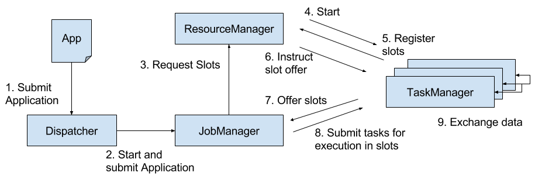
*Figure 3-1. Application submission and component interactions*

Please note that `Figure 3-1` is a high-level sketch to visualize the responsibilities and interactions of the components. Depending on the the environment (YARN, Mesos, Kubernetes, stand-alone cluster), some steps can be omitted or components might run in the same process. For instance, in a stand-alone setup, i.e., a setup without a resource provider, the ResourceManager can only distribute the slots of manually started TaskManagers and cannot start new TaskManagers. In `Chapter 9`, we will discuss how to setup and configure Flink for different environments.

### 3.1.2 Application Deployment
Flink applications can be deployed in two different styles.
+ `Framework style`: In this mode, Flink applications are packaged into a JAR file and submitted by a client to a running service. The service can be a Flink `Dispatcher`, a Flink `JobManager`, or YARN’s `ResourceManager`. In either case, there is a service running that accepts the Flink application and ensures it is executed. If the application was submitted to a `JobManager`, it immediately starts to execute the application. If the application was submitted to a `Dispatcher` or YARN `ResourceManager`, it will spin up a `JobManager`, hand over the application, and the `JobManager` continues to execute the application.
+ `Library style`: In this mode, the Flink application is bundled in an application-specific container image, such as a Docker image. The image also includes the code to run a `JobManager` and `ResourceManager`. When an container is started from the image, it automatically launches the `ResourceManager` and the `JobManager` and hands over the bundled job. A second type of image is used to deploy `TaskManagers`. When a container is started, it automatically starts a `TaskManager`, which connects to the `ResourceManager` and registers its slots. The `TaskManager` image can be application independent. Typically, an external resource manager such as `Kubernetes` takes care of starting the images and ensuring that of each type a certain number of containers is running.

The framework style is follows the traditional approach of submitting an application (or query) via a client to a running service. In the library mode, there is no Flink service continuously running. Instead, Flink is bundled as a library together with the application in a container image. This deployment mode is also common for microservice architectures. We discuss the topic of application deployment in more detail in `Chapter 10`.

### 3.1.3 Task Execution🐬
A `TaskManager` can execute several tasks at the same time. These tasks can be of the same operator (data parallelism), a different operator (task parallelism), or even from a different application (job parallelism). A `TaskManager` provides a certain number of processing slots to control the number of tasks that it can concurrently execute. A processing slot is able to execute one slice of an application, i.e., one task of each operator of the application. `Figure 3-2` visualizes the relationship of TaskManagers, slots, tasks, and operators.

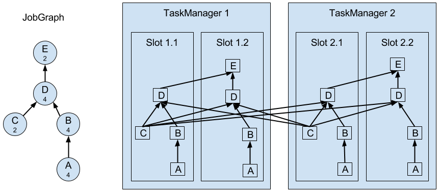
*Figure 3-2. Operators, Tasks, and Processing Slots*

On the left hand side you see a `JobGraph` - the non-parallel representation of an application - consisting of five operators. Operators `A` and `C` are sources and operator `E` is a sink. Operators `C` and `E` have a parallelism of two. The other operators have a parallelism of four. Since the maximum operator parallelism is four, the application requires at least four available processing slots to be executed. Given two `TaskManagers` with two processing slots each, this requirement is fulfilled. The `JobManager` parallelizes the `JobGraph` into an `ExecutionGraph` and assigns the tasks to the four available slots. The tasks of the operators with a parallelism of four are assigned to each slot. The two tasks of operators `C` and `E` are assigned to slots 1.1 and 2.1 and slots 1.2 and 2.2, respectively. Scheduling tasks as slices to slots has the advantage that many tasks are co-located on the `TaskManager` which means that they can efficiently exchange data without accessing the network.

A `TaskManager` executes its tasks multi-threaded in the same JVM process. Threads are more lightweight than individual processes and have lower communication costs but do not strictly isolate tasks from each other. Hence, a single misbehaving task can kill the whole `TaskManager` process and all tasks which run on the `TaskManager`. Therefore, it is possible to isolate applications across `TaskManagers`, i.e., a `TaskManager` runs only tasks of one application. By leveraging thread-parallelism inside of a TaskManager and the option to deploy several `TaskManager` processes per host, Flink offers a lot of flexibility to trade off performance and resource isolation when deploying applications. We will discuss the configuration and setup of Flink clusters in detail in `Chapter 9`.

### 3.1.4 Highly-Available Setup
Streaming applications are typically designed to run 24/7. Hence, it is important that their execution does not stop even if an involved process fails. Recovery from failures consists of two aspects, first restarting failed processes and second restarting the application and recovering its state. In this section, we explain how Flink restarts failed processes. Restoring the state of an application is discussed in a later section of this chapter.

As discussed before, Flink requires a sufficient amount of processing slots in order to execute all tasks of an application. Given a Flink setup with 4 `TaskManagers` that provide 2 `slots` each, a streaming application can be executed with a maximum parallelism of 8. If one of the `TaskManagers` fails, the number of available slots is reduced to 6. In this situation, the `JobManager` will ask the `ResourceManager` to provide more processing slots. If this is not possible, for example because the application runs in a stand-alone cluster, the `JobManager` scales the application down and executes it on fewer slots until more slots become available.

A more challenging problem than `TaskManager` failures are `JobManager` failures. The `JobManager` controls the execution of a streaming application and keeps metadata about its execution, such as pointers to completed checkpoints. A streaming application cannot continue processing if the associated `JobManager` process disappears which makes the `JobManager` a single-point-of-failure in Flink. To overcome this problem, Flink features a high-availability mode that migrates the responsibility and metadata for a job to another `JobManager` in case that the original `JobManager` disappears.

Flink’s high-availability mode is based on `Apache ZooKeeper`, a system for distributed services that require coordination and consensus. Flink uses `ZooKeeper` for leader election and as a highly-available and durable data store. When operating in high-availability mode, the `JobManager` writes the `JobGraph` and all required metadata such as the application’s JAR file into a remote persistent storage system. In addition, the `JobManager` writes a pointer to the storage location into `ZooKeeper`’s data store. During the execution of an application, the `JobManager` receives the state handles (storage locations) of the individual task checkpoints. Upon the completion of a checkpoint, i.e., when all tasks have successfully written their state into the remote storage, the `JobManager` writes the state handles to the remote storage and a pointer to this location to `ZooKeeper`. Hence, all data that is required to recover from a `JobManager` failure is stored in the remote storage and `ZooKeeper` holds pointers to the storage locations. `Figure 3-3` illustrates this design.

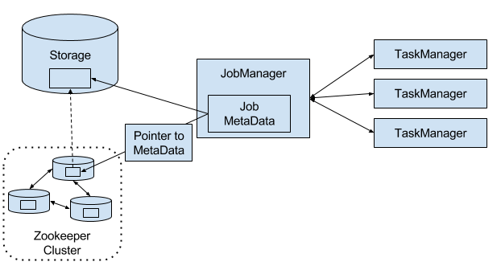
*Figure 3-3. A highly-available Flink Setup*

When a `JobManager` fails, all tasks that belong to its application are automatically cancelled. A new `JobManager` that takes over the work of the failed master performs the following steps.
1. It requests the storage locations from `ZooKeeper` to fetch the `JobGraph`, the JAR file, and the state handles of the last checkpoint of the application from the remote storage.
2. It requests processing slots from the `ResourceManager` to continue executing the application.
3. It restarts the application and resets the state of all its tasks to the last completed checkpoint.

When running an application as a library deployment in a container environment, such as `Kubernetes`, failed `JobManager` or `TaskManager` containers can be automatically restarted. When running on `YARN` or on `Mesos`, Flink’s remaining processes trigger the restart of `JobManager` or `TaskManager` processes. Flink does not provide tooling to restart failed processes when running in a stand-alone cluster. Hence, it can be useful to run stand-by `JobManagers` and `TaskManager` that can take over the work of failed processes. We will discuss the configuration of highly available Flink setups later in `Chapter 9`.

## 3.2 Data Transfer in Flink🐬
The tasks of a running application are continuously exchanging data. The `TaskManagers` take care of shipping data from sending tasks to receiving tasks. The network component of a `TaskManager` collect records in buffers before they are shipped, i.e., records are not shipped one-by-one but batched into buffers. This technique is fundamental to effectively utilize the networking resource and achieve high throughput. The mechanism is similar to buffering techniques used in networking or disk IO protocols. **Note shipping records in buffers does imply that Flink’s processing model is based on micro-batches**.

Each `TaskManager` has a pool of network buffers (by default `32KB` in size) which are used to send and receive data. If the sender and receiver tasks run in separate `TaskManager` processes, they communicate via the network stack of the operating system. Streaming applications need to exchange data in a pipelined fashion, i.e., each pair of `TaskManagers` maintains a permanent TCP connection to exchange data. In case of a shuffle connection pattern, each sender task needs to be able to send data to each receiving task. A `TaskManager` needs one dedicated network buffer for each receiving task that any of its tasks need to send data to. Once a buffer is filled, it is shipped over the network to the receiving task. On the receiver side, each receiving task needs one network buffer for each of its connected sending tasks. `Figure 3-4` visualizes this architecture.

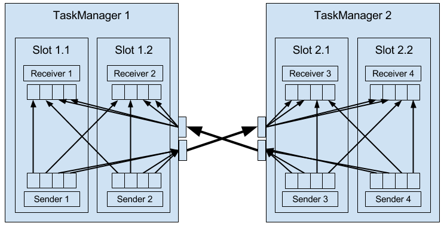
*Figure 3-4. Data Transfer in Flink*

The figure shows four sender and four receiver tasks. Each sender task has four network buffers to send data to each receiver task and each receiver task has four buffers to receive data. Buffers which need to be sent to the other `TaskManager` are multiplexed over the same network connection. In order to enable a smooth pipelined data exchange, a `TaskManager` must be able to provide enough buffers to serve all outgoing and incoming connections concurrently. In case of a shuffle or broadcast connection, each sending task needs a buffer for each receiving task, i.e, the number of required buffers is quadratic to the parallelism of the involved operators.

If the sender and receiver task run in the same `TaskManager` process, the sender task serializes the outgoing records into a byte buffer and puts the buffer into a queue once it is filled. The receiving task takes the buffer from the queue and deserializes the incoming records. Hence, no network communication is involved. Serializing records between `TaskManager-local` tasks has the advantage that it decouples the tasks and allows to use mutable objects in tasks which can considerably improve the performance because it reduces object instantiations and garbage collection. Once an object has been serialized, it can be safely modified.

On the other hand, serialization can cause significant computational overhead. Therefore, Flink can - under certain conditions - chain multiple DataStream operators into a single task. Operators in the same task communicate by passing objects through nested function calls which avoids serialization. The concept of operator chaining is discussed in more detail in `Chapter 10`.

### 3.2.1 High Throughput and Low Latency
Sending individual records over a network connection is inefficient and causes significant overhead. Buffering is a mandatory technique to fully utilize the bandwidth of network connections. In the context of stream processing, one disadvantage of buffering is that it adds latency because records are collected in a buffer instead of being immediately shipped. If a sender task only rarely produces records for a specific receiving task, it might take a long time until the respective buffer is filled and shipped. Because this would cause high processing latencies, Flink ensures that each buffer is shipped after a certain period of time regardless of how much it is filled. This timeout can be interpreted as an upper bound for the latency added by a network connection. However, the threshold does not serve as a strict latency SLA for the job as a whole because a job might involve multiple network connections and it does also not account for delays caused by the actual processing.

### 3.2.2 Flow Control with Back Pressure
Streaming applications that ingest streams with high volume can easily come to a point where a task is not able to process its input data at the rate at which it arrives. This might happen if the volume of an input stream is too high for the amount of resources allocated to a certain operator or if the input rate of an operator significantly varies and causes spikes of high load. Regardless of the reason why an operator cannot handle its input, this situation should never be a reason for a stream processor to terminate an application. Instead the stream processor should gracefully throttle the rate at which a streaming application ingests its input to the maximum speed at which the application can process the data. With a decent monitoring infrastructure in place, a throttling situation can be easily detected and usually resolved by adding more compute resources and increasing the parallelism of the bottleneck operator. The described flow control technique is called `backpressure` and an important feature of stream processors.

Flink naturally supports `backpressure` due to the design of its network layer. `Figure 3-5` illustrates the behavior of the network stack when a receiving task is not able to process its input data at the rate at which it is emitted by the sender task.

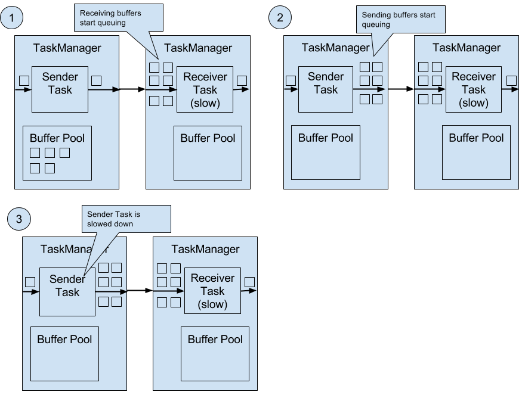
*Figure 3-5. Backpressure in Flink*

The figure shows a sender and a receiver task running on different machines.
1. When the input rate of the application increases, the sender task can cope with the load but the receiver task starts to fall behind and is no longer able to process records at the rate at which they arrive. Now the receiving `TaskManager` starts to queue buffers with received data. At some point the buffer pool of the receiving `TaskManager` is exhausted and can no longer continue to buffer arriving data.
2. The sending `TaskManager` starts queuing buffers with outgoing records until its own buffer pool is empty.
3. Finally, the sender task cannot emit more data and blocks until a new buffer becomes available. A task which is blocked due to a slow receiver behaves itself like a slow receiver and in turn slows down its predecessors. The slowdown escalates up to the sources of the streaming application. Eventually, the whole application is slowed down to the processing rate of the slowest operator.

## 3.3 Event Time Processing
In `Chapter 2`, we highlighted the importance of time semantics for stream processing applications and explained the differences between `processing-time` and `event-time`. While `processing-time` is easy to understand because it is based on the local time of the processing machine, it produces somewhat arbitrary, inconsistent, and non-reproducible results. In contrast, `event-time` semantics yield reproducible and consistent results which is a hard requirement for many stream processing use cases. However, `event-time` applications require some additional configuration compared to applications with `processing-time` semantics. Also the internals of a stream processor that supports `event-time` are more involved than the internals of a system that purely operates in `processing-time`.

Flink provides intuitive and easy-to-use primitives for common `event-time` processing operations but also exposes expressive APIs to implement more advanced `event-time` applications with custom operators. For such advanced applications, a good understanding of Flink’s internal time handling is often helpful and sometimes required. The previous chapter introduced two concepts that Flink leverages to provide `event-time` semantics: `record timestamps` and `watermarks`. In the following we will describe how Flink internally implements and handles timestamps and watermarks to support streaming applications with `event-time` semantics.

### 3.3.1 Timestamps
All records that are processed by a Flink `event-time` streaming application must have a timestamp. A timestamp associates the record with a specific point in time. Usually, the timestamp references the point in time at which the event that is encoded by the record happened. However, applications can freely choose the meaning of the timestamps as long as the timestamps of the stream records are roughly ascending as the stream is advancing. As motivated in `Chapter 2`, a certain degree of timestamp out-of-orderness is given in basically all real-world use cases.

When Flink processes a data stream in `event-time` mode, it evaluates time-based operators based on the timestamps of records. For example, a time-window operator assigns records to windows according to their associated timestamp. Flink encodes timestamps as `16-byte long` values and attaches them as metadata to records. Its built-in operators interpret the long value as a Unix timestamp with millisecond precision, i.e., the number of milliseconds since `1970-01-01-00:00:00.000`. However, custom operators can have their own interpretation and, for example, adjust the precision to microseconds.

### 3.3.2 Watermarks🐬
In addition to record timestamps, a Flink `event-time` application must also provide `watermarks`. `Watermarks` are used to derive the current `event-time` at each task in an `event-time` application. Time-based operators use this time to trigger computations and make progress. For example, a time-window operator finalizes a window computation and emits the result when the operator `event-time` passes the window’s end boundary.

In Flink, `watermarks` are implemented as special records holding a timestamp long value. Watermarks flow in a stream of regular records with annotated timestamps as `Figure 3-6` shows.

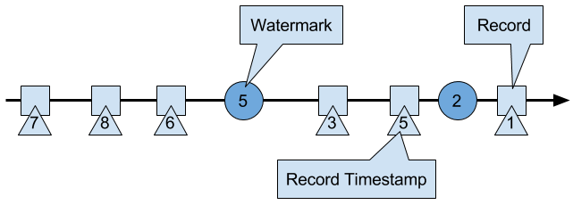
*Figure 3-6. A stream with timestamped records and watermarks*

`Watermarks` have two basic properties.

1. `Watermarks` must be monotonically increasing in order to ensure that the `event-time` clocks of tasks are progressing and not going backwards.
2. `Watermarks` are related to record timestamps. A `watermark` with a timestamp `t` indicates that all subsequent records should have `timestamps > t`.

The second property is used to handle streams with out-of-order record timestamps, such as the records with timestamps `3` and `5` in `Figure 3-6`. Tasks of time-based operators collect and process records with possibly unordered timestamps and finalize a computation when their `event-time` clock, which is advanced by received `watermarks`, indicates that no more records with relevant timestamps have to be expected. When a task receives a record that violates the `watermark` property and has smaller timestamps than a previously received `watermark`, it might be the case that the computation it would belong to has already been completed. Such records are called late records. Flink provides different mechanisms to deal with late records which are discussed in `Chapter 6`.

A very interesting property of `watermarks` is that they allow an application to control result completeness and latency. `Watermarks` that are very tight, i.e., close to the record timestamps, result in low processing latency because a task will only briefly wait for more records to arrive before finalizing a computation. At the same time, the result completeness might suffer because more records might not be included in the result and would be considered as late records. Inversely, very wide `watermarks` increase processing latency but improve result completeness.

### 3.3.3 Watermarks and Event Time🐬
In this section, we discuss how operators process `watermark` records. `Watermarks` are implemented in Flink as special records that are received and emitted by operator tasks. Tasks have an internal time service that maintains timers. A timer can be registered at the timer service to perform a computation at a specific point in time in the future. For example, a time-window task registers a timer for the ending time of each of its active windows in order to finalize a window when the event-time passed the window’s end boundary.

When a task receives a watermark, it performs the following steps.
1. The task updates its internal event-time clock based on the `watermark`’s timestamp.
2. The time service of the task identifies all timers with a time smaller than the updated `event-time`. The task invokes for each expired timer a call-back function that can perform a computation and emit records.
3. The task emits a `watermark` with the updated event-time.

Flink restricts the access to timestamps or `watermarks` through the DataStream API. Except for the `ProcessFunction`, functions are not able to read or modify record timestamps or `watermarks`. The `ProcessFunction` can read the timestamp of a currently processed record, request the current event-time of the operator, and register timers. None of the functions exposes an API to set the timestamps of emitted records, manipulate the `event-time` clock of a task, or emit `watermarks`. Instead, time-based DataStream operator tasks internally set the timestamps of emitted records to ensure that they are properly aligned with the emitted `watermarks`. For instance, a time-window operator task attaches the end time of a window as timestamp to all records emitted by the window computation before it emits the `watermark` with the timestamp that triggered the computation of the window.

We explained before that a task emits watermarks and updates its event-time clock when it receives a new watermark. How this is actually done deserves a detailed discussion. As discussed in Chapter 2, Flink processes a data stream in parallel by partitioning the stream and processing each partition by a separate operator task. A partition is a stream of timestamped records and watermarks. Depending on how an operator is connected with its predecessor or successor operators, the tasks of the operator can receive records and watermarks from one or more input partitions and emit records and watermarks to one or more output partitions. In the following we describe in detail how a task emits watermarks to multiple output tasks and how it computes its event-time clock from the watermarks it received from its input tasks.

A task maintains for each input partition a partition watermark. When it receives a watermark from a partition, it updates the respective partition watermark to be the maximum of the received watermark and the current partition watermark. Subsequently the task updates its event-time clock to be the minimum of all partition watermarks. If the event-time clock advances, the task processes all triggered timers and finally broadcasts its new event-time to all downstream tasks by emitting a corresponding watermark to all connected output partitions.

`Figure 3-7` visualizes how a task with four input partitions and three output partitions receives watermarks, updates its partition watermarks and event-time clock, and emits watermarks.

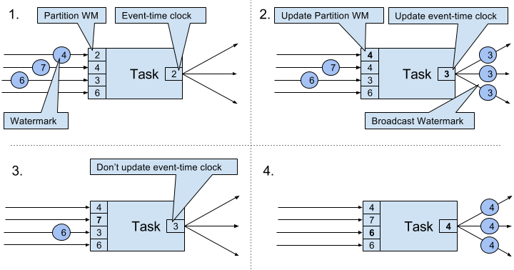
*Figure 3-7. Updating the event-time of a task by watermarks*

The tasks of operators with two or more input streams such as Union or CoFlatMap operators (see Chapter 5) also compute their event-time clock as the minimum of all partition watermarks, i.e., they do not distinguish between partition watermarks of different input streams. Consequently, records of both inputs are processed based on the same event-time clock.

The watermark handling and propagation algorithm of Flink ensures that operator tasks emit properly aligned timestamped records and watermarks. However, it relies on the fact that all partitions continuously provide increasing watermarks. As soon as one partition does not advance its watermarks or becomes completely idle and does not ship any records or watermarks, the event-time clock of a task will not advance and the timers of the task will not trigger. This situation is problematic for time-based operators that rely on an advancing clock to perform computations and clean up their state. Consequently, the processing latencies and state size of time-based operators can significantly increase if a task does not receive new watermarks from all input tasks in regular intervals.

A similar effect appears for operators with two input streams whose watermarks significantly diverge. The event-time clocks of a task with two input streams will correspond to the watermarks of the slower stream and usually the records or intermediate results of the faster stream are buffered in state before the event-time clock allows to process them.

## 3.4 Timestamp Assignment and Watermark Generation
So far we have explained what timestamps and watermarks are and how they are internally handled by Flink. However, we have not discussed yet where they originate from. Timestamps and watermarks are usually assigned and generated when a stream is ingested by a streaming application. Because the choice of the timestamp is application-specific and the watermarks depend on the timestamps and characteristics of the stream, applications have to explicitly assign timestamps and generate watermarks. A Flink DataStream application can assign timestamps and generate watermarks to a stream in three ways.

+ Timestamps and watermarks can be assigned and generated by a SourceFunction, i.e., when a stream is ingested into an application. A source function emits a stream of records. Records can be emitted together with an associated timestamp and watermarks can be emitted at any point in time as special records. If a source function (temporarily) does not emit anymore watermarks, it can declare itself as idle. Flink will exclude stream partitions produced by idle source functions from the watermark computation of subsequent operators. This can be used to address the problem of not advancing watermarks as discussed in the section before. Source functions are discussed in more detail in Chapter 7.
+ The DataStream API provides a user-defined function called AssignerWithPeriodicWatermarks that extracts a timestamp from each record and is periodically queried for the current watermark. The extracted timestamps are assigned to the respective record and the queried watermarks are ingested into the stream. This function will be discussed in Chapter 6.
+ Another user-defined function also extracts a timestamp from each record. In contrast to the AssignerWithPeriodicWatermarks function, this function can, but does not need to, extract a watermark from each record. The function is called AssignerWithPunctuatedWatermarks and can be used to generate watermarks that are encoded in the input records. This function will be discussed in Chapter 6 as well.

User-defined timestamp assignment functions to are usually applied as closed to a source operator as possible because it is usually easier to reason about the out-of-orderness of timestamps before the stream was processed by a operator. This is also the reason why it is often not a good idea to override existing timestamps and watermarks in the middle of a streaming applications, although this is possible with the user-defined functions.

## 3.5 State Management
In Chapter 2 we pointed out that most streaming applications are stateful. Many operators continuously read and update some kind of state such as records collected in a window, reading positions of an input source, or custom, application-specific operator state like machine learning models. Flink treats all state - regardless of built-in or user-defined operators - the same. In this section we discuss the different types of state that Flink supports. We explain how state is stored and maintained by state backends and how stateful applications can be scaled by redistributing state.

In general, all data which are maintained by task and which are used to compute the results of the function belong to the state of the task. You can think of state as any local or instance variable that is accessed by a task’s business logic. `Figure 3-8` visualizes the interaction of a task and its state.

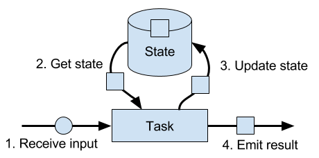
*Figure 3-8.  A stateful stream processing task*

A task receives some input data. While processing the data, the task can read and update its state and compute its result based on its input data and state. A simple example is a task that continuously counts how many records it receives. When the task receives a new record, it accesses the state to get the current count, increments the count, updates the state, and emits the new count.

The application logic to read from and write to state is often straightforward. However, efficient and reliable management of state is more challenging. This includes handling of very large state, possibly exceeding memory, and ensuring that no state is lost in case of failures. All issues related to state consistency, failure handling, and efficient storage and retrieval are the responsibility and taken care of by Flink such that developers can focus on the logic of their applications.

In Flink, state is always associated with a specific operator. In order to make Flink’s runtime aware of the state of an operator, the operator needs to register its state. There are two types of state, Operator State and Keyed State, that are accessible from different scopes and which are discussed in the following sections.

### 3.5.1 Operator State
Operator state is scoped to an operator task. This means that all records which are processed by the same parallel task have access to the same state. Operator state cannot be accessed by another task of the same or a different operator. `Figure 3-9` visualizes how tasks access operator state.

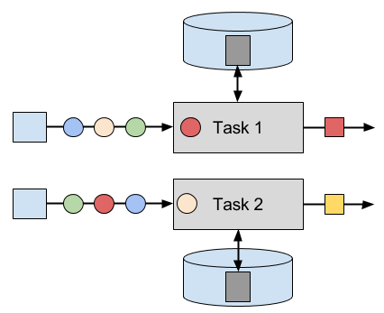
*Figure 3-9. Tasks with operator state*

Flink offers three primitives for operator state.
+ List State represents state as a list of entries.
+ Union List State represents state as a list of entries as well. It differs from regular list state in how it is restored in case of a failure or if an application is started from a savepoint. We discussed this difference later in this section.
+ Broadcast State is designed for the special case where the state of each task of an operator is identical. This property can be leveraged during checkpoints and when rescaling an operator. Both aspects are discussed in later sections of this chapter.

### 3.5.2 Keyed State
Keyed state is scoped to a key that is defined on the records of an operator’s input stream. Flink maintains one state instance per key value and partitions all records with the same key to the operator task that maintains the state for this key. When a task processes a record, it automatically scopes the state access to the key of the current record. Consequently, all records with the same key access the same state. `Figure 3-10` shows how tasks interact with keyed state.

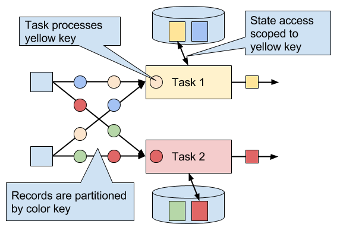
*Figure 3-10. Tasks with keyed state*

You can think of keyed state as a key-value map that is partitioned (or sharded) on the key across all parallel tasks of an operator. Flink provides a different primitives for keyed state that determine the type of the value that is stored for each key in this distribute map. We will briefly discuss the most common keyed state primitives.

+ Value State stores a single value of arbitrary type per key. Also complex data structures can be stored as value state.
+ List State stores a list of values per key. The list entries can be of arbitrary type.
+ Map State stores a key-value map per key. Key and value of the map can be of arbitrary type.

State primitives expose the structure of the state to Flink and enable more efficient state accesses.

### 3.5.3 State Backends
A task of a stateful operator commonly reads and updates its state for each incoming record. Because efficient state access is crucial to process records with low latency, each parallel task locally maintains its state to ensure local state accesses. How exactly the state is stored, accessed, and maintained is determined by a pluggable component that is called state backend. A state backend is responsible for mainly two aspects, local state management and checkpointing state to a remote location.

For local state management, a state backend ensures that keyed state is correctly scoped to the current key and stores and accesses all keyed state. Flink provides state backends that manage keyed state as objects stored in in-memory data structures on the JVM heap. Another state backend serializes state objects and puts them into RocksDB which writes them local hard disks. While the first option gives very fast state accesses, it is bound to the size of the memory. Accessing state stored by the RocksDB state backend is slower but its state may grow very large.

State checkpointing is important because Flink is a distributed system and state is only locally maintained. A TaskManager process (and with it all tasks running on it) may fail at any point in time such that its storage must be considered as volatile. A state backends takes care of checkpointing the state of a task to a remote and persistent storage. The remote storage for checkpointing can be a distributed file system or a database system. State backends differ in how the state is checkpointed. For instance the RocksDB state backend supports asynchronous and incremental checkpoints which significantly reduces the checkpointing overhead for very large state sizes.

We will discuss the different state backends and their pros and cons in more detail in Chapter 8.

### 3.5.4 Scaling Stateful Operators
A common requirement for streaming applications is to adjust the parallelism of operators due to increasing or decreasing input rates. While scaling stateless operators is trivial, changing the parallelism of stateful operators is much more challenging because their state needs to be re-partitioned and assigned to more or fewer parallel tasks. Flink supports four patterns to scale different types of state.

Operators with keyed state are scaled by re-partitioning keys to fewer or more tasks. However, to improve the efficiency of the necessary state transfer between tasks, Flink does not re-distributed individual keys. Instead, Flink organizes keys in so-called Key Groups. A key group is a partition of keys and Flink’s unit to assign keys to tasks. Figure 3-11 visualizes how keyed state is repartitioned in key groups.

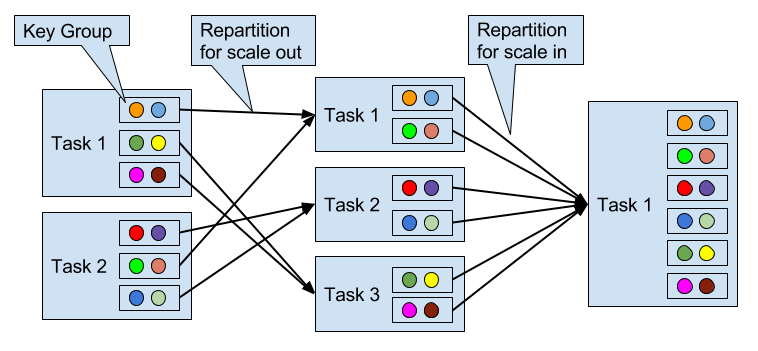
*Figure 3-11. Scaling an operator with keyed state out and in*

Operators with operator list state are scaled by redistributing the list entries. Conceptually, the list entries of all parallel operator tasks are collected and evenly re-distributed to a smaller or larger number of tasks. If there are fewer list entries than the new parallelism of an operator, some tasks will not receive state and have to rebuilt it from scratch. Figure 3-12 shows the redistribution of operator list state.

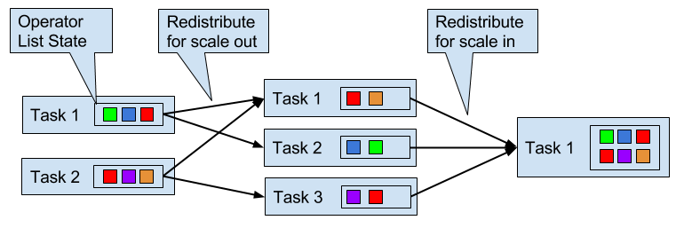
*Figure 3-12. Scaling an operator with operator list state out and in*

Operators with operator union list state are scaled by broadcasting the full list of state entries to each task. The task can then choose which entries to use and which to discard. Figure 3-13 shows how operator union list state is redistributed.

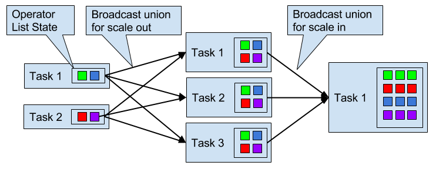
*Figure 3-13. Scaling an operator with operator union list state out and in*

Operators with operator broadcast state are scaled up by copying the state to new tasks. This works because broadcasting state ensures that all tasks have the same state. In case of down scaling, the surplus tasks are simply canceled since state is already replicated and will not be lost. Figure 3-14 visualizes the redistribution of operator broadcast state.

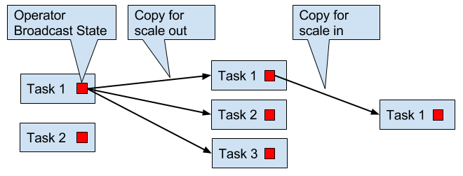
*Figure 3-14. Scaling an operator with operator broadcast state out and in*

## 3.6 Checkpoints, Savepoints, and State Recovery
Flink is a distributed data processing system and has as such to deal with failures such as killed processes, failing machines, and interrupted network connections. Since tasks maintain their state locally, Flink has to ensure that this state does not get lost and remains consistent in case of a failure.

In this section, we present Flink’s lightweight checkpointing and recovery mechanism to guarantee exactly-once state consistency. We also discuss Flink’s unique savepoint feature, a “swiss army knife”-like tool that addresses many challenges of operating streaming applications.

### 3.6.1 Consistent Checkpoints
Flink’s recovery mechanism is based on consistent checkpoints of application state. A consistent checkpoint of a stateful streaming application is a copy of the state of each of its tasks at a point when all tasks have processed exactly the same input. What this means can be explained by going through the steps of a naive algorithm that takes a consistent checkpoint of an application.

1. Pause the ingestion of all input streams.
2. Wait for all in-flight data to be completely processed, i.e., all tasks have processed all their input data.
3. Take a checkpoint by copying the state of each task to a remote, persistent storage. The checkpoint is complete when all tasks finished their copies.
4. Resume the ingestion of all streams.

Note that Flink does not implement this naive algorithm. We will present Flink’s more sophisticated checkpointing algorithm later in this section.

`Figure 3-15` shows a consistent checkpoint of a simple example application.

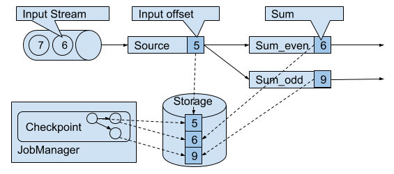
*Figure 3-15. A consistent checkpoint of a streaming application*

The application has a single source task that consumes a stream of increasing numbers, i.e., 1, 2, 3, and so on. The stream of numbers is partitioned into a stream of even and odd numbers. A sum operator computes with two tasks the running sums of all even and odd numbers. The source task stores the current offset of its input stream as state, the sum tasks persist the current sum value as state. In Figure 3-15, Flink took a checkpoint when the input offset was 5, and the sums were 6 and 9.

### 3.6.2 Recovery from Consistent Checkpoints
During the execution of a streaming application, Flink periodically takes consistent checkpoints of the applications state. In case of a failure, Flink uses the latest checkpoint to consistently restore the applications state and restarts the processing. `Figure 3-16` visualizes the recovery process.

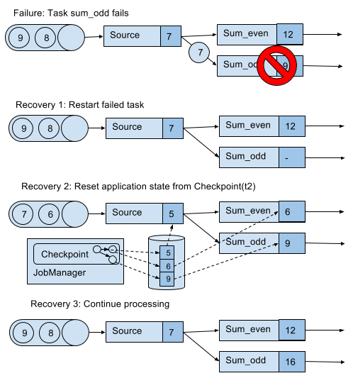
*Figure 3-16. Recovering an application from a checkpoint*

An application is recovered in three steps.

1. Restart all failed tasks.
2. Reset the state of the whole application to the latest checkpoint, i.e., resetting the state of each task.
3. Resume the processing of all tasks.

This checkpointing and recovery mechanism is able to provide exactly-once consistency for application state, given that all operators checkpoint and restore all of their state and that all input streams are reset to the position up to which they were consumed when the checkpoint was taken. Whether a data source can reset its input stream depends on its implementation and the external system or interface from which the stream is consumed. For instance, event logs like Apache Kafka can provide records from a previous offset of the stream. In contrast, a stream consumed from a socket cannot be reset because sockets discard data once it has been consumed. Consequently, an application can only be operated under exactly-once state consistency if all input streams are consumed by resettable data sources.

After an application is restarted from a checkpoint, its internal state is exactly the same as when the checkpoint was taken. It then starts to consume and process all data that was processed between the checkpoint and the failure. Although this means that some messages are processed twice (before and after the failure) by Flink operators, the mechanism still achieves exactly-once state consistency because the state of all operators was reset to a point that had not seen this data yet.

We also need to point out that Flink’s checkpointing and recovery mechanism only resets the internal state of a streaming application. Once the recovery completed, some records have been processed more than once. Depending on the sink operators of an applications, it might happen that some result records are emitted multiple times to downstream systems, such as an event log, a file system, or a database. For selected systems, Flink provides sink functions that feature exactly-once output for example by committing emitted records on checkpoint completion. Another approach that works for many common sink systems are idempotent updates. The challenge of end-to-end exactly-once applications and approaches to address it are discussed in detail in `Chapter 7`.

### 3.6.3 Flink’s Lightweight Checkpointing Algorithm
Flink’s recovery mechanism is based on consistent application checkpoints. The naive approach to take a checkpoint from a streaming application, i.e, to pause, checkpoint, and resume the application, suffers from its “stop-the-world” behavior which is not acceptable for applications that have even moderate latency requirements. Instead, Flink implements an algorithm which is based on the well-known Chandy-Lamport algorithm for distributed snapshots. The algorithm does not pause the complete application but decouples the checkpointing of individual tasks such that some tasks continue processing while others persist their state.In the following we explain how this algorithm works.

Flink’s checkpointing algorithm is based on a special type of record that is called checkpoint barrier. Similar to watermarks, checkpoint barriers are injected by source operators into the regular stream of records and cannot overtake or be passed by any other record. A checkpoint barrier carries a checkpoint ID to identify the checkpoint it belongs to and logically splits a stream into two parts. All state modifications due to records that precede a barrier are included in the checkpoint and all modifications due to records that follow the barrier are included in a later checkpoint.

We use an example of a simple streaming application to explain the algorithm step-by-step. The application consists of two source tasks which consume a stream of increasing numbers. The output of the source tasks is partitioned into streams of even and odd numbers. Each partition is processed by a task that computes the sum of all received number and forwards the updated sum to a sink. The application is depicted in `Figure 3-17`.

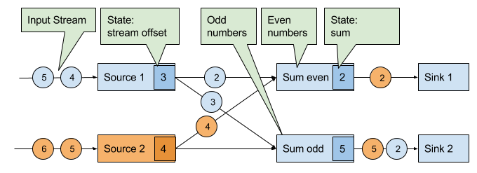
*Figure 3-17. An example streaming application with two stateful sources, two stateful tasks, and two stateless sinks*

A checkpoint is initiated by the JobManager by sending a message with a new checkpoint ID to each data source task as shown in `Figure 3-18`.

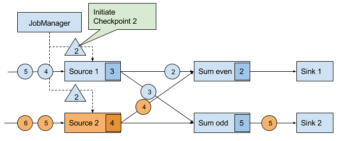
*Figure 3-18. The JobManager initiates a checkpoint by sending a message to all sources*

When a data source task receives the message, it pauses emitting records, triggers a checkpoint of its local state at the state backend, and broadcasts checkpoint barriers with the checkpoint ID via all outgoing stream partitions. The state backend notifies the task once the task checkpoint is complete and the task acknowledges the checkpoint at the JobManager. After all barriers are sent out, the source continues its regular operations. By injecting the barrier into its output stream, the source function defines the stream position on which the checkpoint is taken. `Figure 3-19` shows the streaming application after both source tasks checkpointed their local state and emitted checkpoint barriers.

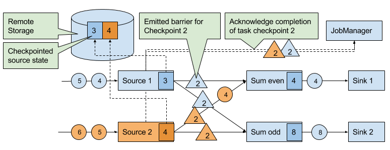
*Figure 3-19. Sources checkpoint their state and emit a checkpoint barrier*

The checkpoint barriers emitted by the source tasks are shipped to the subsequent tasks. Similar to watermarks, checkpoint barriers are broadcasted to all connected parallel tasks. Checkpoint barriers must be broadcasted to ensure that each task receives a checkpoint from each of its input streams, i.e., all downstream connected tasks. When a task receives a barrier for a new checkpoint, it waits for the arrival of all barriers for the checkpoint. While it is waiting, it continues processing records from stream partitions that did not provided a barrier yet. Records which arrive via partitions that forwarded a barrier already must not be processed and need to be buffered. The process of waiting for all barriers to arrive is called barrier alignment and depicted in `Figure 3-20`.

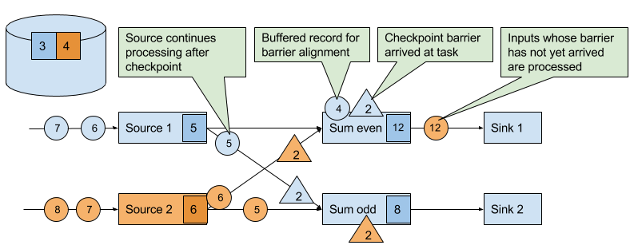
*Figure 3-20. Tasks wait until they received a barrier on each input stream. Meanwhile they bu er records of input streams for which a barrier did arrived. All other records are regularly processed*

As soon as all barriers have arrived, the task initiates a checkpoint at the state backend and broadcasts the checkpoint barrier to all of its downstream connected tasks as shown in `Figure 3-21`.

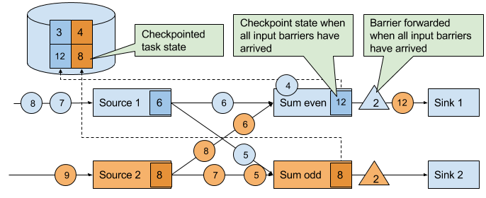
*Figure 3-21. Tasks checkpoint their state once all barriers have been received. Subsequently they forward the checkpoint barrier*

Once all checkpoint barriers have been emitted, the task starts to process the buffered records. After all buffered records have been emitted, the task continues processing its input streams. `Figure 3-22` shows the application at this point.

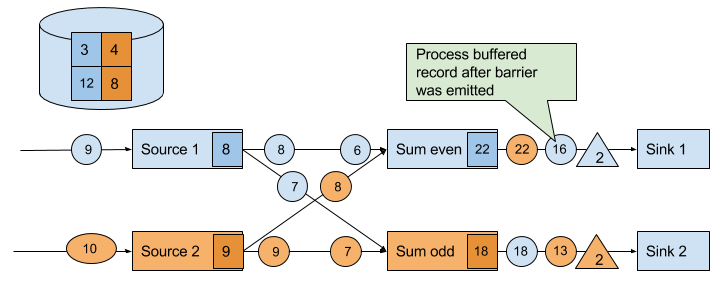
*Figure 3-22. Tasks continue their regular processing after the checkpoint barrier was forwarded*

Eventually, the checkpoint barriers arrive at a sink task. When a sink task receives a barrier, it performs a barrier alignment, checkpoints its own state, and acknowledges the reception of the barrier to the JobManager. The JobManager records the checkpoint of an application as completed once it received a checkpoint acknowledgement from all tasks of the application. `Figure 3-23` shows the final step of the checkpointing algorithm. The completed checkpoint can be used to recover the application from a failure as described before.

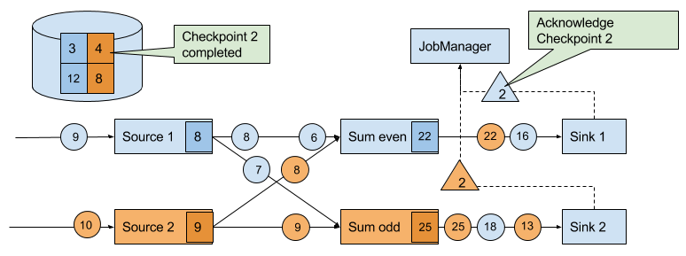
*Figure 3-23. Sinks acknowledge the reception of a checkpoint barriers to the JobManager. A checkpoint is complete when all sinks acknowledge the barriers of a checkpoint*

The discussed algorithm produces consistent distributed checkpoints from streaming applications without stopping the whole application. However, it has two properties that can increase the latency of an application. Flink’s implementation features tweaks that improve the performance of the application under certain conditions.

The first spot is the process of checkpointing the state of a task. During this step, a task is blocked and its input is buffered. Since operator state can become quite large and checkpointing means sending the data over the network to a remote storage system, taking a checkpoint can easily take several seconds, much too long for latency sensitive applications. In Flink’s design it is the responsibility of the state backend to perform a checkpoint. How exactly the state of a task is copied depends on the implementation of the state backend and can be optimized. For example, the RocksDB state backend supports asynchronous and incremental checkpoints. When a checkpoint is triggered, the RocksDB state backend, locally snapshots all state modifications since the last checkpoint (a very lightweight and fast operation due to RocksDBs design) and immediately returns such that the task can continue processing. A background thread asynchronously copies the local snapshot to the remote storage and notifies the task once it completed the checkpoint. Asynchronous checkpointing significantly reduces the latency of copying state to remote storage. Incremental checkpointing reduces the amount of data to transfer.

Another reason for increased latency can result from the record buffering during the barrier alignment step. For applications that require consistently very low latency and can tolerate at-least-once state guarantees, Flink can be configured to process all arriving records during buffer alignment instead of buffering those for which the barrier has already arrived. Once all barriers for a checkpoint have arrived, the operator checkpoints the state, which might now also include modifications cause by records that would usually belong to the next checkpoint. In case of a failure, these records will be processed again which means that the checkpoint provides at-least-once instead of exactly-once consistency guarantees.

### 3.6.4 Savepoints
Flink’s recovery algorithm is based on state checkpoints. Checkpoints are periodically taken and automatically discarded when a new checkpoint completes. Their sole purpose is to ensure that in case of a failure an application can be restarted without losing state. However, consistent snapshots of the state of an application can be used for many more purposes.

One of Flink’s most valuable and unique features are savepoints. In principle, savepoints are checkpoints with some additional metadata and are created using the same algorithm as checkpoints. Flink does not automatically take a savepoint, but a user (or external scheduler) has to trigger its creation. Flink does also not automatically clean up savepoints.

Given an application and a compatible savepoint, you can start the application from the savepoint which will initialize state of the application to the state of the savepoint and run the application from the point at which the savepoint was taken. While this sounds basically the same as recovering an application from a failure using a checkpoint, failure recovery is actually just a special case because it starts the same application with the same configuration on the same cluster. Starting an application from a savepoint allows you to do much more.

You can start a different but compatible application from a savepoint. Hence you can fix bugs in your application logic and reprocess as many events as your streaming source can provide in order to repair your results. Modified applications can also be used to run A/B tests or what-if scenarios with different business logic. Note that the application and the savepoint must be compatible, i.e., the application must be able to load the state of the savepoint.
You can start the same application with a different parallelism and scale the application out or in.
You can start the same application on a different cluster. This allows you to migrate an application to a newer Flink version or to a different cluster or data-center.
You can use a savepoint to pause an application and resume it later.
You can also just take a savepoint to version and archive the state of an application.
Since savepoints are such a powerful feature, many users periodically take savepoints to be able to go back in time. One of the most interesting applications of savepoints we have seen in the wild is to migrate streaming applications to the data center that provides the lowest instance prices.

## 3.7 Summary
In this chapter we have discussed Flink’s high-level architecture and the internals of its networking stack, event-time processing mode, state management, and failure recovery mechanism. You will find knowledge about these internals helpful when designing advanced streaming applications, setting up and configuring clusters, and operating streaming applications as well as reasoning about their performance.

