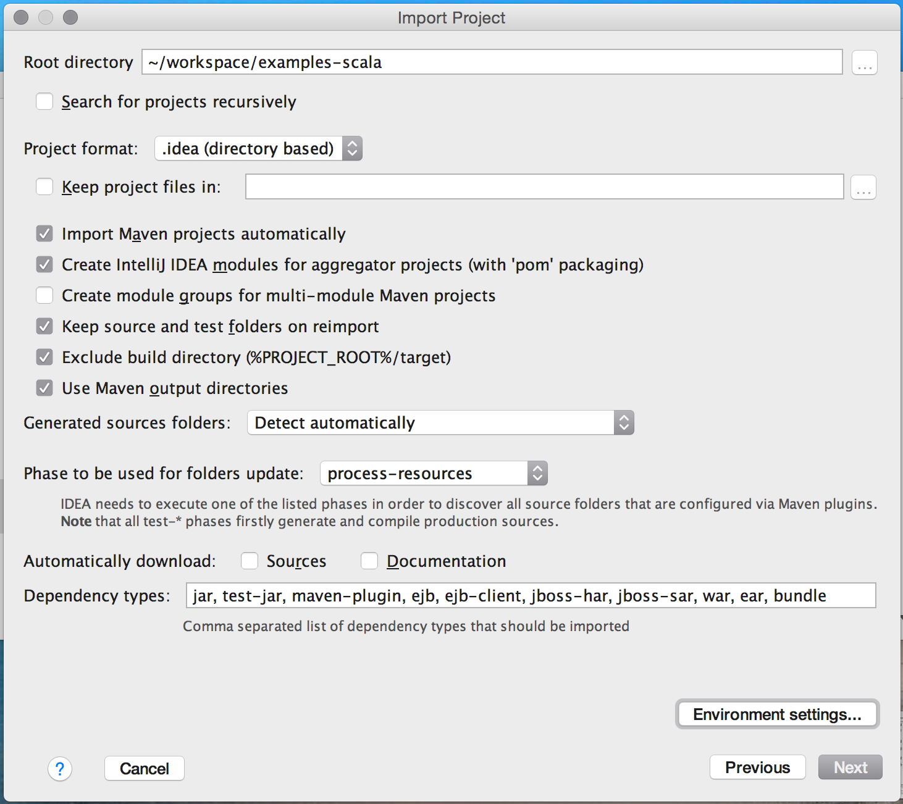
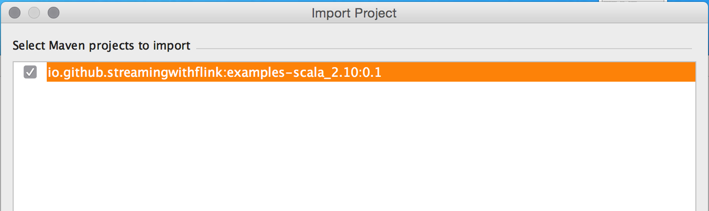
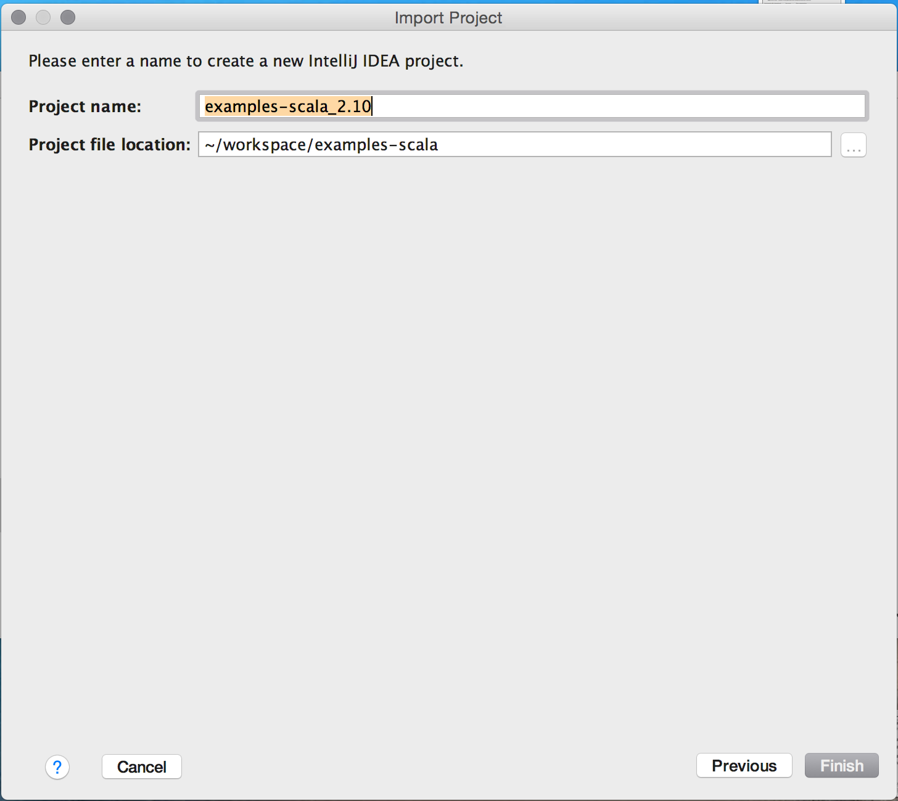

# Chapter 4. Setting up a development environment for Apache Flink
Time to get our hands dirty and start developing Flink applications! In this chapter, you will learn how to setup an environment to develop, run, and debug Flink applications.

We will start discussing required software and explain how to obtain the code examples of this book. Using these examples, we will show how Flink applications are executed and debugged in an IDE. Finally, we show how to bootstrap a Flink Maven project that serves as a starting point for a new application.

## 4.1 Required Software
First, let’s discuss the software that is required to develop Flink applications. You can develop and execute Flink applications on Linux, macOS, and Windows. However, UNIX-based setups enjoy the richest tooling support because this environment is preferred by most Flink developers. We will be assuming a UNIX-based setup in the rest of this chapter. As a Windows user you can use Windows subsystem for Linux (WSL), Cygwin, or a Linux virtual machine to run Flink in a UNIX environment.

Flink’s DataStream API is available for Java and Scala. Hence, a Java JDK is required to implement Flink DataStream applications:
+ Java JDK 8 (or higher). A Java JRE is not sufficient.

We assume that the following software is installed as well, although it is not strictly required to develop Flink applications:
+ Apache Maven 3.x. The code examples of the book use Maven build management. Moreover, Flink provides Maven archetypes to bootstrap new Flink Maven projects.
+ an IDE for Java and/or Scala development. Common choices are IntelliJ IDEA, Eclipse, or Netbeans with appropriate plugins installed. We recommend using IntelliJ IDEA. You can follow the instructions in https://www.jetbrains.com/idea/download/ to download and install it.

## 4.2 Run and debug Flink applications in an IDE
Even though Flink is a distributed data processing system, you will typically develop and run initial tests on your local machine. This makes development easier and simplifies cluster deployment, as you can run the exact same code in a cluster environment without making any changes. In the following, we describe how to obtain the code examples of the book, how to import them into IntelliJ, how to run an example application, and how to debug it.

### 4.2.1 Import the book’s examples in your IDE
The code examples of this book are hosted on GitHub. At [https://github.com/streaming-with-flink](http://github.com/streaming-with-flink), you will find one repository with Scala examples and one repository with Java examples. We will be using the Scala repository for the setup, but you should be able to follow the same instructions if you prefer Java.

Open a terminal and run the following Git command to clone the examples repository to your local machine.
```
git clone https://github.com/streaming-with-flink/examples-scala
```

You can also download the source code of the examples as a zip-archive from Github.
```
wget https://github.com/streaming-with-flink/examples-scala/archive/master.zip
unzip master.zip
```

The book examples are provided as a Maven project. You will find the source code in the `src/` directory, grouped by chapter:
```
.
└── main
    └── scala
        └── io
            └── github
                └── streamingwithflink
                    ├── chapter1
                    │   └── AverageSensorReadings.scala
                    ├── chapter4
                    │   └── ...
                    ├── chapter5
                    │   └── ...
                    ├── ...
                    │   └── ...
                    └── util
                        ├── SensorReading.scala
                        ├── SensorSource.scala
                        └── SensorTimeAssigner.scala
```

Now open your IDE and import the Maven project. The import steps are similar for most IDEs. In the following, we explain this step in detail for IntelliJ.

Select `Import Project`. Find the book examples folder and hit `Open -> Import project from external model -> Maven` and click `Next`. Select the project to import (there should be only one) and set up your SDK, give your project a name, and click `Finish`:


*Figure 4-1. Import the book examples repository into IntelliJ*


*Figure 4-2. Select the Maven project to import (TODO: Update Screenshot for Scala version 2.11)*


*Figure 4-3. Give your project a name and click Finish (TODO: Update Screenshot for Scala version 2.11)*

That’s it! You should now be able to browse and inspect the code of the book examples.

### 4.2.2 Run Flink applications in an IDE
Next, let’s run one of the book example applications in your IDE. Search for the `AverageSensorReadings` class and open it. As discussed in Chapter 1, the program generates read events for multiple thermal sensors, converts the temperature of the events from Fahrenheit to Celsius, and computes the average temperature of each sensor every second. The results of the program are emitted to standard-out. Just like many DataStream applications, the source, sink, and operators of the program are assembled in the `main()` method of the `AverageSensorReadings` class.

To start the the application, run the `main()` method. The output of the program is written to the standard-out (or console) window of your IDE. The output starts with a few log statements about the states that parallel operator tasks go through, such as SCHEDULING, DEPLOYING, and RUNNING. Once all tasks are up and running, the program starts to produce its results that should look similar to the following lines:
```
2> SensorReading(sensor_31,1515014051000,23.924656183848732)
4> SensorReading(sensor_32,1515014051000,4.118569049862492)
1> SensorReading(sensor_38,1515014051000,14.781835420242471)
3> SensorReading(sensor_34,1515014051000,23.871433252250583)
```

The program will continue to generate new events, process them, and emit new results every second until you terminate it.

Now let’s quickly discuss what is happening under the hood. As explained in Chapter 3, a Flink application is submitted to the JobManager (master) which distributes execution tasks to one or more TaskManagers (workers). Since Flink is a distributed system, the JobManager and TaskManagers typically run as separate JVM processes on different machines. Usually, the program’s `main()` method assembles the dataflow and submits it to a remote JobManager when the `StreamExecutionEnvironment.execute()` method is called.

However, there is also a mode in which the call of the `execute()` method starts a JobManager and a TaskManager (by default with as many slots as available CPU threads) as separate threads within the same JVM. Consequently, the whole Flink application is multi-threaded and executed within the same JVM process. This mode is used to execute a Flink program within an IDE.

### 4.2.3 Debug Flink applications in an IDE
Due to the single JVM execution mode, it is also possible to debug Flink applications in an IDE almost like any other program in your IDE. You can define breakpoints in the code and debug your application as you would normally do.

However, there are a few aspects to consider when debugging a Flink application in an IDE:
- Unless you specify a parallelism, a program is executed by as many threads as the number of CPU threads of your development machine. Hence, you should be aware that you might debug a multi-threaded program.
- In contrast to executing a Flink program by sending it to a remote JobManager, the program is executed in a single JVM. Therefore, certain issues, such as classloading issues, cannot be properly debugged.
- Although a program is executed in a single JVM, records are serialized for cross-thread communication and possibly state persistance.

## 4.3 Bootstrap a Flink Maven project
Importing the book examples repository into your IDE to experiment with Flink is a good first step. However, you should also know how to create a new Flink project from scratch.

Flink provides Maven archetypes to generate Maven projects for Java or Scala Flink applications. Open a terminal and run the following command to create a Flink Maven Quickstart Scala project as a starting point for your Flink application:
```
mvn archetype:generate                            \
   -DarchetypeGroupId=org.apache.flink            \
   -DarchetypeArtifactId=flink-quickstart-scala   \
   -DarchetypeVersion=1.5.2                       \
   -DgroupId=org.apache.flink.quickstart          \
   -DartifactId=flink-scala-project               \
   -Dversion=0.1                                  \
   -Dpackage=org.apache.flink.quickstart          \
   -DinteractiveMode=false
```

This will generate a Maven project for Flink 1.5.2 in a folder called `flink-scala-project`. You can change the Flink version, group and artifact IDs, version, and generated package by changing the respective parameters of the above `mvn` command. The generated folder contains a `src/` folder and a `pom.xml`file. The `src/` folder has the following structure:
```
src/
└── main
    ├── resources
    │   └── log4j.properties
    └── scala
        └── org
            └── apache
                └── flink
                    └── quickstart
                        ├── BatchJob.scala
                        ├── SocketTextStreamWordCount.scala
                        ├── StreamingJob.scala
                        └── WordCount.scala
```

The project contains two example applications and two skeleton files which you can use as templates for your own programs or simply delete. `WordCount.scala` contains an implementation of the popular WordCount example using Flink’s DataSet API. `SocketStreamWordCount.scala` uses the DataStream API to implement a streaming WordCount program that reads words from a text socket. `BatchJob.scala` and `StreamingJob.scala` provide skeleton code for a batch and a streaming Flink program respectively.

You can import the project in your IDE following the steps we described in the previous section or you can execute the following command to build a jar:
```
mvn clean package -Pbuild-jar
```

If the command is completed successfully, you will find a new `target` folder in your project folder which contains a jar file called `flink-scala-project-0.1.jar`. The generated `pom.xml` file also contains instructions on how to add new dependencies to your project.

