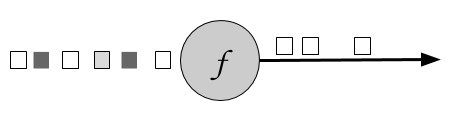
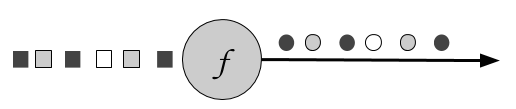
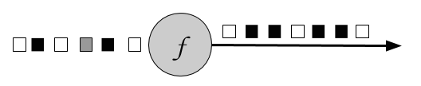
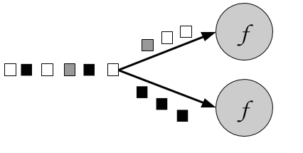
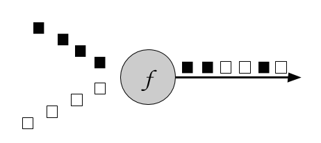
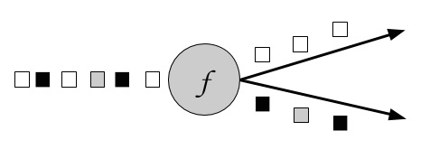
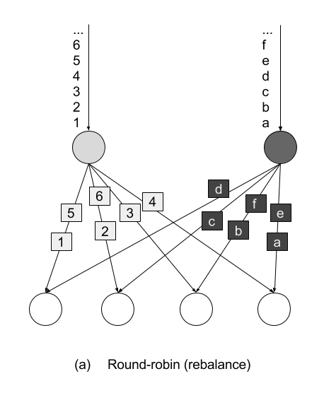
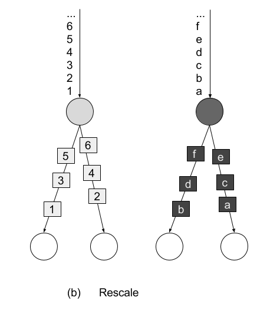

# Chapter 5. The DataStream API (v1.4.0)
This chapter introduces the basics of Flink’s DataStream API. We show the structure and components of a typical Flink streaming application, we discuss Flink’s type systems and the supported data types, and we present data and partitioning transformations. Window operators, time-based transformations, stateful operators, and connectors are discussed in the next chapters. After reading this chapter, you will have learned how to implement a stream processing application with basic functionality. We use Scala for the code examples, but the Java API is mostly analogous (exceptions or special cases will be pointed out).

## 5.1 Hello, Flink!
Let’s start with a simple example to get a first impression of what it is like to write streaming applications with the DataStream API. We will use this example to showcase the basic structure of a Flink program and introduce some important features of the DataStream API. Our example application ingests a stream of temperature measurements from multiple sensors.

First, let’s have a look at the data type we will be using to represent sensor readings:
*Example 5-1. Scala case class for sensor data*
```scala
case class SensorReading(
  id: String,
  timestamp: Long,
  temperature: Double)
```

The following program converts the temperatures from Fahrenheit degrees to Celsius degrees and computes the average temperature every five seconds for each sensor.
*Example 5-2. Compute the average temperature every 5 seconds for a stream of sensors*
```scala
// Scala object that defines the DataStream program in the 
// main() method.
object AverageSensorReadings {

 // main() defines and executes the DataStream program
 def main(args: Array[String]) {

   // set up the streaming execution environment
   val env = StreamExecutionEnvironment.getExecutionEnvironment

   // use event time for the application
   env.setStreamTimeCharacteristic(TimeCharacteristic.EventTime)

   // create a DataStream[SensorReading] from a stream source
   val sensorData: DataStream[SensorReading] = env
     // ingest sensor readings with a SensorSource SourceFunction
     .addSource(new SensorSource).setParallelism(4)
     // assign timestamps and watermarks (required for event time)
     .assignTimestampsAndWatermarks(new SensorTimeAssigner)

   val avgTemp: DataStream[SensorReading] = sensorData
     // convert Fahrenheit to Celsius with an inline 
     // lambda function
     .map( r => {
         val celsius = (r.temperature - 32) * (5.0 / 9.0)
         SensorReading(r.id, r.timestamp, celsius)
       } )
     // organize readings by sensor id
     .keyBy(_.id)
     // group readings in 5 second tumbling windows
     .timeWindow(Time.seconds(5))
     // compute average temperature using a user-defined function
     .apply(new TemperatureAverager)

   // print result stream to standard out
   avgTemp.print()

   // execute application
   env.execute("Compute average sensor temperature")
 }
}
```

You have probably already noticed that Flink programs are defined and submitted for execution in regular Scala or Java methods. Most commonly, this is done in a static main method. In our example, we define the AverageSensorReadings object and include most of the application logic inside main().

The structure of a typical Flink streaming application consists of the following parts:
+ Set up the execution environment
+ Read one or more streams from data sources
+ Apply streaming transformations to implement the application logic
+ Optionally output the result to one or more data sinks
+ Execute the program

We now look into these parts in detail using the above example.

### 5.1.1 Set up the execution environment
The first thing a Flink application needs to do is set up its execution environment. The execution environment determines whether the program is running on a local machine or on a cluster. In the DataStream API, the execution environment of an application is represented by the StreamExecutionEnvironment. In our example, we retrieve the execution environment by calling the getExecutionEnvironment(). This method returns a local or remote environment, depending on the context in which the method is invoked. If the method is invoked from a submission client with a connection to a remote cluster, a remote execution environment is returned. Otherwise, it returns a local environment.

It is also possible to explicitly create local or remote execution environments as follows:
*Example 5-3. Create a local or remote execution environment*
```scala
// create a local stream execution environment
val localEnv: StreamExecutionEnvironment.createLocalEnvironment()

// create a remote stream execution environment
val remoteEnv = StreamExecutionEnvironment.createRemoteEnvironment(
  "host",                // hostname of JobManager
  1234,                  // port of JobManager process
  "path/to/jarFile.jar)  // JAR file to ship to the JobManager
```

The JAR file that is shipped to the JobManager must contain all resources that are required to execute the streaming application.

Next, we use env.setStreamTimeCharacteristic(TimeCharacteristic.EventTime) to instruct our program to interpret time semantics using event time. The execution environment allows for more configuration options, such as setting the program parallelism and enabling fault tolerance.

### 5.1.2 Read an input stream
Once the execution environment has been configured, it is time to do some actual work and start processing streams. The StreamExecutionEnvironment provides methods to create a stream source that ingests data streams into the application. Data streams can be ingested from sources such as message queues, files, or also be generated on the fly.

In our example, we use
```scala
val sensorData: DataStream[SensorReading] = env.addSource(new SensorSource)
```

to connect to the source of the sensor measurements and create an initial DataStream of type SensorReading. Flink supports many data types which we describe in the next section. Here, we use a Scala case class as the data type that we defined before. A SensorReading contains the sensor id, a timestamp denoting when the measurement was taken, and the measured temperature. The following two methods configure the input data source to be executed with a parallelism of 4 by calling setParallelism(4) and assign timestamps and watermarks, which are required for event time using assignTimestampsAndWatermarks(new SensorTimeAssigner). The implementation details of SensorTimeAssigner should not concern us for the moment.

### 5.1.3 Apply transformations
Once we have a DataStream, we can apply a transformation on it. There are different types of transformations. Some transformations can produce a new DataStream, possibly of a different type, while other transformations do not modify the records of the DataStream but reorganize it by partitioning or grouping. The logic of an application is defined by chaining transformations.

In our example, we first apply a map() transformation, which converts the temperature of each sensor reading to celsius. Then, we use the keyBy() transformation to partition the sensor readings by their sensor id. Subsequently, we define a timeWindow() transformation, which groups the sensor readings of each sensor id partition into tumbling windows of 5 seconds. Window transformations are described in detail in the next chapter. Finally, we apply a user-defined function (UDF) that computes the average temperature on each window. We discuss more about defining UDFs in the DataStream API later in this chapter.

### 5.1.4 Output the result
Streaming applications usually emit their result to some external system, such as Apache Kafka, a file system, or a database. Flink provides a well maintained collection of stream sinks that can be used to write data to different systems. It is also possible to implement own streaming sinks. There are also applications that do not emit results but keep them internally to serve them via Flink’s queryable state feature.

In our example, the result is a DataStream[SensorReading] with the average measured temperature over 5 seconds of each sensor. The result stream is written to the standard output by calling print().

Please note that the choice of a streaming sink affects the end-to-end consistency of an application, i.e., whether the result of the application is provided with at-least once or exactly-once semantics. The end-to-end consistency of the application depends on the integration of the chosen stream sinks with Flink’s checkpointing algorithm. We will discuss this topic in more detail in Chapter 7.

### 5.1.5 Execute
When the application has been completely defined, it can be executed by calling StreamExecutionEnvironment.execute(). Flink programs are lazy executed. That is, that all methods to create stream sources and transformation have not resulted in any data processing so far. Instead, the execution environment constructs an execution plan which starts from all stream sources created from the environment and includes all transformations which are transitively applied to these sources.

Only when execute() is called, the system triggers the execution of the constructed plan. Depending on the type of execution environment, an application is locally executed or sent to a remote JobManager for execution.

## 5.2 Types
In Flink, type information is required to properly choose serializers, deserializers, and comparators, to efficiently execute functions, and to correctly manage state. For instance, records of a DataStream need to be serialized in order to transfer them over the network or write them to a storage system, for example during checkpointing. The more the system knows about the types of the data it processes the better optimization it can perform.

### 5.2.1 Supported Data Types
Flink supports the many common data types that you are used to working with already. The most widely used types can be grouped into the following categories:
+ Primitives
+ Java and Scala tuples
+ Scala case classes
+ POJOs, including classes generated by Apache Avro
+ Flink Value types
+ Some special types

Types that are not especially handled are treated as generic types and serialized using the Kryo serialization framework.

Let us look into each type category by example.

##### PRIMITIVES
All Java and Scala primitive types, such as Int (or Integer for Java), String, and Double, are supported as DataStream types. Here is an example that processes a stream of Long values and increments each element:
*Example 5-4. Increment a stream of Long values*
```scala
val numbers: DataStream[Long] = env.fromElements(1L, 2L, 3L, 4L)
numbers.map( n => n + 1)
```

##### JAVA AND SCALA TUPLES
Tuples are composite data types that consist of a fixed number of typed fields.

The Scala DataStream API uses regular Scala tuples. Below is an example that filters a DataStream of tuples with two fields. We will discuss the semantics of the filter transformation in the next section:
*Example 5-5. Filtering tuples in the Scala DataStream API*
```scala
// DataStream of Tuple2[String, Integer] for Person(name, age)
val persons: DataStream[(String, Integer)] = env.fromElements(
  ("Adam", 17), 
  ("Sarah", 23))

// filter for persons of age > 18
persons.filter(p => p._2 > 18)
```

Flink provides efficient implementations of Java tuples. Flink’s Java tuples can have up to 25 fields and each length is implemented as a separate class, i.e., Tuple1, Tuple2, up to, Tuple25. The tuple classes are strongly typed.

We can rewrite the filtering example in the Java DataStream API as follows:
*Example 5-6. Filtering tuples in the Java DataStream API*
```scala
// DataStream of Tuple2<String, Integer> for Person(name, age)
DataStream<Tuple2<String, Integer>> persons = env.fromElements(
  Tuple2.of("Adam", 17), 
  Tuple2.of("Sarah", 23));

// filter for persons of age > 18
persons.filter(new FilterFunction<Tuple2<String, Integer>() {
   @Override
   public boolean filter(Tuple2<String, Integer> p) throws Exception {
       return p.f1 > 18;
   }
})
```

Tuple fields can be type-safe accessed by the name of their public fields f0, f1, f2, etc. as above or by position using the Object getField(int pos) method, where indexes start at 0:
*Example 5-7. Accessing a tuple field in the Java DataStream API*
```scala
Tuple2<String, Integer> personTuple = Tuple2.of("Alex", "42");
Integer age = personTuple.getField(1); // age = 42
```

In contrast to their Scala counterparts, Flink’s Java tuples are mutable, such that the values of fields can be reassigned. Hence, functions can reuse Java tuples in order to reduce the pressure on the garbage collector.
*Example 5-8. Setting tuple fields in the Java DataStream API*
```scala
personTuple.f1 = 42;         // set the 2nd field to 42
personTuple.setField(43, 1); // set the 2nd field to 43
```

##### SCALA CASE CLASSES
Flink supports Scala case classes; classes that can be decomposed by pattern matching. Case class fields are accessed by name. In the following example, we define a case class Person with two fields, name and age. Similar as for the tuples, we filter the DataStream by age.
*Example 5-9. Filtering persons by age using a Scala case class*
```scala
case class Person(name: String, age: Int)

val persons: DataStream[Person] = env.fromElements(
  Person("Adam", 17), 
  Person("Sarah", 23))

// filter for persons with age > 18
persons.filter(p => p.age > 18)
```

##### POJOS
Flink analyzes each type that does not fall into any category and checks if it can be identified and handled as a POJO type. Flink accepts a class as POJO if it satisfies the following conditions:
+ It is a public class
+ It has a public constructor without any arguments, a.k.a. default constructor.
+ All fields are public or accessible through getters and setters. The getter and setter functions must follow the default naming scheme, i.e., Y getX() and setX(Y x) for a field x of type Y.
+ All fields have types that are supported by Flink.

For example, the following Java class will be identified as a POJO by Flink:
*Example 5-10. A Java class which is identified by Flink as a POJO*
```scala
public class Person {
  // both fields are public
  public String name;
  public int age;

  // default constructor is present
  public Person() {}

  public Person(String name, int age) {
      this.name = name;
      this.age = age;
  }
}

DataStream<Person> persons = env.fromElements(
   new Person("Alex", 42),
   new Person("Wendy", 23));
```

Avro generated classes are automatically identified by Flink and handled as POJOs.

##### FLINK VALUE TYPES
Value types implement the org.apache.flink.types.Value interface. The interface consists of two methods read() and write() to implement serialization and deserialization logic. For example, the methods can be leveraged to encode common values more efficiently than general-purpose serializers.

Flink comes with a few built-in Value types, such as IntValue, DoubleValue, and StringValue, that provide mutable alternatives for Java’s and Scala’s immutable primitive types.

##### SPECIAL TYPES
Flink supports several special-purpose types, such as Scala’s Either, Option, and Try types, and Flink’s Java version of the Either type. Similarly to Scala’s Either, it represents a value of one of two possible types, Left or Right. In addition, Flink supports primitive and object Array types, Java Enum types and Hadoop Writable types.

### 5.2.2 Type Hints
In many cases, Flink is able to automatically infer types and choose the appropriate serializers and comparators. Sometimes, though, this is not a straightforward task. For example, Java erases generic type information. Flink tries to reconstruct as much type information as possible via reflection, using function signatures and subclass information. Type inference is as well possible when the return type of a function depends on its input type. If a function uses generic type variables in the return type that cannot be inferred from the input type, you can give Flink hints about your types using the returns() method.

You can provide type hints with a class, as in the following example:
*Example 5-11. Providing type hints with a class in the Java API*
```scala
DataStream<MyType> result = input
   .map(new MyMapFunction<Long, MyType>())
   .returns(MyType.class);
```

If the function uses generic type variables in the return type that cannot be inferred from the input type, you need to provide a TypeHint instead:
*Example 5-12. Providing type hints with a TypeHint in the Java API*
```scala
DataStream<Integer> result = input
   .flatMap(new MyFlatMapFunction<String, Integer>())
   .returns(new TypeHint<Integer>(){});
class MyFlatMapFunction<T, O> implements FlatMapFunction<T, O> {

   public void flatMap(T value, Collector<O> out) { ... }
}
```

### 5.2.3 TypeInformation
The central class in Flink’s type system is TypeInformation. It provides the system with the necessary information it needs to generate serialiazers and comparators. For instance, when you join or group by some key, this is the class that allows Flink to perform the semantic check of whether the fields used as keys are valid.

You might in fact use Flink for a while without ever needing to worry about this class, as it usually does all type handling for you automatically. However, when you start writing more advanced applications, you might want to define your own types and tell Flink how to handle them efficiently. In such cases, it is helpful to be familiar with some of the class details.

TypeInformation maps fields from the types to fields in a flat schema. Basic types are mapped to single fields and tuples and case classes are mapped to as many fields as the class has. The flat schema must be valid for all type instances, thus variable length types like collections and arrays are not assigned to individual fields, but they are considered to be one field as a whole.

The following example defines a TypeInformation and a TypeSerializer for a 2-tuple:
*Example 5-13. Create TypeInformation and TypeSerializer for a 2-tuple in Scala*
```scala
// get the execution config
val config = inputStream.executionConfig

...

// create the type information
val tupleInfo: TypeInformation[(String, Double)] =
    createTypeInformation[(String, Double)

// create a serializer
val tupleSerializer = typeInfo.createSerializer(config)
```

> **TYPE INFORMATION IN THE SCALA API**
> In the Scala API, Flink uses macros that run at compile time. To access the ‘createTypeInformation’ macro function, make sure to always add the following import statement:
> ```scala
> import org.apache.flink.streaming.api.scala._
> ```

## 5.3 Transformations
In this section we give an overview of the basic transformations for the DataStream API. Time-related operators, such as window operators, and further specialized transformations are described in the following chapters. Stream transformations are applied on one or more input streams and transform them into one ore more output streams. Writing a DataStream API program essentially boils down to combining such transformations to create a dataflow graph that implements the application logic.

Most stream transformations are based on user-defined functions (UDF). UDFs encapsulate the user application logic and define how the elements of the input stream(s) are transformed into the elements of the output stream. UDFs are defined as classes that extend a transformation-specific function interface, such as FilterFunction in the following example:
*Example 5-14. A DataStream UDF class*
```scala
class MyFilterFunction extends FilterFunction[Int] {
  override def filter(value: Int): Boolean = {
    value > 0;
  }
}
```

The function interface defines the transformation method that needs to be implemented by the user, such as filter() in the example above.

Most function interfaces are designed as SAM (single abstract method) interfaces. Hence they can be implemented as lambda functions in Java 8. The Scala DataStream API also has built-in support for lambda functions. When presenting the transformations of the DataStream API, we show the interfaces for all function classes, but mostly use lambda functions instead of function classes in code examples for brevity.

The DataStream API provides transformations for the most common data transformation operations. If you are familiar with batch data processing APIs, functional programming languages, or SQL you will find the API concepts very easy to grasp. In the following, we present the transformations of the DataStream API in four groups:
1. Basic transformations are transformations on individual events.
2. KeyedStream transformations are transformations that are applied to events in the context of a key.
3. Multi-stream transformations merge multiple streams into one stream or split one stream into multiple streams.
4. Partitioning transformation reorganize stream events.

### 5.3.1 Basic transformations
Basic transformations process individual events. We explain their semantics and show code examples.

##### FILTER [DATASTREAM -> DATASTREAM]
The filter transformation drops or forwards events of a stream by evaluating a boolean condition on each input event. A return value of true preserves the input event and forwards it to the output, false results in dropping the event. A filter transformation is specified by calling the DataStream.filter() method. Figure 5.2 shows a filter operation that only preserves white squares.


*Figure 5-1. A filter operation that only retains white values*

The boolean condition is implemented as an UDF either using the FilterFunction interface or a lambda function. The FilterFunction interface is typed on the type of the input stream and defines the filter() method that is called with an input event and returns a boolean.

```scala
// T: the type of elements
FilterFunction[T]
    > filter(T): Boolean
```

The following example shows a filter that drops all sensor measurements with temperature below 25 degrees:
*Example 5-15. A filter transformation that drops sensor measurements with temperature below 25 degrees*
```scala
val readings: DataStream[SensorReadings] = ...
val filteredSensors = readings
    .filter( r =>  r.temperature >= 25 )
```

##### MAP [DATASTREAM -> DATASTREAM]
The map transformation is specified by calling the DataStream.map() method. It passes each incoming event to a user-defined mapper that returns exactly one output event, possibly of a different type. Figure 5.1 shows a map transformation that converts every square into a circle.


*Figure 5-2. A map operation that transforms every square into a circle of the same color*

The mapper is typed to the types of the input and output events and can be specified using the MapFunction interface. It defines the map() method that transforms an input event into exactly one output event.

```scala
// T: the type of input elements
// O: the type of output elements
MapFunction[T, O]
    > map(T): O
```

Below is a simple mapper that projects the first field (id) of each ATLAS-CURSOR-SensorReading in the input stream:
*Example 5-16. A mapper that projects the first field of each SensorReading in the input stream*
```scala
val readings: DataStream[SensorReading] = ...
val sensorIds: DataStream[String] = readings.map(new MyMapFunction)

class MyMapFunction extends ProjectionMap[SensorReading, String] {
  override def map(r: SensorReading): String = r.id
}
```

When using the Scala API or Java 8, the mapper can also be expressed as a lambda function.

*Example 5-17. A mapper using a lambda function*
```scala
val readings: DataStream[SensorReading] = ...
val sensorIds: DataStream[String] = readings.map(r => r.id)
```

##### FLATMAP [DATASTREAM -> DATASTREAM]
FlatMap is similar to map, but it can produce zero, one, or more output events for each incoming event. In fact, flatMap is a generalization of filter and map and it can be used to implement both those operations. Figure 5.3 shows a flatMap operation that differentiates its output based on the color of the incoming event. If the input is a white square, it outputs the event unmodified. Black squares are duplicated, and gray squares are filtered out.


*Figure 5-3. A flatMap operation that outputs white squares, duplicates black squares, and drops gray squares*

The flatMap transformation applies a UDF on each incoming event. The corresponding FlatMapFunction defines the flatMap() method, which may return none, one, or more events as result by passing them to the Collector object.

```scala
// T: the type of input elements
// O: the type of output elements
FlatMapFunction[T, O]
    > flatMap(T, Collector[O]): Unit
```

The example below shows a flatMap transformation that transforms the stream of sensor String ids. Our simple event source for sensor readings produces sensor ids of the form “sensor_N”, where N is an integer. The flatMap function below separates each id into its prefix, “sensor_” and the sensor number and emits them both:
*Example 5-18. A flatMap that splits the incoming sensor ids into their prefix and their number.*
```scala
val sensorIds: DataStream[String] = ...
val splitIds: DataStream[String] = sensorIds
  .flatMap(id => id.split("_"))
```

Note that each word will be emitted as an individual record, that is flatMap flattens the output collection.

### 5.3.2 KeyedStream transformations
A common requirement of many applications is to process groups of events together that share a certain property. The DataStream API features the abstraction of a KeyedStream, which is a DataStream that has been logically partitioned into disjoint substreams of events that share the same key.

Stateful transformations that are applied on a KeyedStream read from and write to state in the context of the currently processed event’s key. This means that all events with the same key can access the same state and thereby be processed together. Please note that stateful transformations and keyed aggregates have to be used with care. If the key domain is continuously growing, for example because the key is a unique transaction ID, then the application might eventually suffer from memory problems. Please refer to Chapter 8 which discusses stateful functions in detail.

A KeyedStream can be processed using the map, flatMap, and filter transformations that you saw before. In the following you will see how to use a keyBy transformation to convert a DataStream into a KeyedStream and keyed transformations such as rolling aggregations and reduce.

##### KEYBY [DATASTREAM -> KEYEDSTREAM]
The keyBy transformation converts a DataStream into a KeyedStream using a specified key. Based on the key, it assigns events to partitions. Events with different keys can be assigned to the same partition, but it is guaranteed that elements with the same key will always be in the same partition. Hence, a partition consists of possibly multiple logical substreams, each having a unique key.

Considering the color of the input event as the key, Figure 5.4 below assigns white and gray events to one partition and black events to the other:


*Figure 5-4. A keyBy operation that partitions together events based on their color*

The keyBy() method receives an argument that specifies the key (or keys) to group by and returns a KeyedStream. There are different ways to specify keys. We look into them in the section “Defining Keys” later in the chapter. The following example groups the sensor readings stream by id:
*Example 5-19. Group a DataStream of SensorReadings by id*
```scala
val readings: DataStream[SensorReading] = ...
val keyed: KeyedStream[SensorReading, String] = readings
  .keyBy(_.id
)
```

##### ROLLING AGGREGATIONS [KEYEDSTREAM -> DATASTREAM]
Rolling aggregation transformations are applied on a KeyedStream and produce a stream of aggregates, such as sum, minimum, and maximum. A rolling aggregate operator keeps an aggregated value for every observed key. For each incoming event, the operator updates the corresponding aggregate value and emits an event with the updated value. A rolling aggregation does not require an user-defined function but receives an argument that specifies on which field the aggregate is computed. The DataStream API provides the following rolling aggregation methods:
+ sum(): a rolling sum of the input stream on the specified field
+ min(): a rolling minimum of the input stream on the specified field
+ max(): a rolling maximum of the input stream on the specified field
+ minBy(): a rolling minimum of the input stream that returns the event with the lowest value observed so far
+ maxBy(): a rolling maximum of the input stream that returns the event with the highest value observed so far

It is not possible to combine multiple rolling aggregation methods, i.e., only a single rolling aggregate can be computed at a time.

Consider the following example:
*Example 5-20. Computing a rolling sum on a tuple and printing the result*
```scala
val inputStream: DataStream[(Int, Int, Int)] = env.fromElements(
  (1, 2, 2), (2, 3, 1), (2, 2, 4), (1, 5, 3))

val resultStream: DataStream[(Int, Int, Int)] = inputStream
  .keyBy(0) // key on first field of the tuple
  .sum(1)   // sum the second field of the tuple

resultStream.print()
```

In the example the tuple input stream is keyed by the first field and the rolling sum is computed on the second field. The output of the example is (1,2,2) followed by (1,7,2) for the key “1” and (2,3,1) followed by (2,5,1) for the key “2”. The first field is the common key, the second field is the sum and the third field is not defined.

##### REDUCE [KEYEDSTREAM -> DATASTREAM]
The reduce transformation is a generalization of the rolling aggregations. It applies a user-defined function on a KeyedStream, which combines each incoming event with the current reduced value. A reduce transformation does not change the type of the stream, i.e., the type of the output stream is the same as the type of the input stream.

The UDF can be specified with a class that implements the ReduceFunction interface. ReduceFunction defines the reduce() method which takes two input events and returns an event of the same type.

```scala
// T: the element type
ReduceFunction[T]
    > reduce(T, T): T
```

In the example below, the stream is keyed by language and the result is a continuously updated list of words per language:
*Example 5-21. A rolling reduce that computes the highest timestamp of the each sensor group’s readings*
```scala
val readings: DataStream[SensorReading] = ...

// a rolling reduce that computes the highest temperature of the each group's readings
val reducedSensors = readings
  .keyBy(_.id)
  .reduce((r1, r2) => {
    val highestTimestamp = Math.max(r1.timestamp, r2.timestamp)
    SensorReading(r1.id, highestTimestamp, r1.temperature)
  })
```

### 5.3.3 Multi-stream transformations
Many applications ingest multiple streams that need to be jointly processed or have the requirement to split a stream in order to apply different logic to different substreams. In the following, we discuss the DataStream API transformations that process multiple input streams or emit multiple output streams.

##### UNION [DATASTREAM\* -> DATASTREAM]
Union merges one or more input streams into one output stream. Figure 5.5 shows a union operation that merges black and white events into a single output stream.


*Figure 5-5. A union operation that merges two input streams into one*

The DataStream.union() method receives one or more DataStreams of the same type as input and produces a new DataStream of the same type. Subsequent transformations process the elements of all input streams.

*Example 5-22. A union transformation on three sensor streams*
```scala
val parisStream: DataStream[SensorReading] = ...
val tokyoStream: DataStream[SensorReading] = ...
val rioStream: DataStream[SensorReading] = ...
val allCities = parisStream.union(tokyoStream, rioStream)
```

##### CONNECT, COMAP, AND COFLATMAP [CONNECTEDSTREAMS -> DATASTREAM]
Sometimes it is necessary to associate two input streams that are not of the same type. A very common requirement is to join events of two streams. Consider an application that monitors a forest area and outputs an alert whenever there is a high risk of fire. The application receives the stream of temperature sensor readings you have seen previously and an additional stream of smoke level measurements. When the temperature is over a given threshold and the smoke level is high, the application emits a fire alert.

The DataStream API provides the connect transformation to support such use-cases. The DataStream.connect() method receives a DataStream and returns a ConnectedStreams object, which represents the two connected streams.

```scala
// first stream
val first: DataStream[Int] = ...
// second stream
val second: DataStream[String] = ...

// connect streams
val connected: ConnectedStreams[Int, String] = first.connect(second)
```

The ConnectedStreams provides map() and flatMap() methods that expect a CoMapFunction and CoFlatMapFunction as argument respectively.

Both functions are typed on the types of the first and second input stream and on the type of the output stream and define two methods, one for each input. map1() and flatMap1() are called to process an event of the first input and map2() and flatMap2() are invoked to process an event of the second input.

```scala
// IN1: the type of the first input stream
// IN2: the type of the second input stream
// OUT: the type of the output elements
CoMapFunction[IN1, IN2, OUT]
    > map1(IN1): OUT
    > map2(IN2): OUT
// IN1: the type of the first input stream
// IN2: the type of the second input stream
// OUT: the type of the output elements
CoFlatMapFunction[IN1, IN2, OUT]
    > flatMap1(IN1, Collector[OUT]): Unit
    > flatMap2(IN2, Collector[OUT]): Unit
```

Please note that it is not possible to control the order in which the methods of CoMapFunction and CoFlatMapFunction are called. Instead a method is called as soon as an event has arrived via the corresponding input.

Joint processing of two streams usually requires that events of both streams are deterministically routed based on some condition to be processed by the same parallel instance of an operator. By default, connect() does not establish a relationship between the events of both streams such that the events of both streams are randomly assigned to operator instances. This behavior yields non-deterministic results and is usually not desired. In order to achieve deterministic transformations on ConnectedStreams , connect() can be combined with keyBy() or broadcast() as follows:
```scala
// first stream
val first: DataStream[(Int, Long)] = ...
// second stream
val second: DataStream[(Int, String)] = ...

// connect streams with keyBy
val keyedConnect: ConnectedStreams[(Int, Long), (Int, String)] = first
  .connect(second)
  .keyBy(0, 0) // key both input streams on first attribute

// connect streams with broadcast
val keyedConnect: ConnectedStreams[(Int, Long), (Int, String)] = first
  .connect(second.broadcast()) // broadcast second input stream
```

Using keyBy() with connect() will route all events from both streams with the same key to the same operator instance. An operator that is applied on a connected and keyed stream has access to keyed state 1. All events of a stream, which is broadcasted before it is connected with another stream, are replicated and sent to all parallel operator instances. Hence, all elements of both input streams can be jointly processed. In fact, the combinations of connect() with keyBy() and broadcast() resemble the two most common shipping strategies for distributed joins: repartition-repartition and broadcast-forward.

The following example code shows a possible simplifiecd implementation of the fire alert scenario:
*Example 5-23. Fire alert application using connected streams*
```scala
// ingest sensor stream
val tempReadings: DataStream[SensorReading] = env
  .addSource(new SensorSource)
  .assignTimestampsAndWatermarks(new SensorTimeAssigner)

// ingest smoke level stream
val smokeReadings: DataStream[SmokeLevel] = env
  .addSource(new SmokeLevelSource)
  .setParallelism(1)

// group sensor readings by their id
val keyed: KeyedStream[SensorReading, String] = tempReadings
  .keyBy(_.id)

// connect the two streams and raise an alert
// if the temperature and smoke levels are high
val alerts = keyed
  .connect(smokeReadings.broadcast)
  .flatMap(new RaiseAlertFlatMap)

alerts.print()
```

*Example 5-24. A CoFlatMapFunction that raises an alert if the temperature and the smoke level are both high*
```scala
class RaiseAlertFlatMap extends CoFlatMapFunction[SensorReading, SmokeLevel, Alert] {

  var smokeLevel = SmokeLevel.Low

  override def flatMap1(in1: SensorReading, collector: Collector[Alert]): Unit = {
    // high chance of fire => true
    if (smokeLevel.equals(SmokeLevel.High) && in1.temperature > 100) {
      collector.collect(Alert("Risk of fire!", in1.timestamp))
    }
  }

  override def flatMap2(in2: SmokeLevel, collector: Collector[Alert]): Unit = {
    smokeLevel = in2
  }
}
```

Please note that the state (smokeLevel) in this example is not checkpointed and would be lost in case of a failure.

##### SPLIT [DATASTREAM -> SPLITSTREAM] AND SELECT [SPLITSTREAM -> DATASTREAM]
Split is the inverse transformation to the union transformation. It divides an input stream into two or more output streams. Each incoming event, can be routed to none, one, or more output streams. Hence, split can also be used to filter or replicate events. Figure 5.6 shows an operator all white events into a separate stream than the rest.


*Figure 5-6. A split operation that splits the input stream into a stream of white events and a stream of others*

The DataStream.split() method receives an OutputSelector which defines how stream elements are assigned to named outputs. The OutputSelector defines the select() method which is called for each input event and returns a java.lang.Iterable[String]. The strings represent the names of the outputs to which the element is routed.

```scala
// IN: the type of the split elements
OutputSelector[IN]
    > select(IN): Iterable[String]
```

The DataStream.split() method returns a SplitStream, which provides a select() method to select one or more streams from the SplitStream by specifying listing the output names.

The following example splits a stream of numbers into a stream of large numbers and a stream small numbers.

*Example 5-25. Split a tuple stream into a stream with large numbers and a stream with small numbers.*
```scala
val inputStream: DataStream[(Int, String)] = ...

val splitted: SplitStream[(Int, String)] = inputStream
  .split(t => if (t._1 > 1000) Seq("large") else Seq("small"))

val large: DataStream[(Int, String)] = splitted.select("large")
val small: DataStream[(Int, String)] = splitted.select("small")
val all: DataStream[(Int, String)] = splitted.select("small", "large") 
```

### 5.3.4 Partitioning transformations
Partitioning transformations correspond to the data exchange strategies that we introduced in Chapter 2. These operations define how events are assigned to tasks. When building applications with the DataStream API the system automatically chooses data partitioning strategies and routes data to the correct destination depending on the operation semantics and the configured parallelism. Sometimes, it is necessary or desirable to control the partitioning strategies in the application level or define custom partitioners. For instance, if we know that the load of the parallel partitions of a DataStream is skewed, we might want to rebalance the data to evenly distribute the computation load of subsequent operators. Alternatively, the application logic might require that all tasks of an operation receive the same data or that events are distributed following a custom strategy. In this section, we present DataStream methods that enable users to control partitioning strategies or define their own.

Note that keyBy() is different from the partitioning transformations discussed in this section. All transformation in this section produce a DataStream whereas keyBy() results in a KeyedStream, on which transformation with access to keyed state can be applied.

##### RANDOM
The random data exchange strategy is implemented by the shuffle() method of the DataStream API. The method distributes data events randomly according to a uniform distribution to the parallel tasks of the following operator.

##### ROUND-ROBIN
The rebalance() method partitions the input stream so that events are evenly distributed to successor tasks in a round-robin fashion.

##### RESCALE
The rescale() method also distributes events in a round-robin fashion, but only to a subset of successor tasks. In essence, the rescale partitioning strategy offers a way to perform a lightweight load rebalance when the dataflow graph contains fan-out patterns. The fundamental difference between rebalance() and rescale() lies in the way task connections are formed. While rebalance() will create communication channels between all sending tasks to all receiving tasks, rescale() will only create channels from each task to some of the tasks of the downstream operator. The connection pattern difference between rebalance and rescale is shown in the following figures:

*Figure 5-7. Rebalance transformation*


*Figure 5-8. Rescale transformation*

##### BROADCAST
The broadcast() method replicates the input data stream so that all events are sent to all parallel tasks of the downstream operator.

##### GLOBAL
The global() method sends all events of the input data stream to the first parallel task of the downstream operator. This partitioning strategy must be used with care, as routing all events to the same task might impact the application performance.

##### CUSTOM
When none of the predefined partitioning strategies is suitable, you can define your own custom partitioning strategy using the partitionCustom() method. The method receives a Partitioner object that implements the partitioning logic and the field or key position on which the stream is to be partitioned. The following example partitions a stream of integers so that all negative numbers are sent to the first task and all other numbers are sent to a random task:
*Example 5-26. A custom partitioning example*
```scala
val numbers: DataStream[(Int)] = ...
numbers.partitionCustom(myPartitioner, 0)

object myPartitioner extends Partitioner[Int] {
  val r = scala.util.Random

  override def partition(key: Int, numPartitions: Int): Int = {
    if (key < 0) 0 else r.nextInt(numPartitions)
  }
}
```

## 5.4 Setting the parallelism
Flink applications are typically executed in a parallel environment, such as a cluster of machines. When a DataStream program is submitted to the JobManager for execution the system creates a dataflow graph and prepares the operators for execution. Each operator is split into one or multiple parallel tasks and each task processes a subset of the input stream. The number of parallel tasks of an operator is called the parallelism of the operator. You can control the operator parallelism of your Flink applications either by setting the parallelism at the execution environment or by setting the parallelism of individual operators.

The execution environment defines a default parallelism for all operators, data sources, and data sinks it executes. It is set using the StreamExecutionEnvironment.setParallelism() method. The following example shows how to set the default parallelism for all operators to 4:
*Example 5-27. Setting the default parallelism for all operators to 4*
```scala
// set up the streaming execution environment
val env = StreamExecutionEnvironment.getExecutionEnvironment

// set default parallelism to 4
env.setParallelism(4)
```

You can override the default parallelism of the execution environment by setting the parallelism of individual operators. In the following example, the source operator will be executed by 4 parallel tasks, the map transformation has parallelism 8, and the sink operation will be executed by 2 parallel tasks:
*Example 5-28. Setting different parallelism for different operators*
```scala
// set up the streaming execution environment
val env = StreamExecutionEnvironment.getExecutionEnvironment

// set default parallelism to 4
env.setParallelism(4)

// the source has parallelism 4
val result: = env.addSource(new CustomSource)
  // set the map parallelism to 8
  .map(new MyMapper).setParallelism(8)
  // set the print sink parallelism to 2
  .print().setParallelism(2)
```

## 5.5 Referencing fields and defining keys
Some of the transformations you have seen in the previous section require a key specification or field reference on the input stream type. In Flink, keys are not predefined in the input types like in systems that work with key-value pairs. Instead, keys are defined as functions over the input data. Therefore, it is not necessary to define data types to hold keys and values which avoids a lot of boilerplate code.

In the following we discuss different methods to reference fields and define keys on data types.

##### FIELD POSITIONS
If the data type is a tuple, keys can be defined by simply using the field position of the corresponding tuple element. The following example keys the input stream by the second field of the input tuple:
*Example 5-29. Key by field position*
```scala
val input: DataStream[(Int, String, Long)] = ...
val keyed = input.keyBy(1)
```

Composite keys consisting of more than one tuple fields can also be defined. In this case, the positions are provided as a list, one after the other. We can key the input stream by the second and third field as follows:
```scala
val keyed2 = input.keyBy(1, 2)
```

##### FIELD EXPRESSIONS
Another way to define keys and select fields is by using String-based field expressions. Field expressions work for tuples, POJOs, and case classes. They also support the selection of nested fields.

In the introductory example of this chapter, we defined the following case class:
```scala
case class SensorReading(
  id: String, 
  timestamp: Long, 
  temperature: Double)
```

To key the stream by sensor id we can pass the field name “id” to the keyBy() function:
```scala
val sensorStream: DataStream[SensorReading] = ...
val keyedSensors = sensorStream.keyBy("id")
```

POJO or case class fields are selected by their field name like in the above example. Tuple fields are referenced either by their field name (1-offset for Scala tuples, 0-offset of Java tuples) or by their 0-offset field index:
```scala
val input: DataStream[(Int, String, Long)] = ...
val keyed1 = input.keyBy("2") // key by 3rd field
val keyed2 = input.keyBy("_1") // key by 1st field

DataStream<Tuple3<Integer, String, Long>> javaInput = ...
javaInput.keyBy(“f2”) // key Java tuple by 3rd field
```

Nested fields in POJOs and tuples are selected by denoting the nesting level with a “.”. Consider the following case classes for example:
```scala
case class Address(
  address: String, 
  zip: String
  country: String)

case class Person(
  name: String,
  birthday: (Int, Int, Int), // year, month, day
  address: Address)
```

If we want to reference a person’s ZIP code, we can use the fields expression address.zip. It is also possible to nesting expressions on mixed types: a fields expressions of birthday._1 references the first field of the birthday tuple, i.e., the year of birth. The full data type can be selected using the wildcard field expression _. For example birthday._ references the whole birthday tuple. The wildcard field expression is valid for all supported data types.

##### KEY SELECTORS
A third option to specify keys are KeySelector functions. A KeySelector function extracts a key from an input event.

```scala
// T: the type of input elements
// KEY: the type of the key
KeySelector[IN, KEY]
  > getKey(IN): KEY
```

The introductory example actually uses a simple KeySelector function in the keyBy() method:
```scala
val sensorData: DataStream[SensorReading] = ...
val byId: KeyedStream[SensorReading, String] = sensorData.keyBy(_.id)
```

A KeySelector function receives an input item and returns a key. The key does not necessarily have to be a field of the input event but can be derived using arbitrary computations. In the following code example, the KeySelector function returns the maximum of the tuple fields as the key:
```scala
val input : DataStream[(Int, Int)] = ...
val keyedStream = input.keyBy(value => math.max(value._1, value._2))
```

Compared to field positions and field expressions, an advantage of KeySelector functions is that the resulting key is strongly typed due to the generic types of the KeySelector class.

## 5.6 Defining UDFs
You have already seen user-defined functions in action in the code examples of this chapter so far. In this section, we explain the different ways in which you can define and parametrize UDFs in the DataStream API in more detail.

##### LAMBDA FUNCTIONS
Most DataStream API methods accept UDFs in the form of lambda functions. Lambda functions are available for Scala and Java 8 and offer a simple and concise way to implement application logic when no advanced operations such as accessing state and configuration are required:
```scala
val tweets: DataStream[String] = ...
// a filter lambda function that checks if tweets contains the 
// word “flink”
val flinkTweets = tweets.filter(_.contains("flink"))
```

#### RICH FUNCTIONS CLASSES
A more powerful way to define UDFs are rich functions. Rich functions define additional methods for UDF initialization and teardown and provide hooks to access the context in which UDFs are executed. The previous lambda function example can be written using a rich function as follows:
```scala
class FlinkFilterFunction extends RichFilterFunction[String] {
  override def filter(value: String): Boolean = {
    value.contains("flink") 
  }
}
```

An instance of the rich function implementation can then be passed as an argument to the filter transformation:
```scala
val flinkTweets = tweets.filter(new FlinkFilterFunction)
```

Another way to define rich functions is as anonymous classes:
```scala
val flinkTweets = tweets.filter(
  new RichFilterFunction[String] {
    override def filter(value: String): Boolean = {
      value.contains(“flink”) 
    } 
  })
```

There exist rich versions of all the DataStream API transformation functions, so that you can use them in the same places where you can use a lambda function. The naming convention is that the function name starts with Rich followed by the transformation name, e.g. Filter and ends with Function, i.e. RichMapFunction, RichFlatMapFunction, and so on.

UDFs can receive parameters through their constructor. The parameters will be serialized with regular Java serialization as part of the function object and shipped to all the parallel task instances that will execute the function.

> **UDF SERIALIZATION**
> Flink serializes all UDFs with Java Serialization to ship them to the worker processes. Everything contained in a user function must be Serializable.

We can parametrize the above example and pass the string "flink" as a parameter to the FlinkFilterFunction constructor as shown below:
```scala
val tweets: DataStream[String] = …
val flinkTweets = tweets.filter(new MyFilterFunction(“flink”))

class MyFilterFunction(keyWord: String) extends RichFilterFunction[String] {
  override def filter(value: String): Boolean = {
    value.contains(keyWord)
  }
}
```

When using a rich function, you can implement two additional methods that provide access to the function’s lifecycle:
+ The open() method is an initialization method for the rich function. It is called once per task before the transformation methods like filter, map, and fold are called. open() is typically used for setup work that needs to be done only once. Please note that the Configuration parameter is only used by the DataSet API and not by the DataStream API. Hence, it should be ignored.
+ The close() method is a finalization method for the function and it is called once per task after the last call of the transformation method. Thus, it is commonly used for cleanup and releasing resources.

In addition, the method getRuntimeContext() provides access to the function’s RuntimeContext. The RuntimeContext can be used to retrieve information such as the function parallelism, its subtask index, and the name of the task where the UDF is currently being executed. Further, it includes methods for accessing partitioned state. Stateful stream processing in Flink is discussed in detail in Chapter 8. The following example code shows how to use the methods of a RichFlatMapFunction:
*Example 5-30. The open() and close() methods of a RichFlatMapFunction*
```scala
class MyFlatMap extends RichFlatMapFunction[Int, (Int, Int)] {
  var subTaskIndex = 0

  override def open(configuration: Configuration): Unit = {
    subTaskIndex = getRuntimeContext.getIndexOfThisSubtask
    // do some initialization
    // e.g. establish a connection to an external system
  }

  override def flatMap(in: Int, out: Collector[(Int, Int)]): Unit = {
    // subtasks are 0-indexed
    if(in % 2 == subTaskIndex) {
      out.collect((subTaskIndex, in))
    }
    // do some more processing
  }

  override def close(): Unit = {
    // do some cleanup, e.g. close connections to external systems

  }
}
```

The open() and getRuntimeContext() methods can also be used for configuration via the environment ExecutionConfig. The ExecutionConfig can be retrieved using RuntimeContext’s getExecutionConfig() method and allows setting global configuration options which are accessible in all rich UDFs.

The following example program uses the global configuration to set the parameter keyWord to “flink” and then reads this parameter in a RichFilterFunction:
*Example 5-31. Using the global configuration to set parameters in a RichFilterFunction*
```scala
def main(args: Array[String]) : Unit = {

  val env = StreamExecutionEnvironment.getExecutionEnvironment

  // create a configuration object
  val conf = new Configuration()

  // set the parameter “keyWord” to “flink”
  conf.setString("keyWord", "flink")

  // set the configuration as global
  env.getConfig.setGlobalJobParameters(conf)

  // create some data
  val input: DataStream[String] = env.fromElements(
   "I love flink", "bananas", "apples", "flinky")

  // filter the input stream and print it to stdout
  input.filter(new MyFilterFunction).print()

  env.execute()
}

class MyFilterFunction extends RichFilterFunction[String] {
  var keyWord = ""

  override def open(configuration: Configuration): Unit = {
    // retrieve the global configuration
    val globalParams = getRuntimeContext.getExecutionConfig.getGlobalJobParameters

    // cast to a Configuration object
    val globConf = globalParams.asInstanceOf[Configuration]

    // retrieve the keyWord parameter
    keyWord = globConf.getString("keyWord", null)
  }

  override def filter(value: String): Boolean = {
    // use the keyWord parameter to filter out elements
    value.contains(keyWord)
  }
}
```

## 5.7 Including External and Flink Dependencies
Adding external dependencies is a common requirement when implementing Flink applications. There are many popular libraries out there, such as Apache Commons or Google Guava, which address and ease various use cases. Moreover, most Flink applications depend on one or more of Flink’s connectors to ingest data from or emit data to external systems, like Apache Kafka, file systems, or Apache Cassandra. Some applications also leverage Flink’s domain-specific libraries, such as the Table API, SQL, or the CEP library. Consequently, most Flink applications do not only depend on Flink’s DataStream API dependency and the Java SDK but also on additional third-party and Flink-internal dependencies.

When an application is executed, all its dependencies must be available to the application. By default, only the core API dependencies (DataStream and DataSet APIs) are loaded by a Flink cluster. All other dependencies that an application requires must be explicitly provided.

The reason for this design is to keep the number of default dependencies low2. Most connectors and libraries rely on one or more libraries, which typically have several additional transitive dependencies. Often, these include frequently used libraries, such as Apache Commons or Google’s Guava. Many problems originate from incompatibilities among different versions of the same library which are pulled in from different connectors or directly from the user application.

There are two approaches to ensure that all dependencies are available to an application when it is executed.
1. Bundling all dependencies into the application JAR file. This yields a self-contained, yet typically quite large, application JAR file.
2. The JAR file of a dependency can be added to the ./lib folder of a Flink setup. In this case, the dependencies are loaded into the classpath when Flink processes are started. A dependency that is added to the classpath like this is available to (and might interfere with) all applications that run on the Flink setup.

Building a so-called fat JAR file is the preferred way to handle application dependencies. Flink’s Maven archetypes that we introduced in Chapter 4 generate Maven projects that are configured to produce application fat JARs which include all required dependencies. Dependencies which are included in the classpath of Flink processes by default are automatically excluded from the JAR file. The pom.xml file contains comments that explain how to add additional dependencies.

## 5.8 Summary
In this chapter we have introduced the basics of Flink’s DataStream API. You have examined the structure of Flink programs and you have learnt how to combine data and partitioning transformations to build streaming applications. You have also looked into supported data types and different ways to specify keys and user-defined functions. If you now take a step back and read the introductory example once more, you hopefully have a clear idea about what is going on. In the next chapter, things are going to get even more interesting, as you learn how to enrich our programs with window operators and time semantics.

