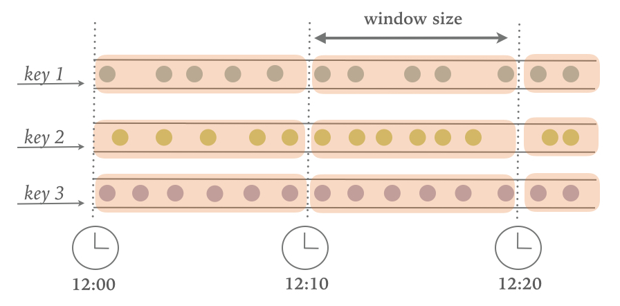
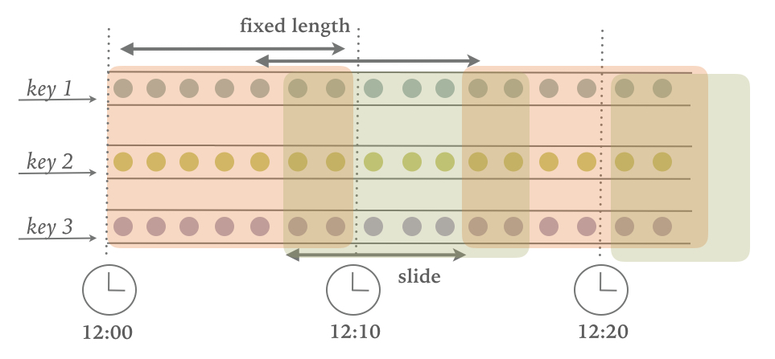
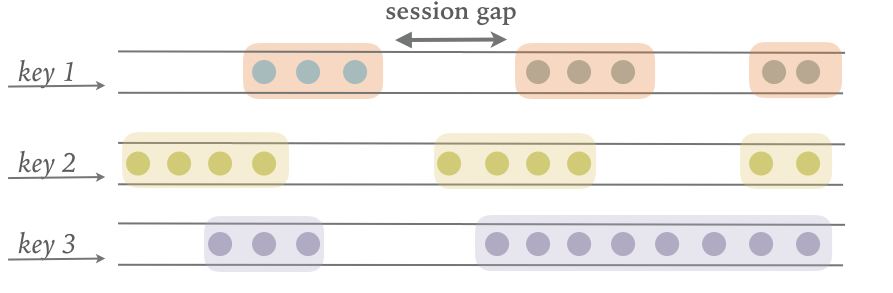
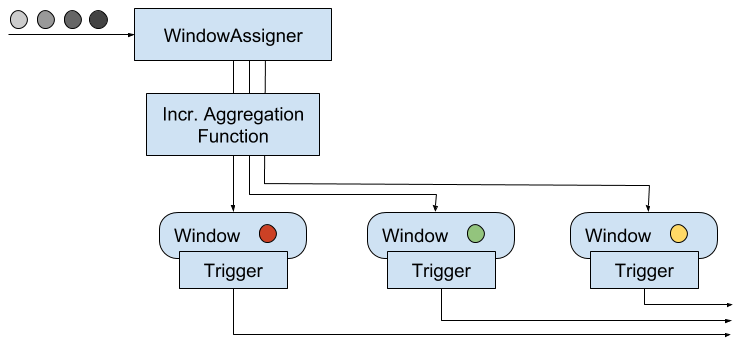
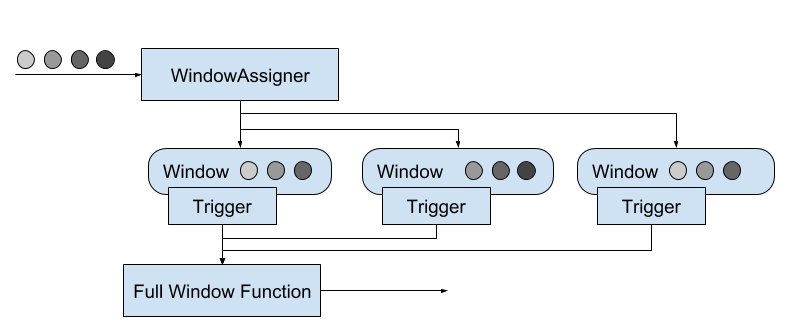
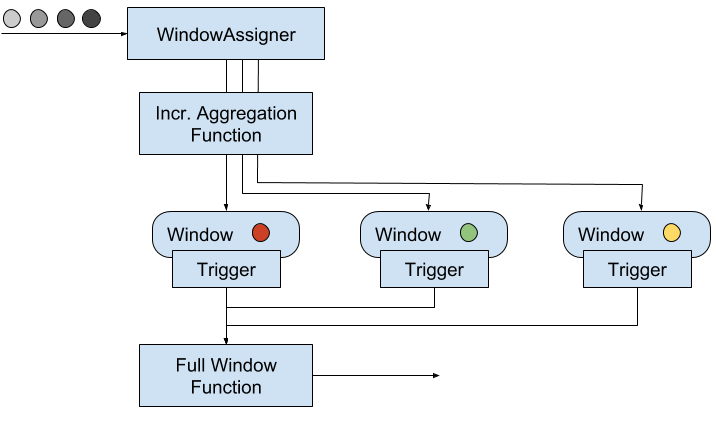
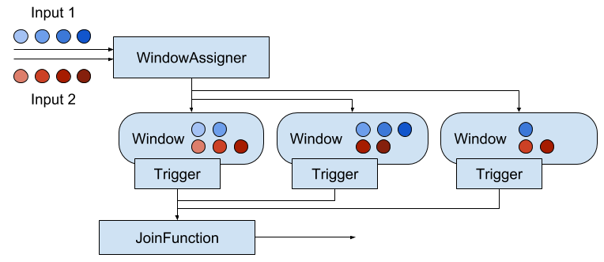

# Chapter 6. Time-based and Window Operators

In this chapter, you will get an introduction to the DataStream API methods for time handling and time-based operators, as for example windows. As you learned in Chapter 2, Flink’s time-based operators can be applied with different notions of time.

In this chapter, you will first learn how to define time characteristics, timestamps, and watermarks. Then, you will learn about the `ProcessFunction`, a low-level transformation that provides access to record timestamps and watermarks and can register timers. Next, you will get to use Flink’s window API which provides built-in implementations of the most common window types. You will also get an introduction to custom, user-defined window operations and core windowing constructs, such as assigners, triggers, and evictors. Finally, we will discuss strategies to handle late events.

## 6.1 Configuring Time Characteristics
As you saw in Chapter 2, when defining time window operations in a distributed stream processing application, it is important to understand the meaning of time. When you specify a window to collect events in one-minute buckets, which events exactly will each bucket contain? In the DataStream API, you can use the time characteristic to instruct Flink how to reason about time when creating windows. The time characteristic is a property of the `StreamExecutionEnvironment` and it takes the following values:

- `ProcessingTime` means that operators use the system clock of the machine where they are being executed to determine the current time of the data stream. Processing-time windows trigger based on machine time and include whatever elements happen to have arrived at the operator until that point in time. In general, using processing time for window operations results in non-deterministic results because the contents of the windows depend on the speed in which elements arrive. On the plus side, this setting offers very low latency because there is no such thing as out of order data for which operations would have to wait for.
- `EventTime` means that operators determine the current time by using information from the data itself. Each event carries a timestamp and the logical time of the system is defined by watermarks. As you saw in Chapter 3, timestamps either exist in the data before entering the data processing pipeline, or they are assigned by the application at the sources. An event-time window triggers when a watermark informs it that all timestamps for a certain time interval have been received. Event-time windows compute deterministic results even when events arrive out-of-order. The window result will be the same and independent of how fast the stream is read or processed.
- `IngestionTime` is a hybrid of of `EventTime` and `ProcessingTime`. The ingestion time of an event is the time when it entered the stream processor. You can think of ingestion time as assigning the processing time of the source operator as an event time timestamp to each ingested record. Ingestion time does not offer much practical value compared to event time as it is not provide deterministic results but has similar performance implications as event time.

We can see in [Example 6-1](https://www.safaribooksonline.com/library/view/stream-processing-with/9781491974285/ch06.html#code_time-characteristic) how to set the time characteristic by revisiting the sensor streaming application code you wrote in Chapter 5.

*Example 6-1. Setting the time characteristic to event time.*
```scala
object AverageSensorReadings {

  // main() defines and executes the DataStream program
  def main(args: Array[String]) {

    // set up the streaming execution environment
    val env = StreamExecutionEnvironment.getExecutionEnvironment
    
    // use event time for the application
    env.setStreamTimeCharacteristic(TimeCharacteristic.EventTime)

  // ingest sensor stream
  val sensorData: DataStream[SensorReading] = env.addSource(...)
 }
}
```

Setting the time characteristic to `EventTime` enables record timestamps and watermark handling, and as a result event-time windows or operations. Of course, one can still use processing-time windows and timers if you choose the `EventTime` time characteristic. 

To use processing time replace `TimeCharacteristic.EventTime` by `TimeCharacteristic.ProcessingTime`.

### 6.1.1 Timestamps and watermarks for event-time applications

As discussed in Chapter 3, your application needs to provide two important pieces of information to Flink in order to operated in event time. Each event must be associated with a timestamp that typically indicates when the event actually happened. Moreover, event-time streams needs to carry watermarks from which operators infer the current event time.

Timestamps and watermarks are specified in milliseconds since the epoch of 1970-01-01T00:00:00Z. A watermark tells operators that no more events with a timestamp smaller or equal to the watermark must be expected. Timestamps and watermarks can be either assigned and generated by a SourceFunction or using an explicit user-defined timestamp assigner and watermark generator. Assigning timestamps and generating watermarks in a SourceFunction is discussed in Chapter 8. Here we explain how to do this with a user-defined function.

> **OVERRIDING SOURCE-GENERATED TIMESTAMPS AND WATERMARKS**
> If a timestamp assigner is used, any existing timestamps and watermarks will be overwritten.

The DataStream API provides the `TimestampAssigner` interface to extract timestamps from elements after they have been ingested into the streaming application. Typically, the timestamp assigner is called right after the source function. That is because most assigners make assumption about the order of elements with respect to their timestamps to generate watermarks. Since elements are typically ingested in parallel, any operation that causes Flink to redistribute elements across parallel stream partitions, such as parallelism changes, `keyBy()`, or other explicit redistributions, mixes up the timestamp order of the elements. 

It is best practice to assign timestamps and generate watermarks as close to the sources as possible or even within the `SourceFunction`. Depending on the use case, it is possible to apply an initial filtering or transformation on the input stream before assigning timestamp if such operations do not induce a redistribution of elements, e.g., by change the parallelism. 

To ensure that event time operations behave as expected, the assigner should be called before any event-time dependent transformation, e.g. before the first event-time window.

Timestamp assigners behave like other transformation operators. They are called on a stream of elements and they produce a new stream of timestamped elements and watermarks. Note that if the input stream already contains timestamps and watermarks, those will be replaced by the timestamp assigner.

The code in [Example 6-2](https://www.safaribooksonline.com/library/view/stream-processing-with/9781491974285/ch06.html#code_assign-wms) shows how to use timestamp assigners. In this example, after reading the stream, we first apply a filter transformation and then call the `assignTimestampsAndWatermarks()` method where we define the timestamp assigner `MyAssigner()`. Note how assigning timestamps and watermarks does not changes the type of the data stream.

*Example 6-2. Using a timestamp assigner.*
```scala
val env = StreamExecutionEnvironment.getExecutionEnvironment

// set the event time characteristic
env.setStreamTimeCharacteristic(TimeCharacteristic.EventTime)

// ingest sensor stream
val readings: DataStream[SensorReading] = env
  .addSource(new SensorSource)
  // assign timestamps and generate watermarks
  .assignTimestampsAndWatermarks(new MyAssigner())
```

In the example above, `MyAssigner` can either be of type `AssignerWithPeriodicWatermarks` or `AssignerWithPunctuatedWatermarks`. These two interfaces extend the `TimestampAssigner` provided by the DataStream API. The first interface allows defining assigners that emit watermarks periodically while the second allows to inject watermarks based on a property of the input events. We describe both interfaces in detail next.

##### ASSIGNER WITH PERIODIC WATERMARKS
Assigning watermarks periodically means that we instruct the system to check the progress of event time in fixed intervals of machine time. The default interval is set to 200 milliseconds but it can be configured using the `ExecutionConfig.setAutoWatermarkInterval()` method as shown in [Example 6-3](https://www.safaribooksonline.com/library/view/stream-processing-with/9781491974285/ch06.html#code_assigning-periodic-wms).

*Example 6-3. Assigning periodic watermarks.*
```scala
val env = StreamExecutionEnvironment.getExecutionEnvironment
env.setStreamTimeCharacteristic(TimeCharacteristic.EventTime)
// generate watermarks every 5 seconds
env.getConfig.setAutoWatermarkInterval(5000)
```

In the above example, you instruct the program to check the current watermark value every 5 seconds. What actually happens is that every 5 seconds Flink invokes the `getCurrentWatermark()` method of `AssignerWithPeriodicWatermarks`. If the method returns a non-null value with a timestamp larger than the timestamp of the previous watermark, then the new watermark is forwarded. Note that this check is necessary to ensure that event time continuously increases. Otherwise, if the method returns a null value or the timestamp of the returned watermark is smaller than that of the last emitted one, no watermark is produced. 

[Example 6-4](https://www.safaribooksonline.com/library/view/stream-processing-with/9781491974285/ch06.html#code_periodic-wma) shows an assigner with periodic timestamps which produces watermarks by keeping track of the maximum element timestamp it has seen so far. When being asked for a new watermark, the assigner returns a watermark with the maximum timestamp minus a 1 minute tolerance interval.

*Example 6-4. An periodic watermark assigner.*
```scala
class PeriodicAssigner 
    extends AssignerWithPeriodicWatermarks[SensorReading] {

  val bound: Long = 60 * 1000     // 1 min in ms
  var maxTs: Long = Long.MinValue // the maximum observed timestamp

  override def getCurrentWatermark: Watermark = {
    // generated watermark with 1 min tolerance
    new Watermark(maxTs - bound)
  }

  override def extractTimestamp(
      r: SensorReading, 
      previousTS: Long): Long = {
    // update maximum timestamp
    maxTs = maxTs.max(r.timestamp)
    // return record timestamp
    r.timestamp
  }
}
```

The DataStream API provides implementations for two common cases of timestamp assigners with periodic watermarks. If your input elements have timestamps which are monotonously increasing, you can use the shortcut method `assignAscendingTimestamps`. This method uses the current timestamp to generate watermarks, since no earlier timestamps can appear. [Example 6-5](https://www.safaribooksonline.com/library/view/stream-processing-with/9781491974285/ch06.html#code_ascending-ts-wms) shows how to generate watermarks for ascending timestamps.

*Example 6-5. A shortcut to generate watermarks for elements with monotonically increasing timestamps.*
```scala
val stream: DataStream[MyEvent] = ...
val withTimestampsAndWatermarks = stream
      .assignAscendingTimestamps(e => e.getCreationTime)
```

The other common case of periodic watermark generation is when you know the maximum lateness that you will encounter in the input stream, that is the maximum difference between an element’s timestamp and the largest timestamp of all perviously ingested elements. For such cases, Flink provides the `BoundedOutOfOrdernessTimestampExtractor` which takes the maximum expected lateness as an argument.

*Example 6-6. Generating watermarks with a bounded tolerance interval.*
```scala
val stream: DataStream[MyEvent] = ...
val output = stream.assignTimestampsAndWatermarks(
 new BoundedOutOfOrdernessTimestampExtractor[MyEvent](
   Time.seconds(10))( _.getCreationTime)
```

In [Example 6-6](https://www.safaribooksonline.com/library/view/stream-processing-with/9781491974285/ch06.html#code_bounded-wms) elements are allowed to be late for 10 seconds. That is, if the difference between an element’s event time and the maximum timestamp of all previous elements is greater than 10 seconds, the element might arrive after a related computation has completed and result has been emitted. Flink offers different strategies to handle such late events and we discuss those later in this chapter.

##### ASSIGNER WITH PUNCTUATED WATERMARKS
Sometimes the input stream contains special tuples or markers that indicate the stream’s progress. For such cases or when watermarks can be defined based on some other property of the input elements, Flink provides the `AssignerWithPunctuatedWatermarks`. The interface contains the `checkAndGetNextWatermark()` method which is called for each event right after `extractTimestamp()`. The method can decide to generate a new watermark or not. A new watermark is emitted if the method returns a non-null watermark which is larger than the latest emitted watermark.

[Example 6-7](https://www.safaribooksonline.com/library/view/stream-processing-with/9781491974285/ch06.html#code_punctuated-wma) shows a punctuated watermark assigner that emits a watermark for every reading that it rececives from the sensor with the id `"sensor_1"`.

*Example 6-7. A punctuated watermark assigner.*
```scala
class PunctuatedAssigner 
    extends AssignerWithPunctuatedWatermarks[SensorReading] {

  val bound: Long = 60 * 1000 // 1 min in ms

  override def checkAndGetNextWatermark(
      r: SensorReading, 
      extractedTS: Long): Watermark = {
    if (r.id == "sensor_1") {
      // emit watermark if reading is from sensor_1
      new Watermark(extractedTS - bound)
    } else {
      // do not emit a watermark
      null
    }
  }

  override def extractTimestamp(
      r: SensorReading, 
      previousTS: Long): Long = {
    // assign record timestamp
    r.timestamp
  }
}
```

### 6.1.2 Watermarks, Latency, and Completeness
So far we discussed how to generate watermarks using a `TimestampAssigner`. What we have not discussed yet is the effect that watermarks have on your streaming application. 

Watermarks are a mechanism to trade-off result latency and result completeness. They control how long to wait for data to arrive before performing a computation, such as finalizing a window computation and emitting the result. An operator that is based on event time uses watermarks to determine the completeness of its ingested records and the progress of its operation. Based on watermarks the operator computes a point in time up at which it expects to have received all records with a smaller timestamp.

However, the distributed systems’ reality is that we can never have perfect watermarks. That would mean we are always certain that there are no delayed records. In practice, you need to make an educated guess and use heuristics to generate watermarks in your applications. Commonly, you need to use whatever information you have about the sources, the network, the partitions to estimate progress and probably also an upper bound of lateness for your input records. Estimates mean there is room for errors in which case you might generate watermarks that are inaccurate, resulting into late data or unnecessary increase in the application’s latency. With this in mind, you can use watermarks to trade-off the result latency and result completeness of an application.

If you generate loose watermarks, i.e., the watermarks are far behind the timestamps of the processed records, you increase the latency of produced results. You could have generated a result earlier but you had to wait for the watermark. Moreover the state size typically increases because the application needs to buffer more data until it can perform a computation. However, you can be quite certain that all relevant data is available when you perform a computation.

On the other hand, if you generate very tight watermark, i.e., watermarks that might be larger than the timestamps of some later arriving records, time-based operations might be performed before all relevant data has arrived. You should have waited longer to receive delayed events before performing the computation. While this might yield incomplete or inaccurate results, the results are produced in a timely fashion with lower latency.

The latency-completeness tradeoff is a fundamental charateristic of stream processing that is not relevant for batch applications, which are built around the premise that all data is available. Watermarks are a powerful feature to control the behavior of an application with respect to time. Besides watermarks, Flink provides many knobs to tweak the exact behavior of time-based operations, such as window Triggers and the ProcessFunction, and offers different ways to handle late data, i.e., elements that arrived after a computation was performed. We will discuss these features in a dedicated section at the end of this chapter.

## 6.2 Process Functions
Even though time information and watermarks are crucial to many streaming applications, you might have noticed that we cannot access them through the basic DataStream API transformations that we have seen so far. For example, a `MapFunction` does not have access to time-related constructs. 

The DataStream API provides a family of low-level transformations, the process functions, which can also access record timestamps and watermarks and register timers that trigger at a specific time in the future. Moreover, process functions feature side outputs to emit records to multiple output streams. Process functions are commonly used to build event-driven applications and to implement custom logic for which predefined windows and transformations might not be suitable. For example most of operators for Flink’s SQL support are implemented using process functions.

Currently, Flink provides seven different process functions: `ProcessFunction`, `KeyedProcessFunction`, `CoProcessFunction`, `BroadcastProcessFunction`, `KeyedBroadcastProcessFunction`, `ProcessWindowFunction`, and `ProcessAllWindowFunction`. As indicated by the name, these functions are applicable in different contexts. However, they have a very similar features set. We continue discussing the common features by looking in detail at the `ProcessFunction`.

The `ProcessFunction` is a very versatile function and can be applied to a regular `DataStream` and to a `KeyedStream`. The function is called for each record of the stream and can return zero, one, or more records. All process functions implement the `RichFunction` interface and hence offer its  `open()` and `close()`methods. Additionally, the `ProcessFunction` provides the following two methods:

- `processElement(v: IN, ctx: Context, out: Collector[OUT])` is called for each record of the stream. As usual, result records are emitted by passing them to the `Collector`. The `Context` object is what makes the `ProcessFunction` special. It gives access to the timestamp of the current record and to a `TimerService`. Moreover, the `Context` can emit records to side outputs.
- `onTimer(timestamp: Long, ctx: OnTimerContext, out: Collector[OUT])` is a callback function that is invoked when a previously registered timer triggers. The timestamp argument gives the timestamp of the firing timer and the `Collector` allows to emit records. The `OnTimerContext` provides the same services as the `Context` object of the `processElement()`method and it returns the time domain (processing time or event time) of the firing trigger in addition.

### 6.2.1 The TimerService and Timers
The `TimerService` of the `Context` and `OnTimerContext` objects offer the following methods:

- `currentProcessingTime(): Long` returns the current processing time.
- `currentWatermark(): Long` returns the timestamp of the current watermark.
- `registerProcessingTimeTimer(timestamp: Long): Unit` registers a processing time timer. The timer will fire when the processing time of the executing machine reaches the provided timestamp.
- `registerEventTimeTimer(timestamp: Long): Unit` registers an event time timer. The timer will fire when the watermark is updated to a timestamp that is equal to or larger than the timer’s timestamp.

When a timer fires, the `onTimer()` callback function is called. The `processElement()` and `onTimer()`methods are synchronized to prevent concurrent access and manipulation of state. Note that timers can only be registered on keyed streams.

> **TIMERS ON NON-KEYED STREAMS**
> To use timers on a non-keyed stream, you can create a keyed stream by using a `KeySelector` with a constant dummy key. Note that this will move all data to a single task such that the operator would be effectively executed with a parallelism of 1.

For each key and timestamp, one timer can be registered, i.e., each key can have multiple timers but only one for each timestamp. It is not possible to delete registered timers. Internally, a `ProcessFunction` holds the timestamps of all timers in a priority queue on the heap and persists them as function state of type `Long`. A common use case for timers is to clear keyed state after some period of inactivity for a key or to implement custom time-based windowing logic. 

Timers are checkpointed along with any other state of the function. If an application needs to recover from a failure, all processing time timers that expired while the application was restarting will fire immediately when the application resumes. This is also true for processing time timers that are persisted in a savepoint. Note that timers are currently not asynchronously checkpointed. Hence, a `ProcessFunction` with many timers can significantly increase the checkpointing time. It is best practice to not use timers overly excessive.

[Example 6-8](https://www.safaribooksonline.com/library/view/stream-processing-with/9781491974285/ch06.html#code_procfunc-timers) shows a `ProcessFunction` that monitors the temperatures of sensors and emits a warning if the temperature of a sensor monotonically increases for a period of 1 second in processing time.

*Example 6-8. A ProcessFunction that monitors the temperatures of sensors and emits a warning if the temperature of a sensor monotonically increases for a period of 1 second in processing time.*
```scala
val warnings = readings
  // key by sensor id
  .keyBy(_.id)
  // apply ProcessFunction to monitor temperatures
  .process(new TempIncreaseAlertFunction)

// =================== //

/** Emits a warning if the temperature of a sensor
  * monotonically increases for 1 second (in processing time).
  */
class TempIncreaseAlertFunction
  extends KeyedProcessFunction[String, SensorReading, String] {

  // hold temperature of last sensor reading
  lazy val lastTemp: ValueState[Double] =
    getRuntimeContext.getState(
      new ValueStateDescriptor[Double]("lastTemp", Types.of[Double])
    )

  // hold timestamp of currently active timer
  lazy val currentTimer: ValueState[Long] =
    getRuntimeContext.getState(
      new ValueStateDescriptor[Long]("timer", Types.of[Long])
    )

  override def processElement(
      r: SensorReading,
      ctx: KeyedProcessFunction[String, SensorReading, String]#Context,
      out: Collector[String]): Unit = {

    // get previous temperature
    val prevTemp = lastTemp.value()
    // update last temperature
    lastTemp.update(r.temperature)

    if (prevTemp == 0.0 || r.temperature < prevTemp) {
      // temperature decreased. Invalidate current timer
      currentTimer.update(0L)
    }
    else if (r.temperature > prevTemp && currentTimer.value() == 0) {
      // temperature increased and we have not set a timer yet.
      // set processing time timer for now + 1 second
      val timerTs = ctx.timerService().currentProcessingTime() + 1000
      ctx.timerService().registerProcessingTimeTimer(timerTs)
      // remember current timer
      currentTimer.update(timerTs)
    }
  }

  override def onTimer(
      ts: Long,
      ctx: KeyedProcessFunction[String, SensorReading, String]#OnTimerContext,
      out: Collector[String]): Unit = {

    // check if firing timer is current timer
    if (ts == currentTimer.value()) {
      out.collect("Temperature of sensor '" + ctx.getCurrentKey +
        "' monotonically increased for 1 second.")
      // reset current timer
      currentTimer.update(0)
    }
  }
}
```

### 6.2.2 Emitting to Side Outputs
Most operators of the DataStream API have a single output, i.e, they produce one result stream with a specific data type. Only the split operator allows to split a stream into multiple streams of the same type. Side outputs are a mechanism to emit multiple streams from a function with possibly different types. The number of side outputs besides the primary output is not limited. Each individual side output is identified by an `OutputTag[X]` object which is instantiated with a name and the type `X` of the side output stream. A `ProcessFunction` can emit a record to one or more side outputs via a `Context` object.

[Example 6-9](https://www.safaribooksonline.com/library/view/stream-processing-with/9781491974285/ch06.html#code_procfunc-sideoutput) shows a `ProcessFunction` that monitors a stream of sensor readings and emits a warning to a side output for readings with a temperature below 32F.

*Example 6-9. A ProcessFunction that monitors the temperatures of sensors and emits a warning to a side output if the temperature of a sensor is below 32F.*
```scala
// define a side output tag
val freezingAlarmOutput: OutputTag[String] =
  new OutputTag[String]("freezing-alarms")

// =================== //

val monitoredReadings: DataStream[SensorReading] = readings
  // monitor stream for readings with freezing temperatures
  .process(new FreezingMonitor)

// retrieve and print the freezing alarms
monitoredReadings
  .getSideOutput(freezingAlarmOutput)
  .print()

// print the main output
readings.print()

// =================== //

/** Emits freezing alarms to a side output for readings 
  * with a temperature below 32F. */
class FreezingMonitor extends ProcessFunction[SensorReading, SensorReading] {

  override def processElement(
      r: SensorReading,
      ctx: ProcessFunction[SensorReading, SensorReading]#Context,
      out: Collector[SensorReading]): Unit = {
    // emit freezing alarm if temperature is below 32F.
    if (r.temperature < 32.0) {
      ctx.output(freezingAlarmOutput, s"Freezing Alarm for ${r.id}")
    }
    // forward all readings to the regular output
    out.collect(r)
  }
}
```

### 6.2.3 The CoProcessFunction
For low-level operations on two inputs, the Datastream API also provides the `CoProcessFunction`. Similar to a `CoFlatMapFunction`, a `CoProcessFunction` offers a transformation method for each input, `processElement1()` and `processElement2()`. Similar to the `ProcessFunction`, both methods are called with a `Context` object that gives access to the element or timer timestamp, a `TimerService`, and side outputs. The `CoProcessFunction` also provides a `onTimer()` callback method.

[Example 6-10](https://www.safaribooksonline.com/library/view/stream-processing-with/9781491974285/ch06.html#code_coprocfunc-example)shows a `CoProcessFunction` that dynamically filters a stream of sensor readings based on a stream of filter switches.

*Example 6-10. Applying a CoProcessFunction to dynamically filter a stream of sensor readings.*
```scala
// ingest sensor stream
val sensorData: DataStream[SensorReading] = ...

// filter switches enable forwarding of readings
val filterSwitches: DataStream[(String, Long)] = env
  .fromCollection(Seq(
    ("sensor_2", 10 * 1000L), // forward sensor_2 for 10 seconds
    ("sensor_7", 60 * 1000L)) // forward sensor_7 for 1 minute
  )

val forwardedReadings = readings
  // connect readings and switches
  .connect(filterSwitches)
  // key by sensor ids
  .keyBy(_.id, _._1)
  // apply filtering CoProcessFunction
  .process(new ReadingFilter)

// =============== //

class ReadingFilter
  extends CoProcessFunction[SensorReading, (String, Long), SensorReading] {

  // switch to enable forwarding
  lazy val forwardingEnabled: ValueState[Boolean] =
    getRuntimeContext.getState(
      new ValueStateDescriptor[Boolean]("filterSwitch", Types.of[Boolean])
    )

  // hold timestamp of currently active disable timer
  lazy val disableTimer: ValueState[Long] =
    getRuntimeContext.getState(
      new ValueStateDescriptor[Long]("timer", Types.of[Long])
    )

  override def processElement1(
      reading: SensorReading,
      ctx: CoProcessFunction[SensorReading, (String, Long), SensorReading]#Context,
      out: Collector[SensorReading]): Unit = {

    // check if we may forward the reading
    if (forwardingEnabled.value()) {
      out.collect(reading)
    }
  }

  override def processElement2(
      switch: (String, Long),
      ctx: CoProcessFunction[SensorReading, (String, Long), SensorReading]#Context,
      out: Collector[SensorReading]): Unit = {

    // enable reading forwarding
    forwardingEnabled.update(true)
    // set disable forward timer
    val timerTimestamp = ctx.timerService().currentProcessingTime() + switch._2
    ctx.timerService().registerProcessingTimeTimer(timerTimestamp)
    disableTimer.update(timerTimestamp)
  }

  override def onTimer(
      ts: Long,
      ctx: CoProcessFunction[SensorReading, (String, Long), SensorReading]#OnTimerContext,
      out: Collector[SensorReading]): Unit = {

    if (ts == disableTimer.value()) {
      // remove all state. Forward switch will be false by default.
      forwardingEnabled.clear()
      disableTimer.clear()
    }
  }
}
```

## 6.3 Window Operators
Windows are common operations in streaming applications. Windows enable transformations on *bounded intervals* of an unbounded stream, such as aggregations. Typically, these intervals are defined using time-based logic. Window operators provide a way to group events in buckets of finite size and apply computations on the bounded contents of these buckets. For example, a window operator can group the events of a stream into windows of 5 minutes and count for each window how many events have been received.

The DataStream API provides built-in methods for the most common window operations as well as a very flexible windowing mechanism to define custom windowing logic. In this section we show you how to define window operators, present the built-in window types of the DataStream API, discuss the functions that can be applied on a window, and finally explain how to define custom windowing logic.

### 6.3.1 Defining Window Operators
Window operators can be applied on a keyed or a non-keyed stream. Window operators on keyed windows are evaluated in parallel, non-keyed windows are processed in a single thread.

To create a window operator, you need to specify two window components.
1. A *Window Assigner* determines how the elements of the input stream are grouped into windows. A window assigner produces a `WindowedStream` (or `AllWindowedStream` if applied on a non-keyed `DataStream`).
2. A *Window Function* is applied on a `WindowedStream` (or `AllWindowedStream`) and processes the elements which are assigned to a window.

Example 6-11 shows how to specify a window assigner and a window function on a keyed or non-keyed stream.

*Example 6-11. Defining a window operator*
```scala
// define a keyed window operator
stream
  .keyBy(...)                 
  .window(...)                   // specify the window assigner
  .reduce/aggregate/process(...) // specify the window function

// define a non-keyed window-all operator
stream
  .windowAll(...)                // specify the window assigner
  .reduce/aggregate/process(...) // specify the window function
```

In the remainder of the chapter we keep the discussion on keyed windows. Non-keyed windows (also called all-windows in the DataStream API) behave exactly the same, except that they are not evaluated in parallel.

Note that you can customize a window operator by providing a custom Trigger or Evictor and declaring strategies for how to deal with late elements. Custom window operators are dicussed in detail later in this section.

### 6.3.2 Built-in Window Assigners
Flink provides built-in window assigners for the most common windowing use cases. All assigners that we discuss here are time-based and were introduced in Chapter 2. Time-based window assigners assign an element based on its the event-time timestamp or the current processing time to windows. Time windows have a start and an end timestamp. 

All built-in windows assigners provide an default trigger that triggers the evaluation of a window once the (processing or event) time passes the end of the window. It is important to note that a window is created when the first element is assigned to it. Hence, Flink will never evaluate empty windows.

> **Count-based Windows**
> In addition to time-based windows, Flink also supports count-based windows, i.e., windows that group a fixed number of elements in the order in which they arrive at the window operator. Since they depend on the ingestion order, count-based windows are not deterministic. Moreover, they can cause issues if they are used without a custom Trigger that discards incomplete and stale windows at some point.

Flink’s built-in window assigners create windows of type `TimeWindow`. This window type essentially represents a time interval between the two timestamps, where start is inclusive and end is exclusive. It exposes methods to retrieve the window boundaries, to check whether windows intersect, and to merge overlapping windows.

In the following, we show the different built-in window assigners of the DataStream API and how to use them to define window operators.

##### TUMBLING WINDOWS
A tumbling window assigner places elements to non-overlapping, fixed-size windows, as shown in the Figure [Figure 6-1](https://www.safaribooksonline.com/library/view/stream-processing-with/9781491974285/ch06.html#fig_tumbling-assigner).


*Figure 6-1. A Tumbling windows assigner places elements into fixed-size, non-overlapping windows.*

The Datastream API provides two assigners, `TumblingEventTimeWindows` and `TumblingProcessingTimeWindows` for tumbling event-time and processing-time windows, respectively. A tumbling windows assigner receives one parameter which is the window size in time units and can be specified using the `of(Time size)` method of the assigner. The time interval can be set in milliseconds, seconds, minutes, hours, or days.

[Example 6-12](https://www.safaribooksonline.com/library/view/stream-processing-with/9781491974285/ch06.html#code_event-tumbling-window) and [Example 6-13](https://www.safaribooksonline.com/library/view/stream-processing-with/9781491974285/ch06.html#code_proc-tumbling-window) show how to define event-time and processing-time tumbling windows on a stream of sensor data measurements.

*Example 6-12. Defining an event-time tumbling windows assigner.*
```scala
val sensorData: DataStream[SensorReading] = ...

val avgTemp = sensorData
.keyBy(_.id)
// group readings in 1s event-time windows
.window(TumblingEventTimeWindows.of(Time.seconds(1)))
.process(new TemperatureAverager)
```

*Example 6-13. Defining a processing-time tumbling windows assigner.*
```scala
val avgTemp = sensorData
.keyBy(_.id)
// group readings in 1s processing-time windows
.window(TumblingProcessingTimeWindows.of(Time.seconds(1)))
.process(new TemperatureAverager)
```

If you remember this example when we first encountered it in Chapter 2, the window definition looked a bit different. Back then, we defined an event-time tumbling window using the `timeWindow(size)` method, which is a shortcut for `window.(TumblingEventTimeWindows.of(size))` or `window.(TumblingProcessingTimeWindows.of(size))` depending on the configured time characteristic.

*Example 6-14. Defining a tumbling windows assigner with a shortcut.*
```scala
val avgTemp = sensorData
.keyBy(_.id)
// shortcut for window.(TumblingEventTimeWindows.of(size))
.timeWindow(Time.seconds(1))
.process(new TemperatureAverager)
```

By default, tumbling windows are aligned to the epoch time, i.e., `1970-01-01-00:00:00.000`. For example, an assigner with a size of one hour will define windows at 00:00:00, 01:00:00, 02:00:00 and so on. Alternatively, you can specify an offset as a second parameter in the assigner. The example in [Example 6-15](https://www.safaribooksonline.com/library/view/stream-processing-with/9781491974285/ch06.html#code_tumbling-window-offset) shows windows with an offset of 15 minutes that start at 00:15:00, 01:15:00, 02:15:00, etc.

*Example 6-15. Defining a tumbling windows assigner with an offset.*
```scala
val avgTemp = sensorData
.keyBy(_.id)
// group readings in 1 hour windows with 15 min offset
.window(TumblingEventTimeWindows.of(Time.hours(1), Time.minutes(15)))
.process(new TemperatureAverager
```

##### SLIDING WINDOWS
The sliding window assigner places stream elements to possibly overlapping, fixed-size windows, as shown in Figure [Figure 6-2](https://www.safaribooksonline.com/library/view/stream-processing-with/9781491974285/ch06.html#fig_sliding-assigner).


*Figure 6-2. A Sliding windows assigner places elements into fixed-size, possibly overlapping windows.*

For a sliding window, you have to specify a window size and a slide interval that defines how frequently a new window is started. When the slide interval is smaller than the window size, the windows overlap and elements be assigned to more than one window. If the slide is larger than the window size, some elements might not be assigned to any window and hence be dropped. 

[Example 6-16](https://www.safaribooksonline.com/library/view/stream-processing-with/9781491974285/ch06.html#code_sliding-assigners) shows how to group the sensor readings in sliding windows of 1 hour and 15 minutes slide. Each reading will be added to four windows. The DataStream API provides event-time and processing-time assigners, as well as shortcut methods, while a time interval offset can be set as the third parameter to the window assigner.

*Example 6-16. Defining a sliding windows assigner.*
```scala
// event-time sliding windows assigner
val slidingAvgTemp = sensorData
.keyBy(_.id)
// create 1h event-time windows every 15 minutes
.window(SlidingEventTimeWindows.of(Time.hours(1), Time.minutes(15)))
.process(new TemperatureAverager)


// processing-time sliding windows assigner
val slidingAvgTemp = sensorData
.keyBy(_.id)
// create 1h processing-time windows every 15 minutes
.window(SlidingProcessingTimeWindows.of(Time.hours(1), Time.minutes(15)))
.process(new TemperatureAverager)

// sliding windows assigner using a shortcut method
val slidingAvgTemp = sensorData
.keyBy(_.id)
// shortcut for window.(TumblingEventTimeWindows.of(size))
.timeWindow(Time.hours(1), Time(minutes(15)))
.process(new TemperatureAverager
```

##### SESSION WINDOWS
A session window assigner places elements into non-overlapping windows of activity that have no fixed size. The boundaries of a session windows are defined by gaps of inactivity, i.e., time intervals in which no record is received. Figure [Figure 6-3](https://www.safaribooksonline.com/library/view/stream-processing-with/9781491974285/ch06.html#fig_session-windows)illustrates how elements are assigned to session windows.


*Figure 6-3. A Session windows assigner places elements into varying-size, windows defined by a session gap.*

The following examples show how to group the sensor readings into session windows where a session is defined by a 15 min period of inactivity:
*Example 6-17. Defining a session windows assigner.*
```scala
// event-time session windows assigner
val sessionWindows = sensorData
.keyBy(_.id)
// create event-time session windows with a 15 min gap
.window(EventTimeSessionWindows.withGap(Time.minutes(15)))
.process(...)

// processing-time session windows assigner
val sessionWindows = sensorData
.keyBy(_.id)
// create processing-time session windows with a 15 min gap
.window(ProcessingTimeSessionWindows.withGap(Time.minutes(15)))
.process(...)
```

Since session windows do not have predefined start and end timestamps, a window assigner cannot immediately assign them to the correct window. Therefore, the `SessionWindows` assigner initially maps each incoming element into its own window with the element’s timestamp as the start time and the session gap as the window size. Subsequently, it merges all windows with overlapping ranges

### 6.3.3 Applying Functions on Windows
Window functions define the computation that is performed on the elements of a window. There are two types of functions that can be applied on window.

1. *Incremental Aggregation Functions* are directly applied when an element is added to a window and hold and update a single value as window state. These functions are typically very space efficient and eventually emit the aggregated value as a result. `ReduceFunction` and `AggregateFunction` are incremental aggregation functions.
2. *Full Window Functions* collect all elements of a window and iterate over the list of all collected elements when they are evaluated. Full window functions usually require more space but allow for more complex logic than incremental aggreation functions. The `ProcessWindowFunction` is a full window function.

In this section, we discuss the different types of functions that can be applied on a window to perform aggregations or arbitrary computations on the window’s contents. We also show how to jointly apply incremental aggregation and full window functions in a window operator.

##### ReduceFunction
The `ReduceFunction` was introduced in Chapter 5 when discussing running aggregations on keyed streams. A `ReduceFunction` accepts two values of the same type and combines them into a single value of the same type. When being applied on a windowed stream, a `ReduceFunction` incrementally aggregates the elements that are assigned to a window. A window only stores the current result of the aggregation, i.e., a single value of the `ReduceFunction`’s input (and output) type. When a new element is received, the `ReduceFunction` is called with the new element and the result that is read from the window’s state. The window’s state is replaced by the `ReduceFunction`’s result.

The advantages of applying a ReduceFunction on a window is the constant and small state size per window and the simple function interface. However, the applications for a `ReduceFunction` are limited and usually restricted to simple aggregations since the input and output type must be the same.

Example 6-18 shows a brief example with a ReduceFunction that computes the mininum temperature per sensor and 15 seconds window.

*Example 6-18. Compute the minimum temperature per sensor and window using a lambda function*
```scala
val minTempPerWindow: DataStream[(String, Double)] = sensorData
    .map(r => (r.id, r.temperature))
    .keyBy(_._1)
    .timeWindow(Time.seconds(15))
    .reduce((r1, r2) => (r1._1, r1._2.min(r2._2)))
```

For [Example 6-18](https://www.safaribooksonline.com/library/view/stream-processing-with/9781491974285/ch06.html#code_window-reducefunction), we use a lambda function to specify how two elements of a window can be combined to produce an output of the same type. The same example can also be implemented with a class that implements the ReduceFunction interface as shows in [Example 6-19](https://www.safaribooksonline.com/library/view/stream-processing-with/9781491974285/ch06.html#code_window-reducefunction2).

*Example 6-19. Compute the minimum temperature per sensor and window using a ReduceFunction class implementation.*
```scala
val minTempPerWindow: DataStream[(String, Double)] = sensorData
  .map(r => (r.id, r.temperature))
  .keyBy(_._1)
  .timeWindow(Time.seconds(15))
  .reduce(new MinTempFunction)

// ================ //
// A reduce function to compute the minimum temperature per sensor.
class MinTempFunction extends ReduceFunction[(String, Double)] {
  override def reduce(r1: (String, Double), r2: (String, Double)) = {
    (r1._1, r1._2.min(r2._2))
  }
}
```

##### AggregateFunction
Similar to a `ReduceFunction`, an `AggregateFunction` is also incrementally applied to the elements that are applied to a window. Moreover, also the state of a window with an AggregateFunction consists of a single value.

However, the interface of the `AggregateFunction` is much more flexible but also more complex to implement compared to the interface of the `ReduceFunction`. [Example 6-20](https://www.safaribooksonline.com/library/view/stream-processing-with/9781491974285/ch06.html#code_aggregatefunc_interface) shows the interface of the `AggregateFunction`.

*Example 6-20. The interface of the AggregateFunction*
```scala
public interface AggregateFunction<IN, ACC, OUT> extends Function, Serializable {

 // create a new accumulator to start a new aggregate.
 ACC createAccumulator();

 // add an input element to the accumulator and return the accumulator.
 ACC add(IN value, ACC accumulator);

 // compute the result from the accumulator and return it.
 OUT getResult(ACC accumulator);

 // merge two accumulators and return the result.
 ACC merge(ACC a, ACC b);
}
```

The interface defines a type for input elements, `IN`, an accumulator of type `ACC`, and a result type `OUT`. In contrast to the `ReduceFunction`, the intermediate data type and the output type do not depend on the input type.

Example 6-21 shows how to use an AggregateFunction to compute the average temperature of sensor readings per window. The accumulator maintains a running sum and count and the `getResult()` method computes the average value.

*Example 6-21. Compute the minimum temperature per sensor and window using an AggregateFunction class implementation.*
```scala
val avgTempPerWindow: DataStream[(String, Double)] = sensorData
  .map(r => (r.id, r.temperature))
  .keyBy(_._1)
  .timeWindow(Time.seconds(15))
  .aggregate(new AvgTempFunction)

// ========= //

// An AggregateFunction to compute the average tempeature per sensor.
// The accumulator holds the sum of temperatures and an event count.
class AvgTempFunction
    extends AggregateFunction[(String, Double), (String, Double, Int), (String, Double)] {
  
  override def createAccumulator() = {
    ("", 0.0, 0)
  }

  override def add(in: (String, Double), acc: (String, Double, Int)) = {
    (in._1, in._2 + acc._2, 1 + acc._3)
  }

  override def getResult(acc: (String, Double, Int)) = {
    (acc._1, acc._2 / acc._3)
  }

  override def merge(acc1: (String, Double, Int), acc2: (String, Double, Int)) = {
    (acc1._1, acc1._2 + acc2._2, acc1._3 + acc2._3)
  }
}
```

##### ProcessWindowFunction
`ReduceFunction` and `AggregateFunction` are incrementally applied on events that are assigned to a window. However, sometimes we need access to all elements of a window to perform more complex computations, such as computing the the median of values in a window or the most frequently occurring value. For such applications, neither the `ReduceFunction` nor the `AggregateFunction` are suitable. Flink’s DataStream API offers the `ProcessWindowFunction` to perform arbitrary computations on the contents of a window.

> **A NOTE ABOUT THE WINDOWFUNCTION**
> The DataStream API of Flink 1.5 features the `WindowFunction` interface. `WindowFunction` has been superseded by `ProcessWindowFunction` and will not be discussed here.

Example 6-22 shows the interface of the ProcessWindowFunction.

*Example 6-22. The interface of the ProcessWindowFunction.*
```scala
public abstract class ProcessWindowFunction<IN, OUT, KEY, W extends Window> 
    extends AbstractRichFunction {

  // Evaluates the window.
  void process(KEY key, Context ctx, Iterable<IN> vals, Collector<OUT> out) throws Exception;

  // Deletes any custom per-window state when the window is purged.
  public void clear(Context ctx) throws Exception {}

  // The context holding window metadata.
  public abstract class Context implements Serializable {
      
    // Returns the metadata of the window
    public abstract W window();

    // Returns the current processing time.
    public abstract long currentProcessingTime();

    // Returns the current event-time watermark.
    public abstract long currentWatermark();

    // State accessor for per-window state.
    public abstract KeyedStateStore windowState();

    // State accessor for per-key global state.
    public abstract KeyedStateStore globalState();

    // Emits a record to the side output identified by the OutputTag.
    public abstract <X> void output(OutputTag<X> outputTag, X value);
  }
}
```

The `process()` method is called with the key of the window, an `Iterable` to access the elements of the window, and a `Collector` to emit results. Moreover, the method has a `Context` parameter similar to other process methods. The `Context` object of the `ProcessWindowFunction` gives access to meta data of the window, the current processing time and watermark, state stores to manage per-window and per-key global state, as well as side outputs to emit records.

We already discussed some of the features of the `Context` object when introducing the `ProcessFunction`, such as access to the current processing and event time and side outputs. However, `ProcessWindowFunction`’s `Context` object also offers a unique features. The meta data of the window typically contains information that can be used as an identifier for a window, such as the start and end timestamps in case of a time window.

Another feature are per-window and per-key global state. Global state refers to the keyed state that is not scoped to any window, while per-window state refers to the window instance that is currently being evaluated. Per-window state is useful to maintain information that should be shared between multiple invocations of the `process()` method on the same window, which can happen due to configuring allowed lateness or using a custom Trigger. A `ProcessWindowFunction` that utilizes per-window state needs to implement its `clear()` method to clean up any window-specific state before the window is purged. Global state can be used to share information between multiple windows on the same key.

Example 6-23 groups the sensor reading stream into tumbling windows of 5 seconds and uses a `ProcessWindowFunction` to compute the lowest and the highest temperature that occurs within the window. It then outputs the start and end timestamp of each window, followed by these two temperature values:

*Example 6-23. Compute the minimum and maximum temperature per sensor and window using a ProcessWindowFunction.*
```scala
// output the lowest and highest temperature reading every 5 seconds
val minMaxTempPerWindow: DataStream[MinMaxTemp] = sensorData
  .keyBy(_.id)
  .timeWindow(Time.seconds(5))
  .process(new HighAndLowTempProcessFunction)

// ========= //

case class MinMaxTemp(id: String, min: Double, max:Double, endTs: Long)

/**
 * A ProcessWindowFunction that computes the lowest and highest temperature
 * reading per window and emits a them together with the 
 * end timestamp of the window.
 */
class HighAndLowTempProcessFunction
    extends ProcessWindowFunction[SensorReading, MinMaxTemp, String, TimeWindow] {

  override def process(
      key: String,
      ctx: Context,
      vals: Iterable[SensorReading],
      out: Collector[MinMaxTemp]): Unit = {

    val temps = vals.map(_.temperature)
    val windowEnd = ctx.window.getEnd

    out.collect(MinMaxTemp(key, temps.min, temps.max, windowEnd))
  }
}
```

Internally, a window that is evaluated by `ProcessWindowFunction` stores all assigned events in a `ListState`[1](https://www.safaribooksonline.com/library/view/stream-processing-with/9781491974285/ch06.html#idm139895517790656). By collecting all events and providing access to window meta data and other features, the ProcessWindowFunction can address many more use cases than a ReduceFunction or AggregateFunction. However, the state of a window that collects all events can become significantly larger than the state of a window whose elements are incrementally aggregated. 

##### Incremental Aggregation and ProcessWindowFunction
The `ProcessWindowFunction` is a very powerful window function but you need to use it with caution since it typically holds more data in state than incrementally aggregating functions. In fact it is quite common, that most of the logic that needs be applied on a window can be expressed as an incremental aggregation but it also need access to window metadata or state.

In such a case, you can combine a `ReduceFunction` or `AggregateFunction`, which performs incremental aggreagtion, with a `ProcessWindowFunction` that provides access to more functionality. Elements that are assigned to a window will be immediately processed and when the Trigger of the window fires, the aggregated result will be handed to the `ProcessWindowFunction`. The `Iterable` parameter of the `ProcessWindowFunction.process()` method will only provide a single value, the incrementally aggregated result.

In the DataStream API this is done by providing a `ProcessWindowFunction` as a second parameter to the `reduce()` or `aggregate()` methods as shown in [Example 6-24](https://www.safaribooksonline.com/library/view/stream-processing-with/9781491974285/ch06.html#code_reduce-process-interface) and [Example 6-25](https://www.safaribooksonline.com/library/view/stream-processing-with/9781491974285/ch06.html#code_aggregate-process-interface).

*Example 6-24. Using a reduce pre-aggregation with the ProcessWindowFunction*
```scala
input
  .keyBy(...)
  .timeWindow(...)
  .reduce(incrAggregator: ReduceFunction[IN],
    function: ProcessWindowFunction[IN, OUT, K, W])
```

*Example 6-25. Using an aggregate pre-aggregation with the ProcessWindowFunction*
```scala
input
  .keyBy(...)
  .timeWindow(...)
  .aggregate(incrAggregator: AggregateFunction[IN, ACC, V],
    windowFunction: ProcessWindowFunction[V, OUT, K, W])
```

The example in [Example 6-26](https://www.safaribooksonline.com/library/view/stream-processing-with/9781491974285/ch06.html#code_reduce-process-example) shows how to solve the same use case as the code in [Example 6-23](https://www.safaribooksonline.com/library/view/stream-processing-with/9781491974285/ch06.html#code_window-procwinfunc) with a combination of a ReduceFunction and a ProcessWindowFunction, i.e., how to emit every 5 seconds the minimun and maximum temperature per sensor and the end timestamp of each window.

*Example 6-26. Compute the minimum and maximum temperature per sensor and window using a ReduceFunction and a ProcessWindowFunction.*
```scala
val minMaxTempPerWindow2: DataStream[MinMaxTemp] = sensorData
  .map(r => (r.id, r.temperature, r.temperature))
  .keyBy(_._1)
  .timeWindow(Time.seconds(5))
  .reduce(
    // incrementally compute min and max temperature
    (r1: (String, Double, Double), r2: (String, Double, Double)) => {
      (r1._1, r1._2.min(r2._2), r1._3.max(r2._3))
    },
    // finalize result in ProcessWindowFunction
    new AssignWindowEndProcessFunction()
  )

// ========= //

case class MinMaxTemp(id: String, min: Double, max:Double, endTs: Long)

class AssignWindowEndProcessFunction
  extends ProcessWindowFunction[(String, Double, Double), MinMaxTemp, String, TimeWindow] {

  override def process(
      key: String,
      ctx: Context,
      minMaxIt: Iterable[(String, Double, Double)],
      out: Collector[MinMaxTemp]): Unit = {

    val minMax = minMaxIt.head
    val windowEnd = ctx.window.getEnd
    out.collect(MinMaxTemp(key, minMax._2, minMax._3, windowEnd))
  }
}
```

## 6.3 Customizing Window Operators
Window operators that are defined using Flink’s built-in window assigners can address many common business use cases. However, as you start writing more advanced streaming applications, you might find yourself in the need to implement more complex windowing logic, such as windows that emit early results, update their result if late elements are encountered, or windows that start and end when specific records are received. 

The DataStream API exposes interfaces and methods to define custom window operators by implementing your own assigners, triggers, and evictors. Together with the previously discussed window functions, these components work together in a window operator to group and process elements in windows.

When an element arrives at a window operator, it is handed to the `WindowAssigner`. The assigner determines to which windows the element needs to be routed. If a window does not exist yet, it is created.

If the window operator is configured with an incremental aggregation function, such as a `ReduceFunction` or `AggregateFunction`, the newly added element is immediately aggregated and the result is stored as the contents of the window. If the window operator does not have an incremental aggregation function, the new element is appended to a `ListState` that holds all assigned elements.

Everytime an element is added to a window, it is also passed to the `Trigger` of the window. The trigger defines (fires) when a window is considered ready for evaluation and when a window is purged and its contents is cleared. A trigger can decide based on assigned elements or register timers (similar to a process function) to evaluate or purge the content of its window at specific points in time.

What happens when a trigger fires, depends on the configured functions of the window operator. If the operator is configured just with an incremental aggregation function, the current aggregation result is emitted. This case is visualized in Figure [Figure 6-4](https://www.safaribooksonline.com/library/view/stream-processing-with/9781491974285/ch06.html#fig_incr-agg-window-op).


*Figure 6-4. A window operator with an incremental aggregation function.*

If the operator only has a full window function, the function is applied on all elements of the window and the result is emitted as shown by Figure [Figure 6-5](https://www.safaribooksonline.com/library/view/stream-processing-with/9781491974285/ch06.html#fig_full-window-op).


*Figure 6-5. A window operator with a full window function.*

Finally, if the operator has an incremental aggregation function and a full window function, the full window function is applied on the aggregated value and the result is emitted. Figure [Figure 6-6](https://www.safaribooksonline.com/library/view/stream-processing-with/9781491974285/ch06.html#fig_incr-agg-full-window-op) depicts this case.


*Figure 6-6. A window operator with an incremental aggregation and full window function.*

The `Evictor` is an optional component, that can be injected before or after a `ProcessWindowFunction` is called. An evictor can remove collected elements from the content of a window. Since it has to iterate over all elements, it can only be used if no incremental aggregation function is specified.

[Example 6-27](https://www.safaribooksonline.com/library/view/stream-processing-with/9781491974285/ch06.html#code_custom-window-operator) shows how to define a window operator with a custom trigger and evictor.

*Example 6-27. Defining a window operator with custom trigger and evictor.*
```scala
stream
  .keyBy(...)
  .window(...)                   // specify the window assigner
 [.trigger(...)]                 // optional: specify the trigger
 [.evictor(...)]                 // optional: specify the evictor
  .reduce/aggregate/process(...) // specify the window function
```

While evictors are optional components, each window operator needs a trigger to decide when to evaluate its windows. In order provide a concise window operator API, each `WindowAssigner` has a default `Trigger`that is used unless an explicit trigger is defined. Note that an explicitly specified trigger overrides the existing trigger and does not complement it, i.e., the window will only be evaluated based on the trigger that was last defined.

In the following sections, we discuss the lifecycle of windows and introduce the interfaces to define custom window assigners, triggers, and evictors.

##### Window Lifecycle
A window operator creates and typically also deletes windows while it processes incoming stream elements. As discussed before, elements are assigned to windows by a `WindowAssigner`, a `Trigger` decides when to evalute a window, and a window function performs the actual window evaluation. In this section, we discuss the lifecycle of a window, i.e., when it is created, what information it consists of, and when it is deleted.

A window is created when a `WindowAssigner` assigns the first element to it. Consequently, there is no window without at least one element. A window consists of different pieces of state.

- **The window content**. The window content holds the elements that have been assigned to the window or the result of the incremental aggregation in case the window operator has a `ReduceFunction` or `AggregateFunction`.
- **The window object**. A `WindowAssigner` returns one, none, or multiple window objects. The window operator groups elements based on the returned objects. Hence, a window object holds the information to distinguish windows from each other. Each window object has an end timestamp that defines the point in time after which the window can be deleted.
- **Timers of a Trigger**. A `Trigger` can register timers to be called back at certain points in time, for example to evaluate a window or purge its content. These timers are maintained by the window operator.
- **Custom-defined state in a Trigger**. A Trigger can define and use custom, per-window state. This state is completely controlled by the trigger and not maintained by the window operator.

The window operator deletes a window, when the end time of the window, defined by the end timestamp of the window object, is reached. Whether this happens with processing time or event time semantics, depends on the value returned by the `WindowAssigner.isEventTime()` method.

When a window is deleted, the window operator automatically clears the window content, discards the window object, and deletes all registered trigger timers. Custom-defined trigger state is not cleared because it is opaque to the window operator. Hence, a trigger must clear all of its state in the `Trigger.clear()` method to prevent leaking state.

##### Window Assigners
A `WindowAssigner` determines for each arriving element to which windows it is assigned. An element can be added to one, none, but also multiple windows.

Example 6-28 shows the interface of the WindowAssigner.

*Example 6-28. The interface of the WindowAssigner*
```scala
public abstract class WindowAssigner<T, W extends Window> 
    implements Serializable {

  // Returns a collection of windows to which the element is assigned.
  public abstract Collection<W> assignWindows(
    T element, 
    long timestamp, 
    WindowAssignerContext context);

  // Returns the default Trigger of the WindowAssigner.
  public abstract Trigger<T, W> getDefaultTrigger(
    StreamExecutionEnvironment env);

  // Returns the TypeSerializer for the windows of this WindowAssigner.
  public abstract TypeSerializer<W> getWindowSerializer(
    ExecutionConfig executionConfig);

  // Indicates whether this assigner creates event-time windows.
  public abstract boolean isEventTime();

  // A context that gives access to the current processing time.
  public abstract static class WindowAssignerContext {

    // Returns the current processing time.
    public abstract long getCurrentProcessingTime();
  }
}
```

A `WindowAssigner` is typed to the type of the incoming elements and the type of the windows to which the elements are assigned. It also needs to provide a default `Trigger` that is used if no explicit trigger is specified.

The code in [Example 6-29](https://www.safaribooksonline.com/library/view/stream-processing-with/9781491974285/ch06.html#code_windowassigner-example) creates a custom assigner for 30 seconds tumbling event-time windows.

*Example 6-29. A windows assigner for tumbling event-time windows*
```scala
/** A custom window that groups events into 30 second tumbling windows. */
class ThirtySecondsWindows
    extends WindowAssigner[Object, TimeWindow] {

  val windowSize: Long = 30 * 1000L

  override def assignWindows(
      o: Object,
      ts: Long,
      ctx: WindowAssigner.WindowAssignerContext): java.util.List[TimeWindow] = {

    // rounding down by 30 seconds
    val startTime = ts - (ts % windowSize)
    val endTime = startTime + windowSize
    // emitting the corresponding time window
    Collections.singletonList(new TimeWindow(startTime, endTime))
  }

  override def getDefaultTrigger(
      env: environment.StreamExecutionEnvironment): Trigger[Object, TimeWindow] = {
    EventTimeTrigger.create()
  }

  override def getWindowSerializer(
      executionConfig: ExecutionConfig): TypeSerializer[TimeWindow] = {
    new TimeWindow.Serializer
  }

  override def isEventTime = true
}
```

> **GLOBAL WINDOWS**
> The DataStream API also provides a built-in window assigner that has not been discussed yet. The `GlobalWindows` assigner maps all elements to the same global window. Its default trigger is the `NeverTrigger` that, as the name suggests, never fires. Consequently, a global windows assigner requires a custom trigger and potentially an evictor to selectively remove elements from the window state.
> 
> The end timestamp of a `GlobalWindow` is `Long.MAX_VALUE`. Consequently, a global window will never be completely cleaned up. When being applied on a `KeyedStream` with an evolving key space, a `GlobalWindow` will leave on each key some state behind. Hence, it should only be used with care.

In addition to the `WindowAssigner` interface there is also the `MergingWindowAssigner` interface that extends the `WindowAssigner`. The `MergingWindowAssigner` is used for window operators that need to merge existing windows. One example for such an assigner is the `EventTimeSessionWindows` assigner that we discussed before and which works by creating a new window for each arriving element and merging overlapping windows afterwards.

When merging windows, you need to ensure that the state of all merging windows and their triggers is also approriately merged. The `Trigger` interface features a callback method that is invoked when windows are merged to merge state that is associated to the windows. Merging of windows is discussed in more detail in the next section.

##### Triggers
Triggers define when a window is evaluated and its results are emitted. A trigger can decide to fire based on progress in time or data-specific conditions, such as element count or certain observed element values. For example, the default triggers of the previously discussed time-windows fire when the processing time or the watermark exceed the timestamp of the window’s end boundary. 

Triggers have access to time properties, timers, and can work with state. Hence, they are similarly powerful as process functions. For example you can implement triggering logic to fire when the window received a certain number of elements, when an element with a specific value is added to the window, or after detecting a pattern on added elements like “two events of the same type within 5 seconds”. A custom trigger can also be used to compute and emit early results from an event-time window, i.e., before the watermark reaches the window’s end timestamp. This is a common strategy to produce (incomplete) low-latency results despite a conservative watermarking strategy.

Everytime a trigger is called it produces a `TriggerResult` that determines what should happend to the window. A `TriggerResult` can take one of the following values:
- `CONTINUE`: No action is taken.
- `FIRE`: If the window operator has a `ProcessWindowFunction`, the function is called and the result is emitted. If the window only has an incremetal aggregation function (`ReduceFunction` or `AggregateFunction`) the current aggregation result is emitted. The state of the window is not changed.
- `PURGE`: The content of the window is completely discarded and the window including all metadata is removed. Also the `ProcessWindowFunction.clear()` method is invoked to clean up all custom per-window state.
- `FIRE_AND_PURGE`: Evaluates the window first (`FIRE`) and subsequently removes all state and metadata (`PURGE`).

The possible `TriggerResult` values enable you to implement sophisticated windowing logic. A custom trigger may fire several times computing new or updated results or also purge a window without emitting a result if a certain condition is fulfilled.

[Example 6-30](https://www.safaribooksonline.com/library/view/stream-processing-with/9781491974285/ch06.html#code_trigger-interface)shows the `Trigger` API.

*Example 6-30. The Trigger API*
```scala
public abstract class Trigger<T, W extends Window> implements Serializable {

  // Called for every element that gets added to a window.
  TriggerResult onElement(
    T element, long timestamp, W window, TriggerContext ctx);

  // Called when a processing-time timer fires.
  public abstract TriggerResult onProcessingTime(
    long timestamp, W window, TriggerContext ctx);

  // Called when an event-time timer fires.
  public abstract TriggerResult onEventTime(
    long timestamp, W window, TriggerContext ctx);

  // Returns true if this trigger supports merging of trigger state.
  public boolean canMerge();

  // Called when several windows have been merged into one window 
  // and the state of the triggers needs to be merged.
  public void onMerge(W window, OnMergeContext ctx);

  // Clears any state that the trigger might hold for the given window. 
  // This method is called when a window is purged.
  public abstract void clear(W window, TriggerContext ctx);
}

// A context object that is given to Trigger methods to allow them
// to register timer callbacks and deal with state.
public interface TriggerContext {

  // Returns the current processing time.
  long getCurrentProcessingTime();

  // Returns the current watermark time.
  long getCurrentWatermark();

  // Registers a processing-time timer.
  void registerProcessingTimeTimer(long time);

  // Registers an event-time timer
  void registerEventTimeTimer(long time);

  // Deletes a processing-time timer
  void deleteProcessingTimeTimer(long time);

  // Deletes an event-time timer.
  void deleteEventTimeTimer(long time);

  // Retrieves a state object that is scoped to the window and the key of the trigger.
  <S extends State> S getPartitionedState(StateDescriptor<S, ?> stateDescriptor);
}

// Extension of TriggerContext that is given to the Trigger.onMerge() method.
public interface OnMergeContext extends TriggerContext {
  .reduce/aggregate/process() //  define the window function
  // Merges per-window state of the trigger.
  // The state to be merged must support merging.
  void mergePartitionedState(StateDescriptor<S, ?> stateDescriptor);
}
```

As you see, the Trigger API can be used to implement sophisticated logic by providing access to time and state. There are two aspects about triggers that require special care, cleaning up state and merging triggers.

When using per-window state in a trigger, you need to ensure that this state is properly deleted when the window is deleted. Otherwise, the window operator will accumulate more and more state over time and your application will probably fail at some point in the future. In order to clean up all state when a window is deleted, the `clear()` method of a trigger needs to remove all custom per-window state and delete all processing-time and event-time timers using the `TriggerContext` object. It is not possible to clean up state in a timer callback method, since these methods are not called after a window was deleted.

If a trigger is applied together with a `MergingWindowAssigner`, it needs to be able to handle the situation when two windows are merged. In this case, also any custom state of their triggers need to be merged. The `canMerge()` declares that a trigger supports merging and the `onMerge()` method needs to implement the logic to perform the merge. If a trigger does not support merging it cannot be used in combination with a `MergingWindowAssigner`.

Merging of timers requires to provide the state descriptors of all custom state to the `mergePartitionedState()` method of the `OnMergeContext` object. Note that mergable triggers may only use state primitives that can be automatically merged, i.e., `ListState`, `ReduceState`, or `AggregatingState`.

[Example 6-31](https://www.safaribooksonline.com/library/view/stream-processing-with/9781491974285/ch06.html#code_trigger-example) shows a trigger that fires early, i.e., before the end time of the window was reached. The trigger registers a timer when the first event is assigned to a window one second ahead of the current watermark. When the timer fires, a new timer is registered. Therefore, the trigger fires at most every second. 

*Example 6-31. An early firing trigger.*
```scala
/** A trigger that fires early. The trigger fires at most every second. */
class OneSecondIntervalTrigger
    extends Trigger[SensorReading, TimeWindow] {

  override def onElement(
      r: SensorReading,
      timestamp: Long,
      window: TimeWindow,
      ctx: Trigger.TriggerContext): TriggerResult = {

    // firstSeen will be false if not set yet
    val firstSeen: ValueState[Boolean] = ctx.getPartitionedState(
      new ValueStateDescriptor[Boolean]("firstSeen", createTypeInformation[Boolean]))

    // register initial timer only for first element
    if (!firstSeen.value()) {
      // compute time for next early firing by rounding watermark to second
      val t = ctx.getCurrentWatermark + (1000 - (ctx.getCurrentWatermark % 1000))
      ctx.registerEventTimeTimer(t)
      // register timer for the window end
      ctx.registerEventTimeTimer(window.getEnd)
      firstSeen.update(true)
    }
    // Continue. Do not evaluate per element
    TriggerResult.CONTINUE
  }

  override def onEventTime(
      timestamp: Long,
      window: TimeWindow,
      ctx: Trigger.TriggerContext): TriggerResult = {
    if (timestamp == window.getEnd) {
      // final evaluation and purge window state
      TriggerResult.FIRE_AND_PURGE
    } else {
      // register next early firing timer
      val t = ctx.getCurrentWatermark + (1000 - (ctx.getCurrentWatermark % 1000))
      if (t < window.getEnd) {
        ctx.registerEventTimeTimer(t)
      }
      // fire trigger to evaluate window
      TriggerResult.FIRE
    }
  }

  override def onProcessingTime(
      timestamp: Long,
      window: TimeWindow,
      ctx: Trigger.TriggerContext): TriggerResult = {
    // Continue. We don't use processing time timers
    TriggerResult.CONTINUE
  }

  override def clear(
      window: TimeWindow,
      ctx: Trigger.TriggerContext): Unit = {

    // clear trigger state
    val firstSeen: ValueState[Boolean] = ctx.getPartitionedState(
      new ValueStateDescriptor[Boolean]("firstSeen", createTypeInformation[Boolean]))
    firstSeen.clear()
  }
}
```

Note that the trigger uses custom state which is cleaned up in the `clear()` method. Since we are using a simple non-mergable `ValueState`, the trigger is not mergable as well.

##### Evictors
The `Evictor` is an optional component in Flink’s windowing mechanism. It can remove elements from a window before or after the window function is evaluated. 

[Example 6-32](https://www.safaribooksonline.com/library/view/stream-processing-with/9781491974285/ch06.html#code_evictor-interface) shows the `Evictor` interface.

*Example 6-32. The Evictor interface.*
```scala
public interface Evictor<T, W extends Window> extends Serializable {

  // Optionally evicts elements. Called before windowing function.
  void evictBefore(
      Iterable<TimestampedValue<T>> elements, 
      int size, 
      W window, 
      EvictorContext evictorContext);

  // Optionally evicts elements. Called after windowing function.
  void evictAfter(
     Iterable<TimestampedValue<T>> elements, 
     int size, 
     W window, 
     EvictorContext evictorContext);

// A context object that is given to Evictor methods.
interface EvictorContext {

  // Returns the current processing time.
  long getCurrentProcessingTime();

  // Returns the current event time watermark.
  long getCurrentWatermark();
}
```

The `evictBefore()` and `evictAfter()` methods are called before and after a window function is applied on the content of a window, respectively. Both methods are called with an `Iterable` that serves all elements that were added to the window, the number of elements in the window (`size`), the window object, and an `EvictorContext` that provides access to the current processing time and watermark. Elements are removed from a window by calling the `remove()` method on the `Iterator` that can be obtained from the `Iterable`.

> **PRE-AGGREGATION AND EVICTORS**
> Evictors iterate over a list of elements in a window. They can only be applied if the window collects all added events and does not apply a `ReduceFunction` or `AggregateFunction` to incrementally aggregate the window content. 

Evictors are often applied on a `GlobalWindow` for partial cleaning of the window, i.e., without purging the complete window state.

## 6.4 Joining Streams on Time
A common requirement when working with streams is to connect or join the events of two streams. In the following we describe the use case of joining two streams on time-constraint, i.e., the timestamps of the elements of both streams should be somehow correlated.

The DataStream API of Flink 1.5 supports joining or co-grouping of two windowed streams. [Example 6-33](https://www.safaribooksonline.com/library/view/stream-processing-with/9781491974285/ch06.html#code_windowed-join)shows how to join two windowed streams.

*Example 6-33. Joining two windowed streams.*
```scala
input1.join(input2)
  .where(...)       // specify key attributes for input1
  .equalTo(...)     // specify key attributes for input2
  .window(...)      // specify the WindowAssigner
 [.trigger(...)]    // optional: specify a Trigger
 [.evictor(...)]    // optional: specify an Evictor
  .apply(...)       // specify the JoinFunction
```

Figure 6-7 shows how the window join of the DataStream API works.


*Figure 6-7. Operation of a window join.*

Both input streams are keyed on their key attributes and the common window assigner maps events of both streams to common windows, i.e., a window stores the events of both inputs. When the timer of a window fires, the `JoinFunction` is called for each combination of elements from the first and the second input, i.e., the cross product. It is also possible specify a custom trigger and evictor. Since the events of both streams are mapped into the same windows, triggers and evictors behave exactly as in regular window operators.

In addition to joining to streams, it is also possible to co-group two streams on a window by starting the operator definition with `coGroup()` instead of `join()`. The overall logic is the same, but instead of calling a `JoinFunction` for every pair of events from both inputs, a `CoGroupFunction` is called once per window with iterators over the elements from both inputs.

It should be noted that the joining windowed streams can have unexpected semantics. For instance, assume you join two streams with a join operator that is configured with a one hour tumbling window. An element of the first input will not be joined with an element of the second input even if they are just one second aparat from each other but assigned to two different windows.

In case you cannot express your required join semantics using Flink’s window-based joins, you can implement a lot of custom join logic using a `CoProcessFunction`. For instance, you can implement an operator that joins all events with timestamps that are not more than an certain time interval apart from each other. Note that you should design such an operator with efficient state access patterns and effective state cleanup strategies.

## 6.5 Handling Late Data
Flink’s event-time processing is based on the concept of watermarks to reason about the progress in event-time. As discussed before, watermarks are a mechanism to trade off result completeness and result latency. Unless you opt for a very conservative watermark strategy that guarantees to include all relevant records at the cost of high latency, your application will most likely have to handle late elements. 

A late element is an element that arrives at an operator when a computation to which it would need to contribute has already been performed. In the context of an event-time window operator an event is late if it arrives at the operator and the window assigner maps it to a window that has already been computed because the operator’s watermark passed the end timestamp of the window.

The DataStream API provides different options for how to handle late events.

- Late events can be simply dropped.
- Late events can be redirected into a separate stream.
- Computation results can be updated based on late events and updates be emitted.

In the following, we discuss these options in detail and show how they are applied for process functions and window operators.

### 6.5.1 Dropping Late Events
The easiest way to handle late events is to simply discard them. Dropping late events is the default behavior for event-time window operators. Hence, a late arriving element will not create a new window.

Process functions can easily filter out late events by comparing their timestamp with the current watermark.

### 6.5.2 Redirecting Late Events
Late events can also be redirected into another DataStream using the side output feature. From there, the late events can be emitted using a regular sink function. Depending on the business requirements, late data can later be integrated into the results of the streaming application with a periodic backfill process.

[Example 6-34](https://www.safaribooksonline.com/library/view/stream-processing-with/9781491974285/ch06.html#code_late-data-output) shows how to specify a window operator with a side output for late events.

*Example 6-34. Defining a window operator with a side output for late events.*
```scala
// define an output tag for late sensor readings
val lateReadingsOutput: OutputTag[SensorReading] =
  new OutputTag[SensorReading]("late-readings")

val readings: DataStream[SensorReading] = ???

val countPer10Secs: DataStream[(String, Long, Int)] = readings
  .keyBy(_.id)
  .timeWindow(Time.seconds(10))
  // emit late readings to a side output
  .sideOutputLateData(lateReadingsOutput)
  // count readings per window
  .process(new CountFunction())

// retrieve the late events from the side output as a stream
val lateStream: DataStream[SensorReading] = countPer10Secs
  .getSideOutput(lateReadingsOutput)
```

A process function can identify late events by comparing event timestamps with the current watermark and emit them using the regular side output API. [Example 6-35](https://www.safaribooksonline.com/library/view/stream-processing-with/9781491974285/ch06.html#code_procfunc-late-side-output) shows a `ProcessFunction` that filters out late sensor readings from its input and redirects them to a side output stream.

*Example 6-35. A ProcessFunction that filters out late sensor readings and redirects them to a side output.*
```scala
// define a side output tag
val lateReadingsOutput: OutputTag[SensorReading] =
  new OutputTag[SensorReading]("late-readings")

// =================== //

val readings: DataStream[SensorReading] = ???

val filteredReadings: DataStream[SensorReading] = readings
  .process(new LateReadingsFilter)

// retrieve late readings
val lateReadings: DataStream[SensorReading] = filteredReadings
  .getSideOutput(lateReadingsOutput)

// =================== //
/** A ProcessFunction that filters out late sensor readings and 
  * re-directs them to a side output */
class LateReadingsFilter 
    extends ProcessFunction[SensorReading, SensorReading] {

  override def processElement(
      r: SensorReading,
      ctx: ProcessFunction[SensorReading, SensorReading]#Context,
      out: Collector[SensorReading]): Unit = {

    // compare record timestamp with current watermark
    if (r.timestamp < ctx.timerService().currentWatermark()) {
      // this is a late reading => redirect it to the side output
      ctx.output(lateReadingsOutput, r)
    } else {
      out.collect(r)
    }
  }
}
```

### 6.5.3 Updating Results by Including Late Events
Late events arrive at an operator after a computation was completed to which they should have contributed. Therefore, the operator emitted a result that is incomplete or inaccurate. Instead of dropping or redirecting late events, another strategy is to recompute an incomplete result and emit an update. However, there are a few issues that need to be taken into account in order to be able to recompute and update results.

An operator that supports recomputing and updating of emitted results needs to preserve all state that is required for the computation after the first result was emitted. However, since it is typically not possible for an operator to retain all state forever, it needs to purge state at some point. Once the state for a certain result was purged the result cannot be updated anymore and late events can only be dropped or redirected.

In addition to keeping state around, the downstream operators or external systems that follow an operator that produces results, which update previously emitted results, need to be able to handle them. For example, a sink operator that writes the results and updates of a keyed window operator to a key-value store could do this by overriding inaccurate results with the latest update using upsert writes. For some use cases it might also be necessary to distinguish between the first result and an update due to a late event.

The window operator API provides a method to explicitly declare that you expect late elements. When using event-time windows, you can specify an additional time period called *allowed lateness*. A window operator with allowed lateness will not delete a window and its state after the watermark passed the window’s end timestamp. Instead, the operator continues to maintain the complete window for the allowed lateness period. When a late element arrives within the allowed lateness period it is handled like on-time elements and handed to the trigger. When the watermark passes the window end timestamp plus the lateness interval, the window is finally deleted and all subsequent late elements are discarded.

Allowed lateness can be specified using the `allowedLateness()` method as [Example 6-36](https://www.safaribooksonline.com/library/view/stream-processing-with/9781491974285/ch06.html#code_allowed-lateness) demonstrates.

*Example 6-36. Defining a window operator with an allowed lateness of 5 seconds.*
```scala
val readings: DataStream[SensorReading] = ???

val countPer10Secs: DataStream[(String, Long, Int, String)] = readings
  .keyBy(_.id)
  .timeWindow(Time.seconds(10))
  // process late readings for 5 additional seconds
  .allowedLateness(Time.seconds(5))
  // count readings and update results if late readings arrive
  .process(new UpdatingWindowCountFunction)

// =================== //

/** A counting WindowProcessFunction that distinguishes between 
  * first results and updates. */
class UpdatingWindowCountFunction
    extends ProcessWindowFunction[SensorReading, (String, Long, Int, String), String, TimeWindow] {

  override def process(
      id: String,
      ctx: Context,
      elements: Iterable[SensorReading],
      out: Collector[(String, Long, Int, String)]): Unit = {

    // count the number of readings
    val cnt = elements.count(_ => true)

    // state to check if this is the first evaluation of the window or not.
    val isUpdate = ctx.windowState.getState(
      new ValueStateDescriptor[Boolean]("isUpdate", Types.of[Boolean]))

    if (!isUpdate.value()) {
      // first evaluation, emit first result
      out.collect((id, ctx.window.getEnd, cnt, "first"))
      isUpdate.update(true)
    } else {
      // not the first evaluation, emit an update
      out.collect((id, ctx.window.getEnd, cnt, "update"))
    }
  }
}
```

Process functions can also be implemented such that they support late data. Since state management is always custom and manually done in process functions, Flink does not provide a built-in API to support late data. Instead, you can implement the necessary logic using the building blocks of record timestamps, watermarks, and timers.

## 6.6 Summary
In this chapter you learned how to implement streaming applications that operate on time. We explained how to configure the time characteristics of a streaming application and how to assign timestamps and watermarks. You learned about time-based operators, including Flink’s process functions, built-in windows, and custom windows. We also discussed the semantics of watermarks, how to trade-off result completeness and result latency, and strategies to handle late events.