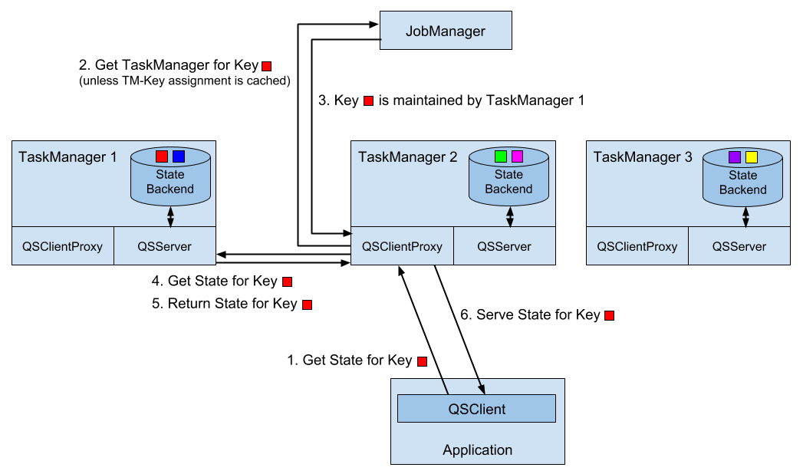

# Chapter 7. Stateful Operators and User Functions
Stateful operators and user functions are common building blocks of stream processing applications. In fact, most non-trivial operations need to memorize records or partial results because data is streamed and arrives over time[1](https://www.safaribooksonline.com/library/view/stream-processing-with/9781491974285/ch07.html#idm139895515536784). Many of Flink’s built-in DataStream operators, sources, and sinks are stateful and buffer records or maintain partial results or metadata. For instance, a window operator collects input records for a `WindowFunction`or the result of applying a `ReduceFunction`, a `ProcessFunction` memorizes scheduled timers, and some sink functions maintain state about transactions to provide exactly-once functionality. In addition to built-in operators and provided sources and sinks, Flink’s DataStream API exposes interfaces to register, maintain, and access state in user-defined functions. 

Stateful stream processing has implications on many aspects of a stream processor, such as failure recovery and memory management as well as the maintenance of streaming applications. Chapters 2 and 3 discussed the foundations of stateful stream processing and related details of Flink’s architecture, respectively. Chapter 9 explains how to setup and configure Flink to reliably process stateful applications including configuration of state backends and checkpointing configuration. Chapter 10 gives guidance for how to operate stateful applications, i.e., taking and restoring from application savepoints, rescaling applications, and application upgrades.

This chapter focuses on the implementation of stateful user-defined functions and discusses the performance and robustness of stateful applications. Specifically, we explain how to define and interact with different types of state in user-defined functions. We discuss performance aspects and how to control the size of function state. Finally, we show how to configure keyed state as queryable and how to access it from an external application.

## 7.1 Implementing Stateful Functions
In Chapter 3, we explained that functions can have two types of state, keyed state and operator state. Flink provides multiple interfaces to define stateful functions. In this section, we show how functions with keyed and operator state are implemented. 

## 7.2 Declaring Keyed State at the RuntimeContext
User functions can employ keyed state to store and access state in the context of a key attribute. For each distinct value of the key attribute, Flink maintains one state instance. The keyed state instances of a function are distributed across all parallel instances of the function, i.e., each parallel instance of the function is responsible for a range of the key domain and maintains the corresponding state instances. Hence, keyed state is very similar to a distributed key-value map. Please consult Chapter 3 for more details on the concepts of keyed state.

Keyed state can only be used by functions which are applied on a `KeyedStream`. A keyed stream is constructed by calling the `DataStream.keyBy(key)` method which defines a key on a stream. A `KeyedStream` is partitioned on the specified key and remembers the key definition. An operator that is applied on a `KeyedStream` is applied in the context of its key definition.

Flink provides multiple primitives for keyed state. The state primitives define the structure of the state for each individual key. The choice of the right state primitive depends on how the function interacts with the state. The choice also affects the performance of a function because each state backend provides its own implementations for these primitives. The following state primitives are supported by Flink:
- `ValueState[T]`: `ValueState[T]` holds a single value of type `T`. The value can be read using `ValueState.value()` and updated with `ValueState.update(value: T)`.
- `ListState[T]`: `ListState[T]` holds a list of elements of type `T`. New elements can be appended to the list by calling `ListState.add(value: T)` or `ListState.addAll(values: java.util.List[T])`. The state elements can be accessed by calling `ListState.get()` which returns an `Iterable[T]` over all state elements. It is not possible to remove individual elements from `ListState`, however the list can be updated by calling `ListState.update(values: java.util.List[T])`.
- `MapState[K, V]`: `MapState[K, V]` holds a map of keys and values. The state primitive offers many methods of a regular Java Map such as `get(key: K)`, `put(key: K, value: V)`, `contains(key: K)`, `remove(key: K)`, and iterators over the contained entries, keys, and values.
- `ReducingState[T]`: `ReducingState[T]` offers the same methods as `ListState[T]` (except for `addAll()` and `update()`) but instead of appending values to a list, `ReducingState.add(value: T)` immediately aggregates `value` using a `ReduceFunction`. The iterator returned by `get()` returns an `Iterable` with a single entry, which is the reduced value.
- `AggregatingState[I, O]`: `AggregatingState[I, O]` behaves similar as `ReducingState`. However, it uses the more general `AggregateFunction` to aggregate values. `AggregatingState.get()` computes the final result and returns it as an `Iterable` with a single element.

All state primitives can be cleared by calling `State.clear()`.

Example 7-1

 shows a simple example of how to use keyed `ValueState` to compare sensor temperature measurements and raise an alert if the temperature increased significantly between the current and the last measurement.

*Example 7-1. A FlatMapFunction with keyed ValueState*
```scala
val sensorData: DataStream[SensorReading]  = ???
// partition and key the stream on the sensor ID
val keyedData: KeyedStream[SensorReading, String] = sensorData
  .keyBy(_.id)


// apply a stateful FlatMapFunction on the keyed stream which 
// compares the temperature readings and raises alerts.
val alerts: DataStream[(String, Double, Double)] = keyedSensorData
  .flatMap(new TemperatureAlertFunction(1.1))

// --------------------------------------------------------------

class TemperatureAlertFunction(val threshold: Double)
    extends RichFlatMapFunction[SensorReading, (String, Double, Double)] {

  // the state handle object
  private var lastTempState: ValueState[Double] = _

  override def open(parameters: Configuration): Unit = {
    // create state descriptor
    val lastTempDescriptor = 
      new ValueStateDescriptor[Double]("lastTemp", classOf[Double])
    // obtain the state handle
    lastTempState = getRuntimeContext
      .getState[Double](lastTempDescriptor)
  }

  override def flatMap(
      in: SensorReading, 
      out: Collector[(String, Double, Double)]): Unit = {
    // fetch the last temperature from state
    val lastTemp = lastTempState.value()
    // check if we need to emit an alert
    if (lastTemp > 0d && (in.temperature / lastTemp) > threshold) {
      // temperature increased by more than the threshold
      out.collect((in.id, in.temperature, lastTemp))
    }
    // update lastTemp state
    this.lastTempState.update(in.temperature)
  }
}
```

In order to create a state object, we have to register a `StateDescriptor` with Flink’s runtime via the `RuntimeContext` which is exposed by a `RichFunction` (see Chapter 5 for a discussion of the `RichFunction` interface). The `StateDescriptor` is specific to the state primitive and includes the name of the state and the data types of the state. The descriptors for `ReducingState` and `AggregatingState`also need a `ReduceFunction` or `AggregateFunction` object to aggregate the added values. The state name is scoped to the operator such that a function can have more than one state object by registering multiple state descriptors. The data types handled by the state are specified as `Class` or `TypeInformation` objects (see Chapter 5 for a discussion of Flink’s type handling). The data type must be specified because Flink needs to create a suitable serializer. Alternatively, it is also possible to explicitly specify a `TypeSerializer` to control how state is written into a state backend, checkpoint, and savepoint[2](https://www.safaribooksonline.com/library/view/stream-processing-with/9781491974285/ch07.html#idm139895515417392).

Typically, the state handle object is created in the `open()` method of the `RichFunction`. `open()` is called before any processing methods, such as `flatMap()` in case of a `FlatMapFunction`, are called. The state handle object (`lastTempState` in the example above) is a regular member variable of the function class. Note that the state handle object only provides access to the state but does not hold the state itself.

When a function registers a `StateDescriptor`, Flink checks if the state backend has data for the function and a state with the given name and type. This might happen if a parallel instance of a stateful function is restarted to recover from a failure or when an application is started from a savepoint. In both cases, Flink links the newly registered state handle object to the existing state. If the state backend does not contain state for the given descriptor, the state that is linked to the handle is initialized as empty.

State can be read and updated in a processing method of a function, such as the `flatMap()` method of a `FlatMapFunction`. When the processing method of a function is called with a record, Flink’s runtime automatically puts all keyed state objects of the function into the context of the record’s key as specified by the `KeyedStream`. Therefore, a function can only access the state which belongs to the record that it currently processes.

The Scala DataStream API offers syntactic shortcuts to define `map` and `flatMap` functions with a single `ValueState`. [Example 7-2](https://www.safaribooksonline.com/library/view/stream-processing-with/9781491974285/ch07.html#code_scala-keyed-state) shows how to implement the previous example with the shortcut.

*Example 7-2. Scala DataStream API shortcut for FlatMap with keyed ValueState*
```scala
val alerts: DataStream[(String, Double, Double)] = keyedSensorData
  .flatMapWithState[(String, Double, Double), Double] {
    case (in: SensorReading, None) =>
      // no previous temperature defined. 
      // Just update the last temperature
      (List.empty, Some(in.temperature))
    case (in: SensorReading, lastTemp: Some[Double]) =>
      // compare temperature difference with threshold
      if (lastTemp.get > 0 && (in.temperature / lastTemp.get) > 1.4) {
        // threshold exceeded. Emit an alert and update the last temperature
        (List((in.id, in.temperature, lastTemp.get)), Some(in.temperature))
      } else {
        // threshold not exceeded. Just update the last temperature
        (List.empty, Some(in.temperature))
      }
  }
```

The flatMapWithState() method expects a function that accepts a Tuple2. The first field of the tuple holds the input record to flatMap, the second field holds an Option of the retrieved state for the key of the processed record. The Option is not defined if the state has not been initialized yet. The function also returns a Tuple2. The first field is a list of the flatMap results, the second field is the new value of the state.

### 7.2.1 Implementing Operator List State with the ListCheckpointed Interface
Operator state is managed per parallel instance of an operator. All events that are processed in the same parallel subtask of an operator have access to the same state. In Chapter 3, we discussed that Flink supports three types of operator state, list state, list union state, and broadcast state. 

A function can work with operator list state by implementing the `ListCheckpointed` interface. The `ListCheckpointed` interface does not work with state handles like `ValueState` or `ListState`, which are registered at the state backend. Instead, functions implement operator state as regular member variables and interact with the state backend via callback functions of the `ListCheckpointed` interface. The interface provides two methods:
- `snapshotState(checkpointId: Long, timestamp: Long): java.util.List[T]`
- `restoreState(java.util.List[T] state): Unit`

The `snapshotState()` method is invoked when Flink requests a checkpoint from the stateful function. The method has two parameters, `checkpointId`, which is a unique, monotonically increasing identifier for checkpoints, and `timestamp`, which is the wall clock time when the master initiated the checkpoint. The method has to return the operator state as a list of serializable state objects. 

The `restoreState()` method is always invoked when the state of a function needs to be initialized, i.e., when the job is started (from a savepoint or not) or in case of a failure. The method is called with a list of state objects and has to restore state of the operator based on these objects.

Example 7-3 shows how to implement the `ListCheckpointed` interface for a function that counts temperature measurements that exceed a threshold per partition, i.e., for each parallel instance of the operator.

*Example 7-3. A RichFlatMapFunction with operator list state*
```scala
class HighTempCounter(val threshold: Double)
    extends RichFlatMapFunction[SensorReading, (Int, Long)]
    with ListCheckpointed[java.lang.Long] {

  // index of the subtask
  private lazy val subtaskIdx = getRuntimeContext
    .getIndexOfThisSubtask
  // local count variable
  private var highTempCnt = 0L

  override def flatMap(
      in: SensorReading, 
      out: Collector[(Int, Long)]): Unit = {
    if (in.temperature > threshold) {
      // increment counter if threshold is exceeded
      highTempCnt += 1
      // emit update with subtask index and counter
      out.collect((subtaskIdx, highTempCnt))
    }
  }

  override def restoreState(
      state: util.List[java.lang.Long]): Unit = {
    highTempCnt = 0
    // restore state by adding all longs of the list
    for (cnt <- state.asScala) {
      highTempCnt += cnt
    }
  }

  override def snapshotState(
      chkpntId: Long, 
      ts: Long): java.util.List[java.lang.Long] = {
    // snapshot state as list with a single count
    java.util.Collections.singletonList(highTempCnt)
  }
}
```

The function in the above example counts per parallel instance how many temperature measurements exceeded a configured threshold . The function uses operator state and has a single state variable for each parallel operator instance that is checkpointed and restored using the methods of the `ListCheckpointed` interface. Note that the `ListCheckpointed` interface is implemented in Java and expects `java.util.List` instead of a Scala native list.

Looking at the example, you might wonder why operator state is handled as a list of state objects. As discussed in Chapter 3, the list structure supports changing the parallelism of functions with operator state. In order to increase or decrease the parallelism of a function with operator state, the operator state needs to be redistributed to a larger or smaller number of task instances. This requires splitting or merging of state objects. Since the logic for splitting and merging of state is custom for every stateful function, this cannot be automatically done for arbitrary types of state.

By providing a list of state objects, functions with operator state can implement this logic in the snapshotState() and restoreState() methods. The snapshotState() method splits the operator state into multiple parts and the restoreState() method assembles the operator state from possibly multiple parts. When the state of a function is restored, the parts of the state are distributed among all parallel subtasks of the function and handed to the restoreState() method. In case that there are more parallel subtasks than state objects, some subtasks are started with no state, i.e., the restoreState() method is called with an empty list.

Looking again at the example of the `HighTempCounter` function in [Example 7-3](https://www.safaribooksonline.com/library/view/stream-processing-with/9781491974285/ch07.html#code_op-list-state), we see that each parallel instance of the operator exposes its state as a list with a single entry. If we would increase the parallelism of this operator, some of the new subtasks would be initialized with an empty state, i.e., start summing from zero. In order to achieve a better state distribution behavior when the `HighTempCounter` function is rescaled, we can implement the `snapshotState()` method such that it splits its count into multiple partial counts as shown in [Example 7-4](https://www.safaribooksonline.com/library/view/stream-processing-with/9781491974285/ch07.html#code_rescaled-op-list-state).

*Example 7-4. Split operator list state for better distribution during rescaling*
```scala
override def snapshotState(
    chkpntId: Long, 
    ts: Long): java.util.List[java.lang.Long] = {
  // split count into ten partial counts
  val div = highTempCnt / 10
  val mod = (highTempCnt % 10).toInt
  // return count as ten parts
  (List.fill(mod)(new java.lang.Long(div + 1)) ++
    List.fill(10 - mod)(new java.lang.Long(div))).asJava
}
```

### 7.2.2 Using Connected Broadcast State
A common requirement in streaming applications is to distribute the same information to all parallel instances of a function and maintain it as recoverable state. An example is a stream of rules and a stream of events on which the rules are applied. The operator that applies the rules ingests two input streams, the event stream and the rules stream, and remembers the rules in an operator state in order to apply them to all events of the event stream. Since each parallel instance of the operator must hold all rules in its operator state, the rules stream needs to be broadcasted to ensure that each instance of the operator receives all rules. 

In Flink such a state is called broadcast state. Broadcast state can only be combined with a regular `DataStream` or a `KeyedStream`. [Example 7-5](https://www.safaribooksonline.com/library/view/stream-processing-with/9781491974285/ch07.html#code_broadcast-state) shows how to implement the temperature alert application with a rules stream to dynamically adjust the alert thresholds.

*Example 7-5. A function connecting a broadcast rules stream and keyed event stream*
```scala
val keyedSensorData: KeyedStream[SensorReading, String] = 
  sensorData.keyBy(_.id)

// the descriptor of the broadcast state
val broadcastStateDescriptor = 
  new MapStateDescriptor[String, Double](
    "thresholds", 
    classOf[String], 
    classOf[Double])

val broadcastThresholds: BroadcastStream[ThresholdUpdate] = 
  thresholds.broadcast(broadcastStateDescriptor)

// connect keyed sensor stream and broadcasted rules stream
val alerts: DataStream[(String, Double, Double)] = keyedSensorData
  .connect(broadcastThresholds)
  .process(new UpdatableTempAlertFunction(4.0d))

// --------------------------------------------------------------

class UpdatableTempAlertFunction(val defaultThreshold: Double)
    extends KeyedBroadcastProcessFunction[String, SensorReading, ThresholdUpdate, (String, Double, Double)] {

  // the descriptor of the broadcast state
  private lazy val thresholdStateDescriptor =
    new MapStateDescriptor[String, Double](
      "thresholds", 
      classOf[String], 
      classOf[Double])

  // the keyed state handle
  private var lastTempState: ValueState[Double] = _

  override def open(parameters: Configuration): Unit = {
    // create keyed state descriptor
    val lastTempDescriptor = new ValueStateDescriptor[Double](
      "lastTemp", 
      classOf[Double])

    // obtain the keyed state handle
    lastTempState = getRuntimeContext
      .getState[Double](lastTempDescriptor)
  }

  override def processBroadcastElement(
      update: ThresholdUpdate,
      keyedCtx: KeyedBroadcastProcessFunction[String, SensorReading, ThresholdUpdate, (String, Double, Double)]#KeyedContext,
      out: Collector[(String, Double, Double)]): Unit = {
    // get broadcasted state handle
    val thresholds: MapState[String, Double] = keyedCtx
      .getBroadcastState(thresholdStateDescriptor)

    if (update.threshold >= 1.0d) {
      // configure a new threshold of the sensor
      thresholds.put(update.id, update.threshold)
    } else {
      // remove sensor specific threshold
      thresholds.remove(update.id)
    }
  }

  override def processElement(
      reading: SensorReading,
      keyedReadOnlyCtx: KeyedBroadcastProcessFunction[String, SensorReading, ThresholdUpdate, (String, Double, Double)]#KeyedReadOnlyContext,
      out: Collector[(String, Double, Double)]): Unit = {
    // get read-only broadcast state
    val thresholds: MapState[String, Double] = keyedReadOnlyCtx
      .getBroadcastState(thresholdStateDescriptor)

    // get threshold for sensor
    val sensorThreshold: Double = 
      if (thresholds.contains(reading.id)) {
        thresholds.get(reading.id) 
      } else {
        defaultThreshold
      }

    // fetch the last temperature from keyed state
    val lastTemp = lastTempState.value()

    // check if we need to emit an alert
    if (lastTemp > 0 && 
         (reading.temperature / lastTemp) > sensorThreshold) {
      // temperature increased by more than the threshold
      out.collect((reading.id, reading.temperature, lastTemp))
    }
  
    // update lastTemp state
    this.lastTempState.update(reading.temperature)
  }
}
```

A function with broadcast state is defined in three steps.
1. You create a `BroadcastStream` by calling `DataStream.broadcast()` and provide one or more `MapStateDescriptor` objects. Each descriptor defines a separate broadcast state of the function that is later applied on the `BroadcastStream`.
2. You connect the `BroadcastStream` with a `DataStream` or `KeyedStream`. Note, that the `BroadcastStream` must be put as an argument in the `connect()` method.
3. You apply a function on the connected streams. Depending on whether the other stream was keyed or not, a `KeyedBroadcastProcessFunction` or `BroadcastProcessFunction` can be applied.

The `BroadcastProcessFunction` and `KeyedBroadcastProcessFunction` differ from a regular `CoProcessFunction` because the element processing methods are not symmetric. The methods are named `processElement()` and `processBroadcastElement()` and called with different context objects. Both context objects offer a method `getBroadcastState(MapStateDescriptor)` that provides access to a broadcast state handle. However, the broadcast state handle that is returned in the `processElement()`method provides read-only access to the broadcast state. This is a safety mechanism to ensure that the broadcast state holds the same information in all parallel instances. In addition, both context objects also provide access to the event-time timestamp, the current watermark, the current processing-time, and side outputs, similar to the context objects of a regular `ProcessFunction`.

The `BroadcastProcessFunction` and `KeyedBroadcastProcessFunction` differ from each other as well. The `BroadcastProcessFunction` does not expose a timer service to register timers and consequently does not offer an `onTimer()` method. Note that you should not access keyed state from the `processBroadcastElement()` of the `KeyedBroadcastProcessFunction`. Since the broadcast input does not specify a key, the state backend cannot access a keyed value and will throw an exception. Instead, the context of the `KeyedBroadcastProcessFunction.processBroadcastElement()` method provides a method `applyToKeyedState(StateDescriptor, KeyedStateFunction)` to apply a `KeyedStateFunction` to the value of each key in the keyed state that is referenced by the `StateDescriptor`.

### 7.2.3 Using the CheckpointedFunction Interface
The `CheckpointedFunction` interface is the lowest-level interface to specify stateful functions. It provides hooks to register and maintain keyed state and operator state and is the only interface that gives access to operator list union state, i.e., operator state that is fully replicated in case of a recovery or savepoint restart[3](https://www.safaribooksonline.com/library/view/stream-processing-with/9781491974285/ch07.html#idm139895515339904).

The `CheckpointedFunction` interface defines two methods, `initializeState()` and `snapshotState()`, which work similarly to the methods of the `ListCheckpointed` interface for operator list state. The `initializeState()` method is called when a parallel instance of a `CheckpointedFunction` is created. This happens when an application is started or when a task is restarted due to a failure. The method is called with a `FunctionInitializationContext` object which provides access to an `OperatorStateStore` and an `KeyedStateStore` object. The state stores are responsible for registering function state with Flink’s runtime and returning the state objects, such as `ValueState`, `ListState`, or `BroadcastState`. Each state is registered with a name that must be unique for the function. When a function registers state, the state store tries to initialize the state by checking if the state backend holds state for the function registered under the given name. If the task was restarted due to a failure or from a savepoint, the state will be initialized from the saved data. If the application was not started from a checkpoint or savepoint, the state will be initially empty.

The `snapshotState()` method is called immediately before a checkpoint is taken and receives a `FunctionSnapshotContext` object as parameter. The `FunctionSnapshotContext` gives access to the unique identifier of the checkpoint and the timestamp when the JobManager initiated the checkpoint. The purpose of the `snapshotState()` method is to ensure that all state objects are updated before the checkpoint is done. Moreover, in combination with the `CheckpointListener` interface, the `snapshotState()`method can be used to consistently write data to external data stores by synchronizing with Flink’s checkpoints.

Example 7-6 shows how the CheckpointedFunction interface is used to create a function with keyed and operator state that counts per key and operator instance how many sensor readings exceed a specified threshold.

*Example 7-6. A function implementing the CheckpointedFunction interface.*
```scala
class HighTempCounter(val threshold: Double)
    extends FlatMapFunction[SensorReading, (String, Long, Long)]
    with CheckpointedFunction {

  // local variable for the operator high temperature cnt
  var opHighTempCnt: Long = 0
  var keyedCntState: ValueState[Long] = _
  var opCntState: ListState[Long] = _

  override def flatMap(
      v: SensorReading, 
      out: Collector[(String, Long, Long)]): Unit = {
    // check if temperature is high
    if (v.temperature > threshold) {
      // update local operator high temp counter
      opHighTempCnt += 1
      // update keyed high temp counter
      val keyHighTempCnt = keyedCntState.value() + 1
      keyedCntState.update(keyHighTempCnt)
      // emit new counters
      out.collect((v.id, keyHighTempCnt, opHighTempCnt))
    }
  }

  override def initializeState(
      initContext: FunctionInitializationContext): Unit = {
    // initialize keyed state
    val keyCntDescriptor = new ValueStateDescriptor[Long](
      "keyedCnt",
      createTypeInformation[Long])
    keyedCntState = initContext.getKeyedStateStore
      .getState(keyCntDescriptor)

    // initialize operator state
    val opCntDescriptor = new ListStateDescriptor[Long](
      "opCnt",
      createTypeInformation[Long])
    opCntState = initContext.getOperatorStateStore
      .getListState(opCntDescriptor)

    // initialize local variable with state
    opHighTempCnt = opCntState.get().asScala.sum
  }

  override def snapshotState(
      snapshotContext: FunctionSnapshotContext): Unit = {
    // update operator state with local state
    opCntState.clear()
    opCntState.add(opHighTempCnt)
  }
}
 
```

### 7.2.4 Receiving Notifications about Completed Checkpoints
Frequent synchronization a major reason for performance limitations in distributed systems. Flink’s design aims to reduce synchronization points. Checkpoints are implemented based on barriers that flow with the data and therefore avoid global synchronization across all operators of an application.

Due to its checkpointing mechanism, Flink is able to achieve very good performance. However, another implication is that the state of an application is never in a consistent state except for the logical points in time when a checkpoint is taken. For some operators it can be important to know whether a checkpoint completed or not. For example, sink functions that aim write data to external systems with exactly-once guarantees must only emit records that were received before a successful checkpoint to ensure that the received data will not be recomputed in case of a failure.

As discussed in Chapter 3, a checkpoint is only successful if all operator tasks successfully checkpointed their state to the checkpoint storage. Hence, only the JobManager can determine whether a checkpoint is successful or not. Operators that need to be notified about completed checkpoints can implement the `CheckpointListener` interface. The interface provides the `notifyCheckpointComplete(long chkpntId)` method, which might be called when the JobManager registers a checkpoint as completed, i.e., when all operators successfully copied their state to the remote storage.

Note, that Flink does not guarantee that the notifyCheckpointComplete() method is called for each completed checkpoint. It is possible that a task misses the notification. This needs to be taken into account when implementing the interface.

## 7.3 Robustness and Performance of Stateful Applications

The way that operators interact with state has implications on the robustness and performance of applications. There are several aspects that affect the behavior of an application such as the choice of the state backend that locally maintains the state and performs checkpoints, the configuration of the checkpointing algorithm, and the size of the application’s state. In this section, we discuss aspects that need to be taken into account in order to ensure robust execution behavior and consistent performance of long-running applications.

## 7.4 Choosing a State Backend

In Chapter 3, we explained that Flink maintains operator state of streaming applications in a state backend. The state backend is responsible for storing the local state of each task instance and persisting it to a remote storage when a checkpoint is taken. Because local state can be maintained and checkpointed in different ways, state backends are pluggable, i.e., two applications can use different state backend implementations to maintain their state. Currently, Flink offers three state backends, the `InMemoryStateBackend`, the `FsStateBackend`, and the `RocksDBStateBackend`. Moreover, `StateBackend` is a public interface such that it is possible to implement custom state backends.

The choice of the state backend has implications on the robustness and performance of a stateful application. Each state backend provides implementations for the different state primitive, such as ValueState, ListState, and MapState. The InMemoryStateBackend and the FsStateBackend store state as regular objects on the heap of the TaskManager JVM process. For example, a MapState is backed by a Java HashMap object. While this approach provides very low latencies to read or write state, it has implications on the robustness of an application. If the state of a task instance grows too large, the JVM and all task instances running on it can be killed due to an OutOfMemoryError. Moreover, this approach can suffer from garbage collection pauses because it puts many objects on the heap.

In contrast, the `RocksDBStateBackend` serializes all state into a RocksDB instance. RocksDB is an embedded key-value store, which persists data to disk. By writing data to disk and supporting incremental checkpoints (see Chapter 3), the `RocksDBStateBackend` is a good choice for applications with large state. Users reported applications with state sizes of multiple terabytes running on the `RocksDBStateBackend`. However, reading and writing data to disk and the overhead of de/serializing objects result in lower read and write performance compared to organizing state on the heap. Chapter 3 discussed the differences between Flink’s state backends in more detail.

Example 7-7 shows how to configure a state backend (here the RocksDBStateBackend) for an application and all its stateful functions:
*Example 7-7. Configuring a RocksDBStateBackend for an application.*
```scala
val env = StreamExecutionEnvironment.getExecutionEnvironment

val checkpointPath: String = ???
val incrementalCheckpoints: Boolean = true
// configure path for checkpoints on the remote filesystem
val backend = new RocksDBStateBackend(
  checkpointPath, 
  incrementalCheckpoints)

// configure path for local RocksDB instance on worker
backend.setDbStoragePath(dbPath)
// configure RocksDB options
backend.setOptions(optionsFactory)

// configure state backend
env.setStateBackend(backend)
```

Please note that the `RocksDBStateBackend` is an optional module of Flink and not included in Flink’s default classpath. Chapter 5 discusses how to add optional modules to Flink.

### 7.4.1 Enabling Checkpointing
Many streaming applications require that failures, such as a failed TaskManager, must not affect the correctness of the computed result. Moreover, application state can be a valuable asset, which must not be lost in case of a failure because it is expensive or impossible to recompute.

In Chapter 3, we explained Flink’s mechanism to create consistent checkpoints of a stateful application, i.e., a snapshot of the state of all built-in and user-defined stateful functions at a point in time when all operators processed all events up to a specific point in the application’s input streams. Flink’s checkpointing technique and the corresponding failure recovery mechanism guarantee exactly-once consistency for state, i.e., the state of an application is same regardless whether failures occurred or not.

When an application enables checkpointing, the JobManager initiates checkpoints in regular intervals. The checkpointing interval determines the overhead of the checkpointing mechanism during regular processing and the time it takes to recover from a failure. A shorter checkpointing interval causes higher overhead during regular processing but a faster recovery because less data needs to be reprocessed.

An application enables checkpointing via the `StreamExecutionEnvironment` shown in [Example 7-8](https://www.safaribooksonline.com/library/view/stream-processing-with/9781491974285/ch07.html#code_checkpoint_config).

*Example 7-8. Configuring checkpointing for an application.*
```scala
val env = StreamExecutionEnvironment.getExecutionEnvironment

// set checkpointing interval to 10 seconds (10000 milliseconds)
env.enableCheckpointing(10000L)
```

Flink provides more tuning knobs to configure the checkpointing behavior, such as the choice of consistency guarantees (exactly-once or at-least-once), the maximum number of checkpoints to preserve, and a timeout to cancel long-running checkpoints. All these options are discussed in detail in Chapter 9.

### 7.4.2 Updating Stateful Operators
Stateful streaming applications are often designed to run for a long time but also need to be maintained. For example it might be necessary to fix a bug or to evolve an application by implementing a new feature. In either case, a currently running application needs to be replaced by a new version without losing the state of the application.

Flink supports such updates by taking a savepoint of the running application, stopping it, and starting the new version from the savepoint. However, application updates cannot be not supported for arbitrary changes. The original application and its new version need to be savepoint compatible which means that the new version needs to be able to deserialize the data of the savepoint that was taken from the old version and correctly map the data into the state of the its operators.

It is important to note that the design of the original version of the application defines if and how the application can be modified in the future. It will not be easy or not even possible to update an application if the original version was not designed with updates in mind. The problem of savepoint compatibility boils down to two issues.

- Mapping the individual operator states in a savepoint to the operators of a new application.
- Reading the serialized state of the original application with the deserializers of the new version.

When an application is started from a savepoint, Flink associates the state in the savepoint with the operators in the application based on unique identifiers. This matching of state and operators is important, because an updated application might have a different structure, e.g., it might have additional operators or operators have been removed. Each operator has an operator identifier that is serialized into the savepoint along with its state. By default, the identifier is computed as a unique hash based on the operator’s properties and the properties of its predecessors. Hence, the identifier will inevitably change if the operator or its predecessors change and Flink will not be able to map the state of a previous savepoint. The default identifiers are a conservative mechanism to avoid state corruption but prevent many types of application updates. In order to ensure that you can add or remove of operators from your application, you should always manually assign unique identifiers to all of your operators. This is done as shown in [Example 7-9](https://www.safaribooksonline.com/library/view/stream-processing-with/9781491974285/ch07.html#code_operator-uid).

*Example 7-9. Setting an unique operator identified.*
```scala
val alerts: DataStream[(String, Double, Double)] = sensorData
  .keyBy(_.id)
  // apply stateful FlatMap and set unique ID
  .flatMap(new TemperatureAlertFunction(1.1)).uid("alertFunc")
```

When starting an updated stateful application from a savepoint it might happen that the new version does not require all state that was written into the savepoint because a stateful operator was removed. By default, Flink will not allow to restart an application that does not read all state of a savepoint to prevent state loss. However, it is possible to disable this safety check.

While addressing the problem of matching savepoint state and operators is rather easy to solve by adding unique identifiers, ensuring the compatibility of serializers is more challenging. The best approach here is to configure state serializers for data encodings that support versioning, such as Avro, Protobuf, or Thrift. You should also be aware that serialization compatibility does not only affect state that is explicitly defined in a user-defined function (as discussed in this chapter) but also the internal state of stateful DataStream operators such as window operators or running aggregates. All these functions store intermediate data in state. The type of the state usually depends on the input type of the operator. Consequently, also changing the input and output types of functions affects the savepoint compatibility of an application. Therefore, we also recommend to use data types with encodings that support versioning as input types for built-in DataStream operators with state.

An operator with state that is serialized using a versioned encoding can be modified by updating the data type and the schema of its encoding. When the state is read from the savepoint, new fields will be initialized as empty and fields that got dropped will not be read.

If you have already a running application that you need to update but did not use serializers with versioned encodings, Flink offers a migration path for the serialized savepoint data. This functionality is based on two methods in the TypeSerializer interface, snapshotConfiguration() and ensureCompatibility(). Since, serializer compatibility is a fairly advanced and detailed topic, it is not in the scope of this book. We refer you to the documentation of the TypeSerializer interface.

### 7.4.3 Tuning the Performance of Stateful Applications
The performance of a stateful operator (built-in or user-defined) depends on several aspects, including the data types of the state, the state backend of the application, and the chosen state primitives.

For state backends that de/serialize state objects when reading or writing, such as the RocksDBStateBackend, the choice of the state primitive (ValueState, ListState, or MapState) can have a major impact on the performance of an application. For instance, ValueState is completely deserialized when it is accessed and serialized when it is updated. The ListState implementation of the RocksDBStateBackend deserializes all list entries before constructing the Iterable to read the values. However, adding a single value to the ListState, i.e., appending it to the end of the list, is a cheap operation because only the appended value is serialized. The MapState of the RocksDBStateBackend allows to read and write values per key, i.e., only those keys and values are de/serialized that are read or written. When iterating over the entry set of a MapState, the serialized entries are pre-fetched from RocksDB and only deserialized when a key or value is actually accessed.

For example, with the `RocksDBStateBackend` it is more efficient to use `MapState[X, Y]` instead of `ValueState[HashMap[X, Y]]`. `ListState[X]` has an advantage over `ValueState[List[X]]` if elements are frequently appended to the list and the elements of the list are less frequently accessed.

Another good practice is to update state only once per function call. Since checkpoints are synchronized with function invocations, multiple state updates do not provide any benefits but can cause additional serialization overhead when updating state several times in a single function call.

### 7.4.5 Preventing Leaking State
Streaming applications are often designed to run continuously for months or years. If the state of an application is continuously increasing, it will at some point grow too large and kill the application unless action is taken to scale the application to more resources. In order to prevent increasing resource consumption of an application over time, it is important that the size of operator state is controlled. Since the handling of state directly affects the semantics of an operator, Flink cannot automatically clean up state and free storage. Instead, all stateful operators must control the size of their state and have to ensure that it is not infinitely growing.

A common reason for growing state is keyed state on an evolving key domain. In this scenario, a stateful function receives records with keys that are only active for a certain period of time and are never received after that. A typical example is a stream of click events where clicks have a session id attribute that expires after some time. In such a case, a function with keyed state would accumulate state for more and more keys. As the key space evolves, the state of expired keys becomes stale and useless. A solution for this problem is to remove the state of expired keys. However, a function with keyed state can only access the state of a key if it received a record with that key. In many cases, a function does not know if a record will be the last one for a key. Hence, it will not be able to evict the state for the key because it might receive another record for the key.

This problem does not only exist for custom stateful functions but also for some of the built-in operators of the DataStream API. For example, computing running aggregates on a `KeyedStream`, either with the build-in aggregations functions such as `min`, `max`, `sum`, `minBy`, or `maxBy` or with a custom `ReduceFunction` or `AggregateFunction`, keeps the state for each key and never discards it. Consequently, these functions should only be used if the key values are from a constant and bounded domain. Other examples are windows with count-based triggers, which process and clean their state when a certain number of records has been received. Windows with time-based triggers (both, processing time and event time) are not affected by this because they trigger and purge their state based on time.

This means that you should take application requirements and the properties of its input data, such as key domain, into account when designing and implementing stateful operators. If your application requires keyed state for a moving key domain, it should ensure that the state of keys is cleared when it is not needed anymore. This can be done by registering timers for a point of time in the future[4](https://www.safaribooksonline.com/library/view/stream-processing-with/9781491974285/ch07.html#idm139895515124432). Similar to state, timers are registered in the context of the currently active key. When the timer fires, a callback method is called and the context of timer’s key is loaded. Hence, the callback method has full access to the key’s state and can also clear it. There are currently two functions that offer support to register timers, the `Trigger` interface for windows and the `ProcessFunction`. Both have been introduced in Chapter 6.

Example 7-10 shows a ProcessFunction that compares two subsequent temperature measurements and raises an alert if the difference is greater than a threshold. This is the same use case as in the keyed state example before, but the ProcessFunction also clears the state for keys (i.e., sensors) that have not provided any new temperature measurement within one hour of event-time.

A stateful ProcessFunction that cleans its state.
```scala
class StateCleaningTemperatureAlertFunction(val threshold: Double)
    extends ProcessFunction[SensorReading, (String, Double, Double)] {

  // the keyed state handle for the last temperature
  private var lastTempState: ValueState[Double] = _
  // the keyed state handle for the last registered timer
  private var lastTimerState: ValueState[Long] = _

  override def open(parameters: Configuration): Unit = {
    // register state for last temperature
    val lastTempDescriptor = 
      new ValueStateDescriptor[Double]("lastTemp", classOf[Double])
    lastTempState = getRuntimeContext
      .getState[Double](lastTempDescriptor)

    // register state for last timer
    val timerDescriptor: ValueStateDescriptor[Long] =
      new ValueStateDescriptor[Long]("timerState", classOf[Long])
    lastTimerState = getRuntimeContext
      .getState(timerDescriptor)
  }

  override def processElement(
      in: SensorReading,
      ctx: ProcessFunction[SensorReading, (String, Double, Double)]#Context,
      out: Collector[(String, Double, Double)]) = {
    // get current watermark and add one hour
    val checkTimestamp = 
      ctx.timerService().currentWatermark() + (3600 * 1000)
    // register new timer. 
    // Only one timer per timestamp will be registered.
    ctx.timerService().registerEventTimeTimer(checkTimestamp)
    // update timestamp of last timer
    lastTimerState.update(checkTimestamp)

    // fetch the last temperature from state
    val lastTemp = lastTempState.value()
    // check if we need to emit an alert
    if (lastTemp > 0.0d && (in.temperature / lastTemp) > threshold) {
      // temperature increased by more than the threshold
      out.collect((in.id, in.temperature, lastTemp))
    }

    // update lastTemp state
    this.lastTempState.update(in.temperature)
  }

  override def onTimer(
      ts: Long,
      ctx: ProcessFunction[SensorReading, (String, Double, Double)]#OnTimerContext,
      out: Collector[(String, Double, Double)]): Unit = {
    // get timestamp of last registered timer
    val lastTimer = lastTimerState.value()

    // check if the last registered timer fired
    if (lastTimer != null.asInstanceOf[Long] && lastTimer == ts) {
      // clear all state for the key
      lastTempState.clear()
      lastTimerState.clear()
    }
  }
}
```

The state-cleaning mechanism implemented by the above `ProcessFunction` works as follows. For each input event, the `processElement()` method is called. Before comparing the temperature measurements and updating the last temperature, the method registers a clean-up timer. The clean-up time is computed by reading the timestamp of the current watermark and adding one hour. The timestamp of the latest registered timer is held in an additional `ValueState[Long]` named `lastTimerState`. After that, the method compares the temperatures, possibly emits an alert, and updates its state.

While being executed, a `ProcessFunction` maintains a list of all registered timers, i.e., registering a new timer does not override previously registered timers[5](https://www.safaribooksonline.com/library/view/stream-processing-with/9781491974285/ch07.html#idm139895515112288). As soon as the internal event-time clock of the operator (driven by the watermarks) exceeds the timestamp of a registered timer, the `onTimer()` method is called. The method validates if the fired timer was the last registered timer by comparing the timestamp of the fired timer with the timestamp held in the `lastTimerState`. If this is the case, the method removes all managed state, i.e., the last temperature and the last timer state.

## 7.5 Queryable State
Many stream processing applications need to share their results with other applications. A common pattern is to write results into a database or key-value store and other applications retrieve the result from that data store. Such an architecture implies that a separate system needs to be setup and maintained which can be a major effort, especially if this needs to be a distributed system as well.

Apache Flink features queryable state to address use cases that usually would require an external data store to share data. In Flink, any keyed state can be exposed to external applications as queryable state and act as a read-only key-value store. The stateful streaming application processes events as usual and stores and updates its intermediate or final results in an queryable state. External applications request the state for each key while the streaming application is running. Note that only key-point-queries are supported. It is not possible to request key ranges or even run more complex queries.

Queryable state does not address all use cases that require an external data store. For example, the queryable state is only accessible while the application is running. It is not accessible while the application is restarted due to an error, for rescaling the application, or to migrate it to another cluster. However, it makes many other applications much easier to realize, such as real-time dashboards or other monitoring applications.

In the following, we will discuss the architecture of Flink’s queryable state service and explain how streaming applications can expose queryable state and external applications can query it.

### 7.5.1 Architecture and Enabling Queryable State
Flink’s queryable state service consists of three processes.

- The `QueryableStateClient` is used by an external application to submit queries and retrieve results.
- The `QueryableStateClientProxy` accepts and serves client requests. Each TaskManager runs a client proxy. Since keyed state is distributed across all parallel instances of an operator, the proxy needs to identify the TaskManager that maintains the state for the requested key. This information is requested from the JobManager, which manages the key group assignment[6](https://www.safaribooksonline.com/library/view/stream-processing-with/9781491974285/ch07.html#idm139895515100192), and cached. The client proxy retrieves the state from the state server of the respective TaskManager and serves the result to the client.
- The `QueryableStateServer` serves the requests of a client proxy. Each TaskManager runs a state server which fetches the state of a queried key from the local state backend and returns it to the requesting client proxy.

Figure 7-1 visualizes the architecture of the queryable state service.


*Figure 7-1. Architecture of Flink’s Queryable State Service*

In order to enable the queryable state service in a Flink setup, i.e., to start client proxy and server threads within the TaskManagers, you need to add the `flink-queryable-state-runtime` JAR file to the classpath of the TaskManager process. This is done by copying it from the `./opt` folder of you installation into the `./lib`folder. When the JAR file is in the classpath, the queryable state threads are automatically started and can serve requests of the queryable state client. When properly configured, you will find the following log message in the TaskManager logs.

```
Started the Queryable State Proxy Server @ …
```

The ports used by the client proxy and server and additional parameters can be configured in the `./conf/flink-conf.yaml` file.

### 7.5.2 Exposing Queryable State
Implementing a streaming application with queryable state is easy. All you have to do is to define a function with keyed state and enable the state as queryable by calling the `setQueryable(String)` method on the `StateDescriptor` before obtaining the state handle. [Example 7-11](https://www.safaribooksonline.com/library/view/stream-processing-with/9781491974285/ch07.html#code_enable-queryable-state) shows how to make the `lastTempState` queryable that we used in the example to illustrate the usage of the keyed state.

*Example 7-11. Configuring keyed state to be queryable.*
```scala
 override def open(parameters: Configuration): Unit = {

  // create state descriptor
  val lastTempDescriptor = 
    new ValueStateDescriptor[Double]("lastTemp", classOf[Double])
  // enable queryable state and set its external identifier
  lastTempDescriptor.setQueryable("lastTemperature")
  // obtain the state handle
  lastTempState = getRuntimeContext
    .getState[Double](lastTempDescriptor)
}
```

The external identifier that is passed with the `setQueryable()` method can be freely chosen and is only used to configure the queryable state client.

In addition to the generic way of enabling queries on any type of keyed state, Flink also offers shortcuts to define stream sinks that store the events of a stream in queryable state. [Example 7-12](https://www.safaribooksonline.com/library/view/stream-processing-with/9781491974285/ch07.html#code_queryable_state_sink) shows how to use a queryable state sink.

Writing a DataStream into a queryable state sink.
```scala
val tenSecsMaxTemps: DataStream[(String, Double)] = sensorData
  // project to sensor id and temperature
  .map(r => (r.id, r.temperature))
  // compute every 10 seconds the max temperature per sensor
  .keyBy(_._1)
  .timeWindow(Time.seconds(10))
  .max(1)

// store max temperature of the last 10 secs for each sensor 
// in a queryable state.
tenSecsMaxTemps
  // key by sensor id
  .keyBy(_._1)
  .asQueryableState("maxTemperature")
```

The `asQueryableState()` method appends a queryable state sink to the stream. The type of the queryable state is a `ValueState` that holds values of the type of the input stream, i.e., in case of our example `(String, Double)`. For each received record, the queryable state sink upserts the record into the `ValueState`, such that always the latest event per key is stored. The `asQueryableState()` method is overloaded with two more methods.

- `asQueryableState(id: String, stateDescriptor: ValueStateDescriptor[T])`can be used to configure the `ValueState` in more detail, e.g., to configure a custom serializer.
- `asQueryableState(id: String, stateDescriptor: ReducingStateDescriptor[T])` configures a `ReducingState` instead of a `ValueState`. The `ReducingState` is also updated for each incoming record. However, in contrast to the `ValueState`, the new record does not replace the existing value but is instead combined with the previous version using the state’s `ReduceFunction`.

An application with a function that has queryable state is executed just like any other application. You only have to ensure that the TaskManagers are configured to start their queryable state services as discussed in the previous section.

### 7.5.3 Querying State from External Applications
Any JVM-based application can query queryable state of a running Flink application by using the `QueryableStateClient`. This class is provided by the `flink-queryable-state-client-java`dependency, that you can add to your project as follows.

```xml
<dependency>
  <groupid>org.apache.flink</groupid>
  <artifactid>flink-queryable-state-client-java_2.11</artifactid>
  <version>1.5.0</version>
</dependency>
```

The `QueryableStateClient` is initialized with the hostname of any TaskManager and the port on which the queryable state client proxy is listening. By default, the client proxy listens on port 9067 but the port can be configured in the `./conf/flink-conf.yaml` file. 

```scala
val client: QueryableStateClient = 
  new QueryableStateClient(tmHostname, proxyPort)
```

Once you obtained a state client, you can query the state of an application by calling the `getKvState()`method. The method takes several parameters, such as the `JobID` of the running application, the state identifier, the key for which the state should be fetched, the `TypeInformation` for the key, and the `StateDescriptor` of the queried state. The `JobID` can be obtained via the REST API, the web UI, or the log files. The `getKvState()` method returns a `CompletableFuture[S]` where `S` is the type of the state, e.g., `ValueState[_]` or `MapState[_, _]`. Hence, the client can send out multiple asynchronous queries and wait for their results.

Example 7-13 shows a simple console dashboard that queries the queryable state of the application that was shown in the previous section.

A simple dashboard application that queries the state of a Flink application.
```scala
object TemperatureDashboard {

  // assume local setup and TM runs on same machine as client
  val proxyHost = "127.0.0.1"
  val proxyPort = 9069

  // jobId of running QueryableStateJob.
  // can be looked up in logs of running job or the web UI
  val jobId = "d2447b1a5e0d952c372064c886d2220a"

  // how many sensors to query
  val numSensors = 5
  // how often to query the state
  val refreshInterval = 10000

  def main(args: Array[String]): Unit = {
    // configure client with host and port of queryable state proxy
    val client = new QueryableStateClient(proxyHost, proxyPort)

    val futures = new Array[
      CompletableFuture[ValueState[(String, Double)]]](numSensors)
    val results = new Array[Double](numSensors)

    // print header line of dashboard table
    val header = 
      (for (i <- 0 until numSensors) yield "sensor_" + (i + 1))
        .mkString("\t| ")
    println(header)

    // loop forever
    while (true) {
      // send out async queries
      for (i <- 0 until numSensors) {
        futures(i) = queryState("sensor_" + (i + 1), client)
      }
      // wait for results
      for (i <- 0 until numSensors) {
        results(i) = futures(i).get().value()._2
      }
      // print result
      val line = results.map(t => f"$t%1.3f").mkString("\t| ")
      println(line)

      // wait to send out next queries
      Thread.sleep(refreshInterval)
    }
    client.shutdownAndWait()
  }

  def queryState(
      key: String,
      client: QueryableStateClient)
    : CompletableFuture[ValueState[(String, Double)]] = {
    
    client
      .getKvState[String, ValueState[(String, Double)], (String, Double)](
        JobID.fromHexString(jobId),
        "maxTemperature",
        key,
        Types.STRING,
        new ValueStateDescriptor[(String, Double)](
          "", // state name not relevant here
          createTypeInformation[(String, Double)]))
  }
}
```

In order to run the example, you have to start the streaming application with the queryable state first. Once it is running, look for the `JobID` in the log file or the web UI, set the `JobID` in the code of the dashboard and run it as well. The dashboard will then start querying the state of the running streaming application.

## 7.6 Summary

Basically every non-trivial streaming application is stateful. The DataStream API provides powerful yet easy-to-use tooling to access and maintain operator state. It offers different types of state primitives and supports pluggable state backends. While developers have lots of flexibility to interact with state, Flink’s runtime manages Terabytes of state and ensures exactly-once semantics in case of failures. The combination of time-based computations as discussed in Chapter 6 and scalable state management, empowers developers to realize sophisticated streaming applications. Queryable state is an easy-to-use feature and can save you the effort of setting up and maintaining a database or key-value store to expose the results of a streaming application to external applications.