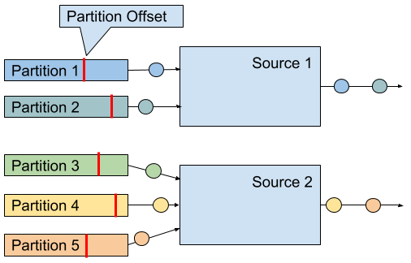

# Chapter 8. Reading from and Writing to External Systems
Data can be stored in many different systems, such as file systems, object stores, relational database systems, key-value stores, search indexes, event logs, and message queues, and so on. Each class of systems has been designed for specific access patterns and excels at serving a certain purpose. Consequently, today’s data infrastructures often consist of many different storage systems. Before adding a new component into the mix, a natural question to ask is “How well does it work with the other components in my stack?”

Adding a data processing system, such as Apache Flink, requires careful considerations because it does not include its own store layer but relies on external storage systems to ingest and persist data. Hence, it is important for data processors like Flink to provide a well-equipped library of connectors to read data from and write data to external systems as well as an API to implement custom connectors. However, just being able to read or write data to external data stores is not sufficient for a stream processor that wants to provide meaningful consistency guarantees in case of failures.

In this chapter, we discuss how source and sink connectors affect the consistency guarantees of Flink streaming applications and present Flink’s most popular connectors to read and write data. You will learn how to implement custom source and sink connectors and how to implement functions that send asynchronous read or write requests to external data stores.

## 8.1 Application Consistency Guarantees
In Chapter 3, you learned that Flink’s checkpointing and recovery mechanism periodically takes consistent checkpoints of an application’s state. In case of a failure, the state of the application is restored from the latest completed checkpoint and processing continues. However, being able to reset the state of an application to a consistent point is not sufficient to achieve satisfying processing guarantees for an application. Instead, the source and sink connectors of an application need to be integrated with Flink’s checkpointing and recovery mechanism and provide certain properties to be able to give meaningful guarantees.

In order to provide exactly-once state consistency for an application[1](https://www.safaribooksonline.com/library/view/stream-processing-with/9781491974285/ch08.html#idm139895515040608), each source connector of the application needs to be able to be reset to a previously checkpointed read position. When taking a checkpoint, a source operator persists its reading positions and restores these positions during recovery. Examples for source connectors that support the checkpointing of reading positions are file-based sources that store the reading offset in the byte stream of the file or a Kafka source that stores the reading offsets in the topic partitions it consumes. If an application ingests data from a source connector that is not able to store and reset a reading position, it might suffer from data loss in case of a failure and only provide at-most-once guarantees.

The combination of Flink’s checkpointing and recovery mechanism and resettable source connectors guarantees that an application will not lose any data. However, the application might emit results twice because all results that have been emitted after the last successful checkpoint (the one to which the application falls back in case of a recovery) will be emitted again. Therefore, resettable sources and Flink’s recovery mechanism, are not sufficient to provide end-to-end exactly-once guarantees even though the application state is exactly-once consistent.

An application that aims to provide end-to-end exactly-once guarantees requires special sink connectors. There are two techniques that sink connectors can apply in different situations to achieve exactly-once guarantees, idempotent writes and transactional writes.

An idempotent operation can be performed several times but will only result in a single change. For example, repeatedly inserting the same key-value pair into a hashmap is an idempotent operation because the first insert operation adds the value for the key into the map and all following insertions will not change the map since it already contains the key-value pair. On the other hand, an append operation is not an idempotent operation, because appending an element multiple times results in multiple appends. Idempotent write operations are interesting for streaming applications because they can be performed multiple times without changing the result. Hence, they can to some extend mitigate the effect of replayed results as caused by Flink’s checkpointing mechanism.

It should be noted an application that relies on idempotent sinks to achieve exactly-once results must guarantee that it overrides previously written results while it replays. For example, an application with a sink that upserts into a key-value store must ensure that it deterministically computes the keys that are used to upsert. Moreover, applications that read from the sink system might observe unexpected results during the time when an application recovers. When the replay starts, previously emitted results might be overridden by earlier results. Hence, an application that consumes the output of the recovering application might witness a jump back in time, e.g., read a smaller count than before. Also, the overall result of the streaming application will be in an inconsistent state while the replay is in progress because some results will be overridden but others not yet. Once the replay completes and the application is past the point at which it previously failed, the result will be consistent again.

The second approach to achieve end-to-end exactly-once consistency is based on transactional writes. The idea here is to only write those results to an external sink system that have been computed before the last successful checkpoint. This behavior guarantees end-to-end exactly-once because in case of a failure, the application is reset to the last checkpoint and no results have been emitted to the sink system after that checkpoint. By only writing data once a checkpoint is completed, the transactional approach does not suffer from the replay inconsistency of the idempotent writes. However, it adds latency because results only become visible when a checkpoint completes.

Flink provides two building blocks to implement transactional sink connectors, a generic Write-Ahead-Log (WAL) sink and a Two-Phase-Commit (2PC) sink. The WAL sink writes all result records into application state and emits them to the sink system once it received the notification that a checkpoint was completed. Since the sink buffers records in the state backend, the WAL sink can be used with any kind of sink system. However, it cannot provide bulletproof exactly-once guarantees[2](https://www.safaribooksonline.com/library/view/stream-processing-with/9781491974285/ch08.html#idm139895515032448), adds to the state size of an application, and the sink system has to deal with a spikey writing pattern.

In contrast, the 2PC sink requires a sink system that offers transactional support or exposes building blocks to emulate transactions. For each checkpoint, the sink starts a transaction and appends all received records to the transaction, i.e., writing them to the sink system without committing them. When it receives the notification that a checkpoint completed, it commits the transaction and materializes the written results. The mechanism relies on the ability of a sink to commit a transaction after recovering from a failure that was opened before a completed checkpoint.

The 2PC protocol piggybacks on Flink’s existing checkpointing mechanism. The checkpoint barriers are notifications to start a new transaction, the notifications of all operators about the success of their individual checkpoint are their commit votes, and the messages of the JobManager that notify about the success of a checkpoint are the instructions to commit the transactions. In contrast to WAL sinks, 2PC sinks can achieve exactly-once output depending on the sink system and the sink’s implementation. Moreover, a 2PC sink continuously writes records to the sink system compared to the spiky writing pattern of a WAL sink.

[Table 8-0](https://www.safaribooksonline.com/library/view/stream-processing-with/9781491974285/ch08.html#tab_consistency) shows the end-to-end consistency guarantees for different types of source and sink connectors that can be achieved in the *best case*, i.e., depending on the implementation of the sink, the actual consistency might be worse.

|                     | **Non-resettable source** | **Resettable source**                                     |
| ------------------- | ------------------------- | --------------------------------------------------------- |
| **Any sink**        | At-most-once              | At-least-once                                             |
| **Idempotent sink** | At-most-once              | Exactly-once* (temporary inconsistencies during recovery) |
| **WAL sink**        | At-most-once              | At-least-once                                             |
| **2PC sink**        | At-most-once              | Exactly-once                                              |

## 8.2 Provided Connectors
Apache Flink provides connectors to read data from and write data to a variety of different storage systems. Message queues and event logs, such as Apache Kafka, Kinesis, or RabbitMQ, are common sources to ingest data streams. In batch processing dominated environments, data streams are also often ingested by monitoring a file system directory and reading files as they appear.

On the sink side, data streams are often produced into message queues to make the events available to subsequent streaming applications, written to file systems for archiving or making the data available for offline analytics or batch applications, or inserted into key-value stores or relational database systems, like Cassandra, ElasticSearch, or MySQL, to make the data searchable and queryable, or to serve dashboard applications.

Unfortunately, there are no standard interfaces for most of these storage systems, except JDBC for relational DBMS. Instead, every system features its own connector library with a proprietary protocol. As a consequence, processing systems like Flink need several dedicated connectors to be able to read events from and write events to the most commonly used message queues, event logs, file systems, key-value stores, and database systems.

Flink provides connectors for Apache Kafka, Kinesis, RabbitMQ, Apache Nifi, various file systems, Cassandra, ElasticSearch, and JDBC. In addition, the The Apache Bahir project provides additional Flink connectors for ActiveMQ, Akka, Flume, Netty, and Redis.

In order to use provided connectors in your application, you need to add their dependencies to the build file of your project. We explained how to add connector dependencies in Chapter 5.

In the following, we discuss the connectors for Apache Kafka, file-based sources and sinks, and Apache Cassandra. These are the most widely used connectors and they also represent important types of source and sink systems. You can find more information about the other connectors in Apache Flink’s or Apache Bahir’s documentation.

### 8.2.1 Apache Kafka Source Connector
Apache Kafka is a distributed streaming platform. Its core is a distributed publish-subscribe messaging system that is widely adopted to ingest and distribute event streams. We briefly explain the main concepts of Kafka before we dive into the details of Flink’s Kafka connector.

Kafka organizes event streams as so-called topics. A topic is an event log, which guarantees that events are read in the same order in which they were written. In order to scale writing to and reading from a topic, it can be split into partitions which are distributed across a cluster. The ordering guarantee is limited to a partition, i.e., Kafka does not provide ordering guarantees when reading from different partitions. The reading position in a Kafka partition is called an offset.

Flink provides source connectors for Kafka versions from 0.8.x to 1.1.x (the latest version as of this writing). Until Kafka 0.11.x, the API of the client library evolved and new features were added. For instance, Kafka 0.10.0 added support for record timestamps. Since release 1.0.x, the API remained stable such that Flink’s connector for Kafka 0.11.x works as well for Kafka 1.0.x and 1.1.x. The dependency for the Flink Kafka 0.11 connector is added to a Maven project as shown in [Example 8-1](https://www.safaribooksonline.com/library/view/stream-processing-with/9781491974285/ch08.html#code_kafka-dependency).

*Example 8-1. Maven dependency for Flink’s Kafka connector*
```xml
<dependency>
   <groupId>org.apache.flink</groupId>
   <artifactId>flink-connector-kafka-0.11_2.11</artifactId>
   <version>1.5.0</version>
</dependency>
```

A Flink Kafka connector ingests an event stream in parallel. Each parallel instance of the source operator may read from multiple partitions or no partition if the number of partitions is less than the number of source instances. A source instance tracks for each partition its current reading offset and includes it into its checkpoint data. When recovering from a failure, the offsets are restored and the source instance continues reading from the checkpointed offset. The Flink Kafka connector does not rely on Kafka’s own offset tracking mechanism which is based on so-called consumer groups. [Figure 8-1](https://www.safaribooksonline.com/library/view/stream-processing-with/9781491974285/ch08.html#fig_kafka-offsets) shows the assignment of partitions to source instances.


*Figure 8-1. Read offsets of Kafka topic partitions.*

A Kafka 0.11.x source connector is created as shown in [Example 8-2](https://www.safaribooksonline.com/library/view/stream-processing-with/9781491974285/ch08.html#code-create-kafka-source).

*Example 8-2. Creating a Flink Kafka Source.*
```scala
val properties = new Properties()
properties.setProperty("bootstrap.servers", "localhost:9092")
properties.setProperty("group.id", "test")

val stream: DataStream[String] = env.addSource(
 new FlinkKafkaConsumer011[String](
   "topic",
   new SimpleStringSchema(),
   properties))
```

The constructor takes three arguments. First argument defines the topics to read from. This can be a single topic, a list of topics, or a regular expression pattern that matches all topics to read from. When reading from multiple topics, the Kafka connector treats all partitions of all topics the same and multiplexes their events into a single stream.

The second argument is a `DeserializationSchema` or `KeyedDeserializationSchema`. Kafka messages are stored as raw byte messages and need to be deserialized into Java or Scala objects. The `SimpleStringSchema`, which is used in [Example 8-2](https://www.safaribooksonline.com/library/view/stream-processing-with/9781491974285/ch08.html#code-create-kafka-source), is a built-in `DeserializationSchema` that simply deserializes a byte array into a String. In addition, Flink provides implementations for Apache Avro and String-based JSON encodings. `DeserializationSchema` and `KeyedDeserializationSchema` are public interfaces such that you can always implement custom deserialization logic.

The third parameter is a `Properties` object that configures the Kafka client which is internally used to connect to and read from Kafka. A minimum `Properties` configuration consists of two entries, `"bootstrap.servers"` and `"group.id"`. The Kafka 0.8 connector needs in addition the `"zookeeper.connect"` property. Please consult the Kafka documentation for additional configuration properties.

In order to extract event-time timestamps and generate watermarks, you can provide an `AssignerWithPeriodicWatermarks` or `AssignerWithPunctuatedWatermarks` to a Kafka consumer by calling `FlinkKafkaConsumer011.assignTimestampsAndWatermarks()` [3](https://www.safaribooksonline.com/library/view/stream-processing-with/9781491974285/ch08.html#idm139895514983936). An assigner is applied to each partition to leverage the per partition ordering guarantees and the source instance merges the partition watermarks according to the watermark propagation protocol (see Chapter 3). Note that the watermarks of a source instance cannot make progress if a partition becomes inactive and does not provide messages. As a consequence, a single inactive partition can stall a whole application because the application’s watermarks do not make progress.

Since version 0.10.0, Kafka supports message timestamps. When reading from Kafka version 0.10 or later, the consumer will automatically extract the message timestamp as event-time timestamp if the application runs in event-time mode. In this case, you still need to generate watermarks and should apply a `AssignerWithPeriodicWatermarks` or `AssignerWithPunctuatedWatermarks` that forwards the previously assigned Kafka timestamp.

There are a few more configuration options that we would like to briefly mention. It is possible to configure the starting position from which the partitions of a topic are initially read. Valid options are listed below.

- The last reading position as known by Kafka for the consumer group that was configured via the “group.id” parameter. This is the default behavior: 
  `FlinkKafkaConsumer011.setStartFromGroupOffsets()`
- The earliest offset of each individual partition:
  `FlinkKafkaConsumer011.setStartFromEarliest()`
- The latest offset of each individual partition:
  `FlinkKafkaConsumer011.setStartFromLatest()`
- All records with a timestamp greater than a given timestamp (requires Kafka 0.10.x or later):
  `FlinkKafkaConsumer011.setStartFromTimestamp()`
- Specific reading positions for all partitions as provided by a Map object:
  `FlinkKafkaConsumer011.setStartFromSpecificOffsets()`

Note that this configuration only affects the first reading positions. In case of a recovery or when starting from a savepoint, an application will start reading from the offsets that are stored in the checkpoint or savepoint.

A Flink Kafka consumer can be configured to automatically discover new partitions that were added to a topic or topics that match a regular expression. These features are disabled by default and can be enabled by adding the parameter `flink.partition-discovery.interval-millis` with a non-negative value to the `Properties` object.

### 8.2.2 Apache Kafka Sink Connector

Flink provides sink connectors for Kafka versions from 0.8.x to 1.1.x (the latest version as of this writing). Until Kafka 0.11.x, the API of the client library evolved and new features were added, such as record timestamp support with Kafka 0.10.0 and transactional writes with Kafka 0.11.0 Since release 1.0.x, the API remained stable such that Flink’s connector for Kafka 0.11.x works as well for Kafka 1.0.x and 1.1.x. The dependency for the Flink Kafka 0.11 connector is added to a Maven project as shown in [Example 8-3](https://www.safaribooksonline.com/library/view/stream-processing-with/9781491974285/ch08.html#code-kafka-sink-dependency).

*Example 8-3. Maven dependency for Flink’s Kafka connector*
```scala
<dependency>
   <groupId>org.apache.flink</groupId>
   <artifactId>flink-connector-kafka-0.11_2.11</artifactId>
   <version>1.5.0</version>
</dependency>
```

A Kafka sink is added to a DataStream application as shown in [Example 8-4](https://www.safaribooksonline.com/library/view/stream-processing-with/9781491974285/ch08.html#code-create-kafka-sink).

*Example 8-4. Creating a Flink Kafka Sink.*
```scala
val stream: DataStream[String] = ...

val myProducer = new FlinkKafkaProducer011[String](
       "localhost:9092",         // broker list
       "topic",                  // target topic
       new SimpleStringSchema)   // serialization schema

stream.addSink(myProducer)
```

The constructor, which is used in [Example 8-4](https://www.safaribooksonline.com/library/view/stream-processing-with/9781491974285/ch08.html#code-create-kafka-sink), receives three parameters. The first parameter is a comma-separated String of Kafka broker addresses. The second parameter is the name of the topic to which the data is written and the last parameter is a `SerializationSchema` that converts the input types of the sink (String in [Example 8-4](https://www.safaribooksonline.com/library/view/stream-processing-with/9781491974285/ch08.html#code-create-kafka-sink)) into a byte array. A `SerializationSchema` is the counterpart of the `DeserializationSchema` that we discussed in the Kafka source section.

The different Flink Kafka producer classes provide more constructors with different combinations of arguments. The following arguments can be provided.

- Similar to the Kafka source connector, you can pass a `Properties` object to pass custom options to the internal Kafka client. When using `Properties`, the list of brokers has to be provided as `"bootstrap.servers"` property. Please have a look at the Kafka documentation for a comprehensive list of parameters.
- You can specify a `FlinkKafkaPartitioner` to control how records are mapped to Kafka partitions. We will discuss this feature in more depth later in this section.
- Instead of using a `SerializationSchema` to convert records into byte arrays, you can also specify a `KeyedSerializationSchema`, which serializes a record into two byte arrays, one for the key and one for the value of a Kafka message. Moreover, `KeyedSerializationSchema` also exposes more Kafka specific functionality, such as overriding the target topic to write to multiple topics.

The consistency guarantees that Flink’s Kafka sink can provide depend on the version of the Kafka cluster into which the sink produces. For Kafka 0.8.x, the Kafka sink does not provide any guarantees, i.e., records might be written zero, one, or multiple times. 

For Kafka 0.9.x and 0.10.x, Flink’s Kafka sink can provide at-least-once guarantees for an application, if the following aspects are correctly configured.

- Flink’s checkpointing is enabled and all sources of the application are resettable.
- The sink connector throws an exception if a write does not succeed, causing the application to fail and recover. This is the default behavior. The internal Kafka client can be configured to retry writes before declaring them as failed by setting the `retries` property to a value larger than 0 (which is the default). You can also configure the sink to only log write failures by calling `setLogFailuresOnly(true)` on the sink object. Note that this will void any output guarantees of the application.
- The sink connector waits for Kafka to acknowledge in-flight records before completing its checkpoint. This is the default behavior. By calling `setFlushOnCheckpoint(false)` on the sink object, you can disable this waiting. However, this will also disable any output guarantees.

Kafka 0.11.x introduced support for transactional writes. Due to this feature, Flink’s Kafka sink is also able to provide exactly-once output guarantees given that the sink and Kafka are properly configured. Again, a Flink application must enable checkpointing and consume from resettable sources. Moreover, the `FlinkKafkaProducer011` provides a constructor with a `Semantic` parameter, which controls the consistency guarantees provided by the sink. Possible values are

- `Semantic.NONE`, which provides no guarantees, i.e., records might be lost or written multiple times.
- `Semantic.AT_LEAST_ONCE`, which guarantees that no write is lost but it might be duplicated. This is the default setting.
- `Semantic.EXACTLY_ONCE`, which builds on Kafka’s transactions to write each record exactly once.

There are a few things to consider, when running a Flink application with a Kafka sink that operates in exactly-once mode and it helps to roughly understand how Kafka processes transactions. In a nutshell, Kafka’s transactions work by appending all messages to the log of a partition and marking messages of open transactions as uncommitted. Once a transaction is committed, the markers are changed to committed. A consumer that reads from a topic can be configured with an isolation level (via the `isolation.level` property) to declare whether it can read uncommitted messages (`read_uncommitted`, the default) or not (`read_committed`). If the consumer is configured to `read_committed`, it stops consuming from a partition once it encounters an uncommitted message. Hence, open transactions can block consumers from reading a partition and introduce significant delays. Kafka guards against this effect by rejecting and closing transactions after a timeout interval, which is configured with the `transaction.timeout.ms` property.

In the context of Flink’s Kafka sink, this is important, because transactions that time out, for example due to too long recovery cycles, lead to data loss. Hence, it is crucial to configure the transaction timeout property appropriately. By default, the Flink Kafka sink sets `transaction.timeout.ms` to one hour, which means that you probably need to adjust the `transaction.max.timeout.ms` property of your Kafka setup, which is set to 15 minutes by default. Moreover, the visibility of committed messages depends on the checkpoint interval of a Flink application. Please refer to the Flink documentation to learn about a few other corner cases when enabling exactly-once consistency.

> **CHECK THE CONFIGURATION OF YOUR KAFKA CLUSTER**
> The default configuration of a Kafka cluster can still lead to data loss, even after a write was acknowledged. You should carefully revise the configuration of your Kafka setup, paying special attention to the following parameters:
> 
> - `acks`
> - `log.flush.interval.messages`
> - `log.flush.interval.ms`
> - `log.flush.*`
>
> We refer you to the Kafka documentation for details about its configuration parameters and guidelines for a suitable configuration.

When writing messages to a Kafka topic, a Flink Kafka sink task can choose to which partition of the topic to write to. A `FlinkKafkaPartitioner` can be defined in some constructors of the Flink Kafka sink. If not specified, the default partitioner maps each sink task to a single Kafka partition, i.e., all records that are emitted by the same sink task are written to the same partition and a single partition may contain the records of multiple sink tasks if there are more tasks than partitions. If the number of partitions is larger than the number of subtasks, the default configuration results in empty partitions which can cause problems for applications consuming the topic in event-time mode.

By providing a custom `FlinkKafkaPartitioner`, you can control how records are routed to topic partitions. For example, you can create a partitioner that is based on a key attribute of the records or a round-robin partitioner for even distribution. There is also the option to let Kafka partition the messages based on the message key. This requires to provide a `KeyedSerializationSchema` in order to extract the message keys and configure the `FlinkKafkaPartitioner` parameter with null to disable the default partitioner.

Finally, Flink’s Kafka sink can be configured to write message timestamps as supported since Kafka 0.10.0. Write the event-time timestamp of a record to Kafka is enabled by calling `setWriteTimestampToKafka(true)` on the sink object.

### 8.2.3 File System Source Connector
File systems are commonly used to store large amount of data in a cost efficient way. In big data architectures they often serve as data source and data sink for batch processing applications. In combination with advanced file formats, such as Apache Parquet or Apache ORC, file systems can efficiently serve analytical query engines such as Apache Hive, Apache Impala, or Presto. Therefore, file systems are commonly used to “connect” streaming and batch applications.

Apache Flink features a resettable source connector to read streams from files. The file system source is part of the `flink-streaming-java` module. Hence, you do not need to add any other dependency to use this feature. Flink supports different types of file systems, such as local file system (including locally mounted NFS or SAN shares, Hadoop HDFS, Amazon S3, and OpenStack Swift FS). Please refer to Chapter 9 to learn how to configure file systems in Flink.

Example 8-5 shows how to ingest a stream by reading text files line-wise.

*Example 8-5. Creating a File System Source.*
```scala
val lineReader = new TextInputFormat(null) 

val lineStream: DataStream[String] = env.readFile[String](
  lineReader,                 // The FileInputFormat
  "hdfs:///path/to/my/data",  // The path to read
  FileProcessingMode
    .PROCESS_CONTINUOUSLY,    // The processing mode
  30000L)                     // The monitoring interval in ms
```

The arguments of the `StreamExecutionEnvironment.readFile()` method are

- A `FileInputFormat` that is responsible for reading the content of the files. We discuss the details of this interface in more detail later in this section. The `null` parameter of `TextInputFormat` the example in [Example 8-5](https://www.safaribooksonline.com/library/view/stream-processing-with/9781491974285/ch08.html#code-create-fs-source), defines the path which is separately set.
- The path that should be read. If the path refers to a file, the single file is read. If the path refers to a directory, the `FileInputFormat` scans the directory for files to read.
- The mode in which the path should be read. The mode can either be `PROCESS_ONCE` or `PROCESS_CONTINUOUSLY`. In `PROCESS_ONCE` mode, the read path is scanned once when the job is started and all matching files are read. In `PROCESS_CONTINUOUSLY`, the path is periodically scanned (after an initial scan) and new files are continuously read.
- The interval in which the path is periodically scanned in milliseconds. The parameter is ignored in `PROCESS_ONCE` mode.

A `FileInputFormat` is a specialized `InputFormat` to read files from a file system[4](https://www.safaribooksonline.com/library/view/stream-processing-with/9781491974285/ch08.html#idm139895514897792). A `FileInputFormat` reads files in two steps. First it scans a file system path and creates so-called input splits for all matching files. An input split defines a range on a file, typically via a start offset and a length. After dividing a large file into multiple splits, the splits can be distributed to multiple reader tasks to read the file in parallel. Depending on the encoding of a file, it can be necessary to only generate a single split to read the file as a whole. The second step of a `FileInputFormat` is to receive an input split, read the file region that is defined by the split, and return all corresponding records.

A `FileInputFormat` that is used in a DataStream application should also implement the `CheckpointableInputFormat` interface, which defines methods to checkpoint and reset the the current reading position of an InputFormat within a file split. The file system source connector provides only at-least-once guarantees when checkpointing is enabled if the `FileInputFormat` does not implement the `CheckpointableInputFormat` interface because the input format will start reading from the beginning of the split that was processed when the last complete checkpoint was taken.

In version 1.5.0, Flink provides three `FileInputFormat` types that implement `CheckpointableInputFormat`. `TextInputFormat` reads text files line-wise (split by newline characters), subclasses of `CsvInputFormat` read files with comma-separated values, and `AvroInputFormat`reads files with Avro encoded records.

In `PROCESS_CONTINUOUSLY` mode, the file system source connector identifies new files based on their modification timestamp. This means that a file is completely reprocessed if it is modified, which includes appending writes. Therefore, a common technique to continuously ingest files is to write them in a temporary directory and atomically moving them to the monitored directory once they are finalized. When a file was completely ingested and a checkpoint completed, it can be removed from the directory. Monitoring ingested files by tracking the modification timestamp also has implications if you read from file stores with eventually-consistent list operations, such as S3. Since files might not appear in order of their modification timestamps, they may be ignored by the file system source connector.

Note that in `PROCESS_ONCE` mode, no checkpoints are taken after the file system path was scanned and all splits were created.

If you want to use a file system source connector in an event-time application, you should be aware that it can be challenging to generate watermarks due to the mechanism that distributes generated input splits. Input splits are generated in a single process and round-robin distributed to all parallel readers which process them in order of the modification timestamp of the referenced file and file name. In order to generate satisfying watermarks you need to reason about the smallest timestamp of a record that is included in a split which is later processed by the task.

### 8.2.4 File System Sink Connector
Writing a stream into files is a common requirement, for example to prepare data with low-latency for offline ad-hoc analysis. Since most applications can only read files once they are finalized and streaming applications run for long periods of time, streaming sink connectors typically chunk their output into multiple files. Moreover, it is common that records are organized into so-called buckets, such that consuming applications have more control which data to read.

In contrast to the file system source connector, the Flink sink connector is not contained in the `flink-streaming-java` module and needs to be added by declaring a dependency in your build file. [Example 8-6](https://www.safaribooksonline.com/library/view/stream-processing-with/9781491974285/ch08.html#code_fs-sink-dependency)shows the corresponding entry in a Maven `pom.xml` file.

*Example 8-6. Maven dependency for Flink’s File System sink*
```scala
<dependency>
  <groupId>org.apache.flink</groupId>
  <artifactId>flink-connector-filesystem_2.11</artifactId>
  <version>1.5.0</version>
</dependency>
```

Flink’s file system sink connector provides end-to-end exactly-once guarantees for an application given that the application is configured with exactly-once checkpoints and all its sources are reseted in case of a failure. We will discuss the recovery mechanism in more detail later in this section.

Flink’s file system sink connector is called `BucketingSink`. [Example 8-7](https://www.safaribooksonline.com/library/view/stream-processing-with/9781491974285/ch08.html#code-create-fs-sink) shows how to create a `BucketingSink` with minimal configuration and append it to a stream.

*Example 8-7. Creating a BucketingSink.*
```scala
val input: DataStream[String] = …
val fileSink = new BucketingSink[String]("/base/path")

input.addSink(fileSink)
```

When the `BucketingSink` receives a record, the record is assigned to a bucket. A bucket is a subdirectory of the base path that is configured in the constructor of the `BucketingSink`, i.e., `"/base/path"` in [Example 8-7](https://www.safaribooksonline.com/library/view/stream-processing-with/9781491974285/ch08.html#code-create-fs-sink). The bucket is chosen by a `Bucketer`, which is a public interface and returns the path to the directory to which the record will be written. The `Bucketer` is configured with the `BucketingSink.setBucketer()` method. If no `Bucketer` is explicitly specified, a `DateTimeBucketer` is used that creates hourly buckets based on the processing time when a record is written.

Each bucket directory contains multiple part files that can be concurrently written by multiple parallel instances of the BucketingSink. Moreover, each parallel instance chunks its output into multiple part files. The path of a part file has the following format
```
[base-path]/[bucket-path]/[part-prefix]-[task-no]-[task-file-count]
```

For example given a base path of `"/johndoe/demo"` and a part prefix of `"part"`, the path `"/johndoe/demo/2018-07-22--17/part-4-8"` points to the 8th file that was written by the 5th (0-indexed) sink task to bucket `"2018-07-22--17"`, i.e., the 5pm bucket of July 22nd, 2018.

A task creates a new part file, when the current file exceeds a size threshold (default is 384 MB) or if no record was appended for a certain period of time (default is one minute). Both thresholds can be configured with the methods `BucketingSink.setBucketSize()` and `BucketingSink.setInactiveBucketThreshold()`.

Records are written to a part file using a `Writer`. The default writer is the `StringWriter`, which calls the `toString()` method of a record and writes records newline separated into the part file. A custom `Writer` can be configured with the `BucketingSink.setWriter()` method. Flink provides writers that produce Hadoop sequence files (`SequenceFileWriter`) or Hadoop Avro Key/Value files (`AvroKeyValueSinkWriter`).

The `BucketingSink` provides exactly-once output guarantees. The sink achieves this by a commit protocol that moves files through different stages, in-progress, pending, and finished, and which is based on Flink’s checkpointing mechanism. While a sink writes to a file, the file is in the in-progress state. Once a file reaches the size limit or its inactivity threshold is exceeded, it is closed and moved into the pending state by renaming it. Pending files are moved into the finished state (again by renaming) when the next checkpoint completes. The `BucketingSink` provides setter methods to configure prefixes and suffixes for files in the different stages, i.e., in-progress, pending, finished.

In case of a failure, a sink task needs to reset its current in-progress file to its writing offset at the last successful checkpoint. This can be done in two ways. Typically, the sink task closes the current in-progress file and removes the invalid tail of a file with the file system’s truncate operation. However, if the file system does not support truncating a file (such as older versions of HDFS), the sink task closes the current in-progress file and writes a valid-length file, that contains the valid length of the oversized in-progress file. An application that reads files produced by a `BucketingSink` on a file system that does not support truncate, must respect the valid-length file to ensure that each output record is only read once.

Note that the `BucketingSink` will never move files from pending into finished state if checkpointing is not enabled. If you would like to use the sink without consistency guarantees, you can set the prefix and suffix for pending files to an empty string.

We would like to point out that the `BucketingSink` in Flink 1.5.0 has a few limitations. First, it is restricted to file systems which are directly supported by Hadoop’s `FileSystem` abstraction. Second, the `Writer` interface is not able to support batched output formats such as Apache Parquet and Apache ORC. Both limitations are on the roadmap to be fixed in a future Flink version.

### 8.2.5 Apache Cassandra Sink Connector
Apache Cassandra is a popular, scalable, and highly available column store database system. Cassandra models data sets as tables of rows that consist of multiple typed columns. One or more columns have to be defined as (composite) primary key. Each row can be uniquely identified by its primary key. Among other APIs, Cassandra features the Cassandra Query Language (CQL), a SQL-like language to read and write records and create, modify, and delete database objects, such as keyspaces and tables.

Flink provides a sink connector to write data streams to Cassandra. Cassandra’s data model is based on primary keys and all writes to Cassandra happen with upsert semantics. In combination with exactly-once checkpointing, resettable sources, and deterministic application logic, upsert writes yield eventually exactly-once output consistency. The output is only eventually consistent, because results are reset to a previous version during recovery, i.e., consumers might read older results than they had read before. Also the versions of values for multiple keys might be out of sync.

In order to prevent temporal inconsistencies during recovery and provide exactly-once output guarantees also for applications with non-deterministic application logic, Flink’s Cassandra connector can be configured to leverage a write-ahead log. We will discuss the write-ahead log mode in more detail later in this section.

Example 8-8 shows the dependency that you need to add to the build file of your application in order to use the Cassandra sink connector.

*Example 8-8. Maven dependency for Flink’s Cassandra sink.*
```xml
<dependency>
 <groupId>org.apache.flink</groupId>
 <artifactId>flink-connector-cassandra_2.11</artifactId>
 <version>1.5.0</version>
</dependency>
```

To illustrate the usage of the Cassandra sink connector, we use the simple example of a Cassandra table that holds data about sensor readings and consists of two columns, sensorId and temperature. The CQL statements in [Example 8-9](https://www.safaribooksonline.com/library/view/stream-processing-with/9781491974285/ch08.html#code-cassandra-example) create a keyspace “example” and a table “sensors” in that keyspace.

*Example 8-9. Definition of Cassandra example table.*
```sql
CREATE KEYSPACE IF NOT EXISTS example
 WITH replication = {'class': 'SimpleStrategy', 'replication_factor': '1'};

CREATE TABLE IF NOT EXISTS example.sensors (
 sensorId VARCHAR,
 temperature FLOAT,
 PRIMARY KEY(name)
);
```

Flink provides different sink implementations to write data streams of different data types to Cassandra. Flink’s Java tuples and Row type, Scala’s built-in tuples and case classes are handled differently than user-defined Pojo types. We discuss both cases separately.

Example 8-10 shows how to create a sink that writes a DataStream of tuple, case class, or row types into a Cassandra table. In this example, a  DataStream[(String, Float)] is written into the “sensors” table.

*Example 8-10. Create a Cassandra sink for Tuples.*
```scala
val readings: DataStream[(String, Float)] = ???

val sinkBuilder: CassandraSinkBuilder[(String, Float)] =
 CassandraSink.addSink(readings)
sinkBuilder
 .setHost("localhost")
 .setQuery(
   "INSERT INTO example.sensors(sensorId, temperature) VALUES (?, ?);")
 .build()
```

Cassandra sinks are created and configured using a builder that is obtained by calling the `CassandraSink.addSink()` method with the `DataStream` object that should be emitted. The method returns a builder which corresponds to the data type of the `DataStream`. In [Example 8-10](https://www.safaribooksonline.com/library/view/stream-processing-with/9781491974285/ch08.html#code-create-cassandra-tuple-sink), it returns a builder for a Cassandra sink that handles Scala tuples.

The Cassandra sink builders for tuples, case classes, and rows require the specification of a CQL INSERT query[5](https://www.safaribooksonline.com/library/view/stream-processing-with/9781491974285/ch08.html#idm139895514829776). The query is configured using the `CassandraSinkBuilder.setQuery()` method. During execution, the sink registers the query as prepared statement and converts the fields of tuples, case classes, or rows into parameters for the prepared statement. The fields are mapped to the parameters based on their position, i.e., the first value is converted into the first parameter and so on.

Since Pojo fields do not have a natural order, Pojos need to be treated differently. [Example 8-11](https://www.safaribooksonline.com/library/view/stream-processing-with/9781491974285/ch08.html#code-create-cassandra-pojo-sink) shows how to configure a Cassandra sink for a Pojo of type `SensorReading`.

*Example 8-11. Create a Cassandra sink for Pojos.*
```scala
val readings: DataStream[SensorReading] = ???

CassandraSink.addSink(readings)
 .setHost("localhost")
 .build()
```

As you can see in [Example 8-11](https://www.safaribooksonline.com/library/view/stream-processing-with/9781491974285/ch08.html#code-create-cassandra-pojo-sink), we do not specify an INSERT query. Instead, Pojos are handed to Cassandra’s Object Mapper which automatically maps Pojo fields to fields of a Cassandra table. In order for this to work, the Pojo class and its fields need to be annotated with Cassandra annotations and provide setters and getters for all fields as shown in [Example 8-12](https://www.safaribooksonline.com/library/view/stream-processing-with/9781491974285/ch08.html#code-cassandra-pojo). The default constructor is required by Flink as mentioned in Chapter 5 when discussing supported data types.

*Example 8-12. Pojo class with Cassandra ObjectMapper annotations.*
```scala
@Table(keyspace = "example", name = "sensors")
class SensorReadings(
 @Column(name = "sensorId") var id: String,
 @Column(name = "temperature") var temp: Float) {

 def this() = {
    this("", 0.0)
 }

 def setId(id: String): Unit = this.id = id
 def getId: String = id
 def setTemp(temp: Float): Unit = this.temp = temp
 def getTemp: Float = temp
}
```

In addition to configuration options of the examples in [Example 8-10](https://www.safaribooksonline.com/library/view/stream-processing-with/9781491974285/ch08.html#code-create-cassandra-tuple-sink) and [Example 8-11](https://www.safaribooksonline.com/library/view/stream-processing-with/9781491974285/ch08.html#code-create-cassandra-pojo-sink), a Cassandra sink builder provides a few more methods to configure the sink connector.

- `setClusterBuilder(ClusterBuilder)`: The `ClusterBuilder` builds a Cassandra `Cluster`which manages the connection to Cassandra. Among other options, it can configure the hostnames and ports of one or more contact points, define load balancing, retry, and reconnection policies, and provide access credentials.
- `setHost(String, [Int])`: This method is a shortcut for a simple `ClusterBuilder` that is configured with the hostname and port of a single contact point. If no port is configured, Cassandra’s default port 9042 is used.
- `setQuery(String)`: Specifies the CQL INSERT query to write tuples, case classes, or rows to Cassandra. A query must not be configured to emit Pojos.
- `setMapperOptions(MapperOptions)`: Provides options for Cassandra’s object mapper, such as configurations for consistency, TTL, null field handling. The options are ignored if the sink emits tuples, case classes, or rows.
- `enableWriteAheadLog([CheckpointCommitter])`: Enables the write-ahead log to provide exactly-once output guarantees in case of non-deterministic application logic. The `CheckpointCommitter` is used to store information about completed checkpoints in an external data store. If no `CheckpointCommitter` is configured, the information is written into a specific Cassandra table.

The Cassandra sink connector with write-ahead log is implemented based on Flink’s `GenericWriteAheadSink` operator. How this operator works, including the role of the `CheckpointCommitter`, and which consistency guarantees it provides is described in more detail in a dedicated section later in this chapter.

## 8.4 Implementing a Custom Source Function
The DataStream API provides two interfaces to implement source connectors along with corresponding RichFunction abstract classes:

- `SourceFunction` and `RichSourceFunction` can be used to define non-parallel source connectors, i.e., sources that run with a single task.
- `ParallelSourceFunction` and `RichParallelSourceFunction` can be used to define source connectors that run with multiple parallel task instances.

Besides their difference in being non-parallel and parallel, both interfaces are identical. Just like the rich variants of processing functions[6](https://www.safaribooksonline.com/library/view/stream-processing-with/9781491974285/ch08.html#idm139895514798880), subclasses of `RichSourceFunction` and `RichParallelSourceFunction`can override the `open()` and `close()` methods and access a `RuntimeContext` that provides the number of parallel task instances and the index of the current instance, among other things.

`SourceFunction` and `ParallelSourceFunction` define two methods:
- `void run(SourceContext<T> ctx)`
- `void cancel()`

The `run()` method is doing the actual work of reading or receiving records and ingesting them into a Flink application. Depending on the system from which the data is received, the data might be pushed or pulled. The `run()` method is just called once by Flink and runs in a dedicated source thread, typically reading or receiving data and emits records in an endless loop (infinite stream). The task can be explicitly canceled at some point in time or terminate in case of a finite stream when the input is fully consumed.

The `cancel()` method is invoked by Flink when the application is cancelled and shut down. In order to perform a graceful shutdown, the `run()` method, which runs in a separate thread, should terminate as soon as the `cancel()` method was called.

[Example 8-13](https://www.safaribooksonline.com/library/view/stream-processing-with/9781491974285/ch08.html#code-simple-custom-source) shows a simple source function that counts from 0 to `Long.MaxValue`.

*Example 8-13. A SourceFunction that counts to Long.MaxValue.*
```scala
class CountSource extends SourceFunction[Long] {
  var isRunning: Boolean = true

  override def run(ctx: SourceFunction.SourceContext[Long]) = {

    var cnt: Long = -1
    while (isRunning && cnt < Long.MaxValue) {
      cnt += 1
      ctx.collect(cnt)
    }
  }

  override def cancel() = isRunning = false
}
```

### 8.4.1 Resettable Source Functions
Earlier in this chapter, we explained that Flink can only provide satisfying consistency guarantees for applications that use source connectors which are able to replay their output data. A source function can replay its output if the external system that provides the data exposes an API to retrieve and reset a reading offset. Examples for such systems are filesystems that provide the offset of a file stream and a seek method to move a file stream to a specific position or Apache Kafka, which provides offsets for each partition of a topic and can set the reading position of a partition. A counterexample is a source connector that reads data from a network socket, which immediately discards delivered data.

A source function that supports output replay needs to be integrated with Flink’s checkpointing mechanism and must persist all current reading positions when a checkpoint is taken. When the application is started or recovers from a failure, the reading offsets are retrieved from the latest checkpoint or savepoint. If the application is started without existing state, the reading offsets should be set to a default value. A resettable source function needs to implement the `CheckpointedFunction` interface and should store the reading offsets and all related meta information, such as file paths or partition ids, in operator list state or operator union list state depending on how the offsets should be distributed to parallel task instances in case of a rescaled application. See Chapter 3 for details on the distribution behavior of operator list state and union list state.

In addition, it is important to ensure that the `SourceFunction.run()` method, which runs in a separate thread, does not advance the reading offset and emit data, while a checkpoint is taken, i.e., while the `CheckpointedFunction.snapshotState()` method is called. This is done by guarding the code in `run()` that advances the reading position and emits records in a block that synchronizing on a lock object, which is obtained from the `SourceContext.getCheckpointLock()` method.

Example 8-14 adapts the CountSource of Example 8-13 to be resettable.

*Example 8-14. A resettable SourceFunction.*
```scala
class ResettableCountSource
    extends SourceFunction[Long] with CheckpointedFunction {

  var isRunning: Boolean = true
  var cnt: Long = _
  var offsetState: ListState[Long] = _

  override def run(ctx: SourceFunction.SourceContext[Long]) = {
    while (isRunning && cnt < Long.MaxValue) {
      // synchronize data emission and checkpoints
      ctx.getCheckpointLock.synchronized {
        cnt += 1
        ctx.collect(cnt)
      }
    }
  }

  override def cancel() = isRunning = false

  override def snapshotState(snapshotCtx: FunctionSnapshotContext): Unit = {
    // remove previous cnt
    offsetState.clear()
    // add current cnt
    offsetState.add(cnt)
  }

  override def initializeState(
      initCtx: FunctionInitializationContext): Unit = {
 
    val desc = new ListStateDescriptor[Long]("offset", classOf[Long])
    offsetState = initCtx.getOperatorStateStore.getListState(desc)
    // initialize cnt variable
    val it = offsetState.get()
    cnt = if (null == it || !it.iterator().hasNext) {
      -1L
    } else {
      it.iterator().next()
    }
  }
}
```

### 8.3.2 Source Functions, Timestamps, and Watermarks
Another important aspect of source functions are timestamps and watermarks. As pointed out in Chapters 3 and 6, the DataStream API provides two options to assign timestamps and generate watermarks. Timestamps and watermarks can be assigned and generate by a dedicated TimestampAssigner (see Chapter 6 for details) or be assigned and generated by a source function.

A source function assigns timestamps and emits watermarks through its `SourceContext` object. The `SourceContext` provides the following methods:
- `def collectWithTimestamp(T record, long timestamp): Unit`
- `def emitWatermark(Watermark watermark): Unit`

`collectWithWatermark()` emits a record with its associated timestamp and `emitWatermark()` emits the provided watermark.

Besides removing the need for an additional operator, assigning timestamps and generating watermarks in a source function can be beneficial if one parallel instance of a source function consumes records from multiple stream partitions, such as partitions of a Kafka topic. Typically, external systems, such as Kafka, only guarantee message order within a stream partition. Given the case of a source function operator that runs with a parallelism of two and which reads data from a Kafka topic with six partitions, each parallel instance of the source function will read records from three Kafka topic partitions. Consequently, each instance of the source function multiplexes the records of three stream partitions to emit them. Multiplexing records most likely introduces additional out-of-orderness with respect to the event-time timestamps such that a downstream timestamp assigner might produce more late records than expected.

To avoid such behavior, a source function can generate watermarks for each stream partition independently and always emit the smallest watermark of each partition as its watermark. This way, it can ensure that the order guarantees on each partition is leveraged and no unnecessary late records are emitted.

Another problem that source functions have to deal with are instances that become idle and do not emit any more data. This can be very problematic, because it may prevent the whole application from advancing its watermarks and hence lead to a stalling application. Since watermarks should be data driven, a watermark generator (either being integrated in a source function or in a timestamp assigner) will not emit new watermarks if it does not receive input records. If you look at how Flink propagates and updates watermarks (see Chapter 3), you can see that a single operator that does not advance watermarks can put all watermarks of an application to an halt if the application involves a shuffle operation (keyBy(), rebalance(), etc.).

Flink provides a mechanism to avoid such situations by marking source functions as temporarily idle. While being idle, Flink’s watermark propagation mechanism will ignore the idle stream partition. The source is automatically set as active as soon as it starts to emit records again. A source function can decide on its own when it marks itself as idle and does so by calling the method `SourceContext.markAsTemporarilyIdle()`.

## 8.4 Implementing a Custom Sink Function
In Flink’s DataStream API, any operator or function can send data to an external system or application. It is not required that a `DataStream` eventually flows into a sink operator. For instance, you could implement a `FlatMapFunction` that emits each incoming record via an HTTP POST call and not via its `Collector`. Nonetheless, the DataStream API provides a dedicated `SinkFunction` interface and a corresponding `RichSinkFunction` abstract class[7](https://www.safaribooksonline.com/library/view/stream-processing-with/9781491974285/ch08.html#idm139895514756976).

The SinkFunction interface provides a single method:
- `void invoke(IN value, Context ctx)`

The `Context` object of the `SinkFunction` provides access to the current processing time, the current watermark, i.e., the current event time at the sink, and the timestamp of the record.

[Example 8-15](https://www.safaribooksonline.com/library/view/stream-processing-with/9781491974285/ch08.html#code_simple-sink-function) shows the example of a simple `SinkFunction` that writes sensor readings to a socket. Note that you need to start a process that listens on the socket before starting the program. Otherwise, the program fails with a ConnectException because a connection to the socket could not be opened. On Linux you can run the command `nc -l localhost 9191` to listen on port localhost:9191.

A simple SinkFunction that writes to a socket.
```scala
val readings: DataStream[SensorReading] = ???

// write the sensor readings to a socket
readings.addSink(new SimpleSocketSink("localhost", 9191))
  // set parallelism to 1 because only one thread can write to a socket
  .setParallelism(1)

// -----

class SimpleSocketSink(val host: String, val port: Int)
    extends RichSinkFunction[SensorReading] {

  var socket: Socket = _
  var writer: PrintStream = _

  override def open(config: Configuration): Unit = {
    // open socket and writer
    socket = new Socket(InetAddress.getByName(host), port)
    writer = new PrintStream(socket.getOutputStream)
  }

  override def invoke(
      value: SensorReading,
      ctx: SinkFunction.Context[_]): Unit = {
    // write sensor reading to socket
    writer.println(value.toString)
    writer.flush()
  }

  override def close(): Unit = {
    // close writer and socket
    writer.close()
    socket.close()
  }
}
```

As discussed previously in this chapter, the end-to-end consistency guarantees of an application depend on the properties of its sink connectors. In order to achieve end-to-end exactly-once semantics, an application requires either idempotent or transactional sink connectors. The `SinkFunction` in [Example 8-15](https://www.safaribooksonline.com/library/view/stream-processing-with/9781491974285/ch08.html#code_simple-sink-function) does neither perform idempotent writes nor feature transactional writes. Due to the append-only characteristic of a socket, it is not possible to perform idempotent writes. Since a socket does not have built-in transactional support, transactional writes could only be done using Flink’s generic Write-Ahead-Log (WAL) sink. In the following sections, you will learn how to implement idempotent or transactional sink connectors.

### 8.4.1 Idempotent Sink Connectors

For many applications, the `SinkFunction` interface is sufficient to implement an idempotent sink connector. Whether this is possible depends on 1) the result data of the application and 2) the external sink system.

1. The result data needs a deterministic (composite) key, on which idempotent updates can be performed. For an application that computes the average temperature per sensor and minute, a deterministic key could be the id of the sensor and the timestamp for each minute. Deterministic keys are important to ensure that all writes are correctly overwritten in case of a recovery.
2. The external system must support updates per key, such as a relational database system or a key-value store.

The example shown in [Example 8-16](https://www.safaribooksonline.com/library/view/stream-processing-with/9781491974285/ch08.html#code_idempotent-sink) illustrates how to implement and use an idempotent `SinkFunction` that writes to a JDBC database, in this case an embedded Apache Derby database.

*Example 8-16. An Idempotent SinkFunction that Writes to a JDBC Database.*
```scala
val readings: DataStream[SensorReading] = ???

// write the sensor readings to a Derby table
readings.addSink(new DerbyUpsertSink)

// -----

class DerbyUpsertSink extends RichSinkFunction[SensorReading] {
  var conn: Connection = _
  var insertStmt: PreparedStatement = _
  var updateStmt: PreparedStatement = _

  override def open(parameters: Configuration): Unit = {
    // connect to embedded in-memory Derby
    conn = DriverManager.getConnection(
       "jdbc:derby:memory:flinkExample",
       new Properties())
    // prepare insert and update statements
    insertStmt = conn.prepareStatement(
      "INSERT INTO Temperatures (sensor, temp) VALUES (?, ?)")
    updateStmt = conn.prepareStatement(
      "UPDATE Temperatures SET temp = ? WHERE sensor = ?")
  }

  override def invoke(r: SensorReading, context: Context[_]): Unit = {
    // set parameters for update statement and execute it
    updateStmt.setDouble(1, r.temperature)
    updateStmt.setString(2, r.id)
    updateStmt.execute()
    // execute insert statement if update statement did not update any row
    if (updateStmt.getUpdateCount == 0) {
      // set parameters for insert statement
      insertStmt.setString(1, r.id)
      insertStmt.setDouble(2, r.temperature)
      // execute insert statement
      insertStmt.execute()
    }
  }

  override def close(): Unit = {
    insertStmt.close()
    updateStmt.close()
    conn.close()
  }
}
```

Since Apache Derby does not provide a built-in `UPSERT` statement, the example sink performs `UPSERT` writes by first trying to update a row and inserting a new row if no row with the given key exists. The Cassandra sink connector follows the same approach when the write-ahead log is not enabled.

### 8.4.2 Transactional Sink Connectors
Whenever an idempotent sink connector is not suitable, either due to the characteristics of the application’s output, the properties of the required sink system, or due to stricter consistency requirements, transactional sink connectors can be an alternative. As described before, transactional sink connectors need to be integrated with Flink’s checkpointing mechanism because they may only commit data to the external system when a checkpoint completed successfully.

In order to ease the implementation of transactional sinks, Flink’s DataStream API provides two templates that can be extended to implement custom sink operators. Both templates implement the `CheckpointListener`interface to receive notifications from the JobManager about completed checkpoints (see Chapter 7 for details about the interface).

- The `GenericWriteAheadSink` collects all outgoing records per checkpoint and stores them in the operator state of the sink task. The state is checkpointed and recovered in case of a failure. When a task receives a checkpoint completion notification, it writes the records of the completed checkpoints to the external system. The Cassandra sink connector with enabled write-ahead log implements this interface.
- The `TwoPhaseCommitSink` leverages transactional features of the external sink system. For every checkpoint, it starts a new transaction and writes all following records to the sink system in the context the current transaction. The sink commits a transaction when it receives the completion notification of the corresponding checkpoint.

In the following, we describe both interfaces and their consistency guarantees in more detail.

##### GENERICWRITEAHEADSINK
The `GenericWriteAheadSink` eases the implementation of sink operators with improved consistency properties. The operator is integrated with Flink checkpointing mechanism and aims to write each record exactly-once to an external system. However, you should be aware that failure scenarios exist in which a write-ahead log sink emits records more than once. Hence, the `GenericWriteAheadSink` does not provide bulletproof exactly-once guarantees but only at-least-once guarantees. We will discuss these scenarios in more detail later in this section.

The GenericWriteAheadSink works be appending all received records to a write-ahead log that is segmented by checkpoints. Everytime the sink operator receives a checkpoint barrier, it starts a new section and all following records are appended to the new section. The write-ahead log is stored and checkpointed as operator state. Since the log will be recovered, no records will be lost in case of a failure.

When the `GenericWriteAheadSink` receives a notification about a completed checkpoint, it emit all records that are stored in the write-ahead log in the segment corresponding to the successful checkpoint. Depending on the concrete implementation of the sink operator, the records can be written to any kind of storage or message system. When all records have been successfully emitted, the corresponding checkpoint must be internally committed.

A checkpoint is committed in two steps. First, the sink persistently stores the information that the checkpoint was committed and secondly it removes the records from the write-ahead log. It is not possible to store the commit information in Flink’s application state because it is not persistent and would be reset in case of a failure. Instead, the `GenericWriteAheadSink` relies on a pluggable component called `CheckpointCommitter` to store and lookup information about committed checkpoints in an external persistent storage. For example, the Cassandra sink connector by default uses a `CheckpointCommitter` that writes to Cassandra.

Thanks to the built-in logic of `GenericWriteAheadSink`, it is not difficult to implement a sink that leverages a write-ahead log. Operators that extend `GenericWriteAheadSink` need to provide three constructor parameters:

- a `CheckpointCommitter` as discussed before,
- a `TypeSerializer` to serialize the input records, and
- a job ID which is passed to the `CheckpointCommitter` to identify commit information across application restarts.

Moreover, the a write-ahead operator needs to implement a single method.

```scala
boolean sendValues(Iterable<IN> values, long chkpntId, long timestamp)
```

The `GenericWriteAheadSink` calls the `sendValues()` method to write the records of a completed checkpoint to the external storage system. The method receives an `Iterable` over all records of a checkpoint, the id of the checkpoint, and the timestamp of when the checkpoint was taken. The method must return `true` if all writes succeeded and `false` if a write failed.

Example 8-17 shows the implementation of a write-ahead sink that writes to the standard output. It uses a FileCheckpointCommitter that we do not discuss here. You can look up its implementation in the repository that contains the examples of the book.

Note that the `GenericWriteAheadSink` does not implement the `SinkFunction` interface. Therefore, sinks that extend `GenericWriteAheadSink` cannot be added using `DataStream.addSink()` but are attached using the `DataStream.transform()` method.

*Example 8-17. A Write-Ahead-Log Sink that Writes to the Standard Output.*
```scala
val readings: DataStream[SensorReading] = ???

// write the sensor readings to the standard out via a write-ahead log
readings.transform(
  "WriteAheadSink", new SocketWriteAheadSink)

// -----

class StdOutWriteAheadSink extends GenericWriteAheadSink[SensorReading](
    // CheckpointCommitter that commits checkpoints to the local file system
    new FileCheckpointCommitter(System.getProperty("java.io.tmpdir")),
    // Serializer for records
    createTypeInformation[SensorReading]
      .createSerializer(new ExecutionConfig),
    // Random JobID used by the CheckpointCommitter
    UUID.randomUUID.toString) {

  override def sendValues(
      readings: Iterable[SensorReading],
      checkpointId: Long,
      timestamp: Long): Boolean = {

    for (r <- readings.asScala) {
      // write record to standard out
      println(r)
    }
    true
  }
}
```

The examples repository contains an application that fails and recovers in regular intervals to demonstrate the behavior of the `StdOutWriteAheadSink` and a regular `DataStream.print()` sink in case of failures.

We have mentioned before, that the `GenericWriteAheadSink` cannot provide bulletproof exactly-once guarantees for all that are built with it. There are two failure cases that can result in records being emitted more than once.

1. The program fails while a task is current running the `sendValues()` method. If the external sink system cannot atomically write multiple records, i.e., either all or none, some records might have been written and others not. Since the checkpoint was not committed yet, the sink will write all records again during recovery.
2. All records are correctly written and the `sendValues()` method returns with true, however, the program fails before the `CheckpointCommitter` is called or the `CheckpointCommitter` fails to commit the checkpoint. During recovery, all records of not yet committed checkpoints will be written again.

Please note, that these discussed failure scenarios do not affect the exactly-once guarantees of the Cassandra sink connector because it performs UPSERT writes. The Cassandra sink connector benefits from the write-ahead log because it guards from non-deterministically keys and prevents inconsistent writes to Cassandra.

##### TWOPHASECOMMITSINKFUNCTION
Flink provides the `TwoPhaseCommitSinkFunction` interface to ease the implementation of sink functions that provide end-to-end exactly-once guarantees. However as usual, it depends on the details whether a 2-phase-commit (2PC) sink function provides such guarantees or not. We start the discussion of this interface with a question, “Isn’t the two phase commit protocol too expensive?”.

In general, two phase commits are an expensive approach to ensure consistency in a distributed system. However in the context of Flink, the protocol is only run once for every checkpoint. Moreover, the protocol of the TwoPhaseCommitSinkFunction piggybacks on Flink’s regular checkpointing mechanism and therefore adds only very little overhead. The 2PC sink function works quite similar to the WAL sink, however it does not collect records in Flink application state but writes them in an open transaction to an external sink system.

The `TwoPhaseCommitSinkFunction` implements the protocol as described in the following. Before a sink task emits its first record, it starts a transaction on the external sink system. All subsequently received records are written in the context of the transaction. The voting phase of the 2PC protocol starts when the JobManager initiates a checkpoint and injects barriers in the sources of the application. When an operator receives the barrier, it checkpoints it state and sends an acknowledgement message to the JobManager once it is done. When a sink task receives the barrier, it persists its state, prepares the current transaction for committing, and acknowledges the checkpoint at the JobManager. The acknowledgement messages to the JobManager is analogue to the task’s commit vote of the textbook 2PC protocol. The sink task must not yet commit the transaction, because it is not guaranteed that all tasks of the job complete their checkpoint. The sink task also starts a new transaction for all records that arrive before the next checkpoint barrier.

When the JobManager received successful checkpoint notifications from all task instances, it sends the checkpoint completion notification to all interested tasks. This notification corresponds to the 2PC protocol’s commit command. When a sink task receives the notification, it commits all open transactions of previous checkpoints[8](https://www.safaribooksonline.com/library/view/stream-processing-with/9781491974285/ch08.html#idm139895514686816). Once a sink task acknowledged its checkpoint, i.e., voted to commit, it must be able to commit the corresponding transaction, even in case of a failure. If the transaction cannot be committed, the sink loses data. An iteration of the 2PC protocol succeeds when all sink tasks committed their transactions.

Now let us summarize the requirements for the external sink system.

- The external sink system must provide transactional support or the sink must be able to emulate transactions on the external system. Hence, the sink should be able to write to the sink system, but the written data must not be made visible to the outside before it is committed.
- A transaction must be open and accept writes for the duration of a checkpoint interval.
- A transaction must wait to be committed until a checkpoint completion notification is received. In case of a recovery cycle, this may take some time. If the sink system closes a transaction, e.g., with a timeout, the not committed data will be lost.
- The sink must be able to recover a transaction after a process failed. Some sink systems provide a transaction ID that can be used to commit or abort an open transaction.
- Committing an transaction must be an idempotent operation, i.e., the sink or external system should be able to notice that a transaction was already committed or a repeated commit must have no effect.

The description of the protocol and the requirements of the sink system might be easier to understand by looking at a concrete example. [Example 8-18](https://www.safaribooksonline.com/library/view/stream-processing-with/9781491974285/ch08.html#code_transactional-sink) shows a 2PC sink function that writes with exactly-once guarantees to a file system. Essentially, this is a simplified version of the `BucketingFileSink` that was discussed earlier in this chapter.

*Example 8-18. A Transactional Sink that Writes to Files.*
```scala
class TransactionalFileSink(val targetPath: String, val tempPath: String)
    extends TwoPhaseCommitSinkFunction[(String, Double), String, Void](
      createTypeInformation[String].createSerializer(new ExecutionConfig),
      createTypeInformation[Void].createSerializer(new ExecutionConfig)) {

  var transactionWriter: BufferedWriter = _

  /** Creates a temporary file for a transaction into which the records are
    * written.
    */
  override def beginTransaction(): String = {
    // path of transaction file is built from current time and task index
    val timeNow = LocalDateTime.now(ZoneId.of("UTC"))
      .format(DateTimeFormatter.ISO_LOCAL_DATE_TIME)
    val taskIdx = this.getRuntimeContext.getIndexOfThisSubtask
    val transactionFile = s"$timeNow-$taskIdx"
 
    // create transaction file and writer
    val tFilePath = Paths.get(s"$tempPath/$transactionFile")
    Files.createFile(tFilePath)
    this.transactionWriter = Files.newBufferedWriter(tFilePath)
    println(s"Creating Transaction File: $tFilePath")
    // name of transaction file is returned to later identify the transaction
    transactionFile
  }

  /** Write record into the current transaction file. */
  override def invoke(
      transaction: String,
      value: (String, Double),
      context: Context[_]): Unit = {
    transactionWriter.write(value.toString)
    transactionWriter.write('\n')
  }

  /** Flush and close the current transaction file. */
  override def preCommit(transaction: String): Unit = {
    transactionWriter.flush()
    transactionWriter.close()
  }

  /** Commit a transaction by moving the pre-committed transaction file
    * to the target directory.
    */
  override def commit(transaction: String): Unit = {
    val tFilePath = Paths.get(s"$tempPath/$transaction")
    // check if the file exists to ensure that the commit is idempotent.
    if (Files.exists(tFilePath)) {
      val cFilePath = Paths.get(s"$targetPath/$transaction")
      Files.move(tFilePath, cFilePath)
    }
  }

  /** Aborts a transaction by deleting the transaction file. */
  override def abort(transaction: String): Unit = {
    val tFilePath = Paths.get(s"$tempPath/$transaction")
    if (Files.exists(tFilePath)) {
      Files.delete(tFilePath)
    }
  }
}
```

The `TwoPhaseCommitSinkFunction[IN, TXN, CONTEXT]` has three type parameters.

- `IN` specifies the type of the input records, a `Tuple2` with a `String` and a `Double` field in [Example 8-18](https://www.safaribooksonline.com/library/view/stream-processing-with/9781491974285/ch08.html#code_transactional-sink).
- `TXN` defines a transaction identifier that can be used to identify and recover a transaction after a failure. In [Example 8-18](https://www.safaribooksonline.com/library/view/stream-processing-with/9781491974285/ch08.html#code_transactional-sink) a `String` holding the name of the transaction file.
- `CONTEXT` defines an optional custom context which is stored in operator list state. The `TransactionalFileSink` in [Example 8-18](https://www.safaribooksonline.com/library/view/stream-processing-with/9781491974285/ch08.html#code_transactional-sink) does not need the context and hence set the type to `Void`.

The constructor of a `TwoPhaseCommitSinkFunction` requires two `TypeSerializer`, one for the `TXN`type and the other for the `CONTEXT` type.

Finally, the `TwoPhaseCommitSinkFunction` defines five functions that need to be implemented.

- `beginTransaction()`: `TXN` starts a new transaction and returns the transaction identifier. The `TransactionalFileSink` in [Example 8-18](https://www.safaribooksonline.com/library/view/stream-processing-with/9781491974285/ch08.html#code_transactional-sink) creates a new transaction file and returns its name as identifier.
- `invoke(txn: TXN, value: IN, context: Context[_]): Unit` writes a value to the current transaction. The sink in [Example 8-18](https://www.safaribooksonline.com/library/view/stream-processing-with/9781491974285/ch08.html#code_transactional-sink) appends the value as `String` to the transaction file.
- `preCommit(txn: TXN): Unit` pre-commits a transaction. A pre-committed transaction may not receive further writes. Our implementation in [Example 8-18](https://www.safaribooksonline.com/library/view/stream-processing-with/9781491974285/ch08.html#code_transactional-sink) flushes and closes the transaction file.
- `commit(txn: TXN): Unit` commits a transaction. This operation must be idempotent, i.e., records must not be written twice to the output system if this method is called twice. In [Example 8-18](https://www.safaribooksonline.com/library/view/stream-processing-with/9781491974285/ch08.html#code_transactional-sink), we check if the transaction file still exists and move it to the target directory if that is the case.
- `abort(txn: TXN): Unit` aborts a transaction. This method may also be called twice for a transaction. Our `TransactionalFileSink` in [Example 8-18](https://www.safaribooksonline.com/library/view/stream-processing-with/9781491974285/ch08.html#code_transactional-sink) checks if the transaction file still exists and delete if that is the case.

As you can see, the implementation of the interface is not too involved. However, the complexity and consistency guarantees of an implementation depend among other things on the features and capabilities of the sink system. For instance, Flink’s Kafka 0.11 producer implements the `TwoPhaseCommitSinkFunction` interface. As mentioned before, the connector might lose data if a transaction is rolled back due to a timeout[9](https://www.safaribooksonline.com/library/view/stream-processing-with/9781491974285/ch08.html#idm139895514646416). Hence it does not offer definitive exactly-once guarantees even though it implements the `TwoPhaseCommitSinkFunction` interface.

## 8.5 Asynchronously Accessing External Systems
Besides ingesting or emitting data streams, enriching a data stream by looking up information in a remote database is another common use case that requires to interact with an external storage system. An example is the well-known Yahoo! stream processing benchmark which is based on a stream of advertisement clicks that need to be enriched with details about their corresponding campaign which are stored in a key value store.

The straightforward approach for such use cases is to implement a MapFunction that queries the data store for every processed records, waits for the query to return a result, enriches the record, and emits the result. While this approach is easy to implement, it suffers from a major issue. Each request to the external data store adds significant latency (a request/response involves two network messages) and the MapFunction spends most of its time waiting for query results.


Apache Flink provides the `AsyncFunction` to mitigate the latency of remote IO calls. The `AsyncFunction` concurrently sends multiple queries and processes their results asynchronously. The `AsyncFunction` can be configured to preserve the order of records (requests might return in a different order than the order in which they were sent out) or return the results in order of the query results to further reduce the latency. The function is also properly integrated with Flink’s checkpointing mechanism, i.e., input record which are currently waiting for a response are checkpointed and queries are repeated in case of a recovery. Moreover, the `AsyncFunction` properly works with event-time processing because it ensures that watermarks are not overtaken by records even if out-of-order results are enabled.

In order to take advantage of the `AsyncFunction`, the external system should provide a client that supports asynchronous calls, which is the case for many systems. If a system only provides a synchronous client, you can spawn threads to send requests and handle them.

The interface of the `AsyncFunction` is shown in [Example 8-19](https://www.safaribooksonline.com/library/view/stream-processing-with/9781491974285/ch08.html#code_async-interface).

The Interface of the AsyncFunction.
```scala
trait AsyncFunction[IN, OUT] extends Function {
  def asyncInvoke(input: IN, resultFuture: ResultFuture[OUT]): Unit
}
```

The type parameters of the function define its input and output types. The `asyncInvoke()` method is called for each input record with two parameters. The first parameter is the input record and the second parameter is a callback object to return the result of the function or an exception.

Example 8-20 shows how to apply an AsyncFunction on a DataStream .

*Example 8-20. Applying an AsyncFunction on a DataStream.*
```scala
val readings: DataStream[SensorReading] = ???

val sensorLocations: DataStream[(String, String)] = AsyncDataStream
  .orderedWait(
    readings,
    new DerbyAsyncFunction,
    5, TimeUnit.SECONDS,    // timeout requests after 5 seconds
    100)                    // at most 100 concurrent requests
```

The asynchronous operator that applies the `AsyncFunction` is configured with the `AsyncDataStream` object which provides two static methods, `orderedWait()` and `unorderedWait()`. Both methods are overloaded for different combinations of parameters. `orderedWait()` applies an asynchronous operator that emits results in the order of the input records, while the operator of `unorderWait()` only ensures that watermarks and checkpoint barriers remain aligned. Additional parameters specify when to timeout the asynchronous call for a record and how many concurrent requests to start.

Example 8-21 shows the DerbyAsyncFunction which queries an embedded Derby database via its JDBC interface.

*Example 8-21. An AsyncFunction that queries a JDBC Database.*
```scala
class DerbyAsyncFunction
    extends AsyncFunction[SensorReading, (String, String)] {

  // caching execution context used to handle the query threads
  private lazy val cachingPoolExecCtx =
    ExecutionContext.fromExecutor(Executors.newCachedThreadPool())
  // direct execution context to forward result future to callback object
  private lazy val directExecCtx =
    ExecutionContext.fromExecutor(
      org.apache.flink.runtime.concurrent.Executors.directExecutor())

  /**
    * Executes JDBC query in a thread and handles the resulting Future
    * with an asynchronous callback.
    */
  override def asyncInvoke(
      reading: SensorReading,
      resultFuture: ResultFuture[(String, String)]): Unit = {

    val sensor = reading.id
    // get room from Derby table as Future
    val room: Future[String] = Future {
      // Creating a new connection and statement for each record.
      // Note: This is NOT best practice!
      // Connections and prepared statements should be cached.
      val conn = DriverManager
        .getConnection(
          "jdbc:derby:memory:flinkExample", 
          new Properties())
      val query = conn.createStatement()
      
      // submit query and wait for result. this is a synchronous call.
      val result = query.executeQuery(
        s"SELECT room FROM SensorLocations WHERE sensor = '$sensor'")

      // get room if there is one
      val room = if (result.next()) {
        result.getString(1)
      } else {
        "UNKNOWN ROOM"
      }

      // close resultset, statement, and connection
      result.close()
      query.close()
      conn.close()
      // return room
      room
    }(cachingPoolExecCtx)

    // apply result handling callback on the room future
    room.onComplete {
      case Success(r) => resultFuture.complete(Seq((sensor, r)))
      case Failure(e) => resultFuture.completeExceptionally(e)
    }(directExecCtx)
  }
}
```

The `asyncInvoke()` method of the `DerbyAsyncFunction` in [Example 8-21](https://www.safaribooksonline.com/library/view/stream-processing-with/9781491974285/ch08.html#code_async-function) wraps the blocking JDBC query in a `Future` which is executed via a `CachedThreadPool`. To keep the example concise, we create a new JDBC connection for each record, which is of course quite inefficient and should be avoided. The `Future[String]` holds the result of the JDBC query.

Finally, we apply an `onComplete()` callback on the `Future` and pass the result (or a possible exception) to the `ResultFuture` handler. In contrast to the JDBC query `Future`, the `onComplete()` callback is processed by a `DirectExecutor` because passing the result to the `ResultFuture` is a lightweight operation that does not require a dedicated thread. Note that all operations are done in a non-blocking fashion.

It is important to point out, that an `AsyncFunction` instance is sequentially called for each of its input records, i.e., a function instance is not called in a multi-threaded fashion. Therefore, the `asyncInvoke()`method should quickly return by starting an asynchronous request and handle the result with a callback that forwards the result to the `ResultFuture`. Common anti-patterns that must be avoided are

- Sending a request that blocks the `asyncInvoke()` method.
- Sending an asynchronous request but waiting inside the `asyncInvoke()` method for the request to complete.

## 8.6 Summary

In this chapter we discussed how Flink DataStream applications can read data from and write data to external systems and explained the requirements for an application to achieve different end-to-end consistency guarantees. We presented Flink’s most commonly used built-in source and sink connectors which also serve as representatives for different types of storage systems, such as message queues, file systems, and key-value stores.

Subsequently, we showed how to implement custom source and sink connectors, including write-ahead log and two-phase-commit sink connectors, providing detailed examples. Finally, we discussed Flink’s `AsyncFunction`, which can significantly improve the performance of interacting with external systems by performing and handling requests asynchronously.